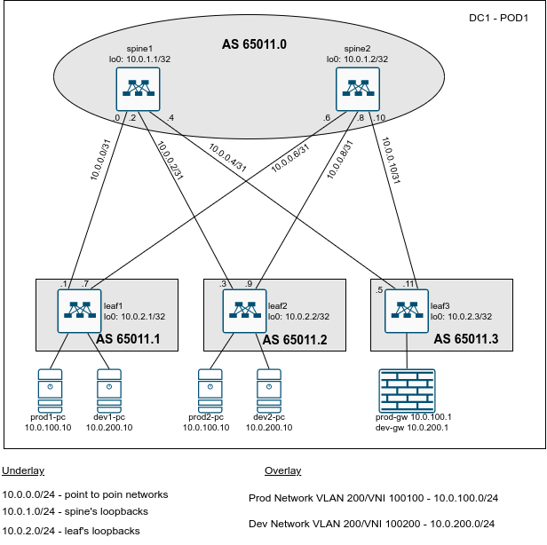

# Lesson 11
Домашняя работа к уроку № 11 "VxLAN. EVPN L2"

## Цели
* Построить overlay сети с помощью EVPN для обеспечения L2 связности внутри ЦОДа;

## Задачи
1. Разработать план IP нумерации для Датацентра (Для Underlay и Overlay сети) 
2. Разработать схему нумерации AS. Спланировать распределение коммутаторов по разным автономным системам.
3. Выполнить настройку IP на интерфейсах коммутаторов. Проверить IP связность для Underlay сети.
4. Выполнить настройку протокола BGP для Underlay сети на коммутаторах
   * Настроить протокол BGP на коммутаторе
   * Настроить таймеры протокола BGP
   * Настроить аутентификацию BGP между коммутаторами 
5. Проверить установление соседства между коммутаторами и наличие маршрутов до префиксов loopback интерфейсов всех коммутаторов
6. Выполнить настройку протокола BGP для Overlay сети на коммутаторах
7. Проверить установление соседства между leaf коммутаторами, проверить распространения маршрутной информации для address family EVPN, проверить сетевую связность между ПК и маршрутизатором, выполняющим роль шлюза между сегментами

## Реализация
### План IP нумерации и распределение AS между коммутаторами
   10.0.0.0/24 - диапазон IP адресов для использования на линках между коммутаторами leaf и spine. На каждом линке планируется использовать сеть /31.
   10.0.1.0/24 - диапазон IP адресов для использования на Loopback интерфейсах коммутаторов уровня spine.
   10.0.2.0/24 - диапазон IP адресов для использования на Loopback интерфейсах коммутаторов уровня leaf.

   Между коммутаторами соседство будет устанавливатся с использованием eBGP.
   
### Схема распределения коммутаторов по различным Автономным системам (AS)
  Коммутаторы уровня spine будут находится в одной AS, коммутаторы уровняя leaf - каждый в своей AS.
  Для нумерации AS будем использовать 32 битные номера формата 650XZ.N, где X - номер ЦОД, Z - номер POD внутри ЦОД, N - номер коммутатора (0 - для коммутаторов уровня spine).
  Для нашего примера (DC1, POD1) номер AS для коммутаторов spine будет 65011.0. Для коммутаторов leaf номера AS будут 65011.1, 65011.2, 65011.3

### План IP нумерации для Overlay сети
Для сервисных подключений будем использовать два сегмента (VLAN 100 и VLAN 200). Маршрутизация сегментов будет осуществляться на МСЭ. 
IP адресация для сегментов будет следующая:
VLAN 100 - 10.0.100.0/24,
VALN 200 - 10.0.200.0/24

Настройки EVPN L2 будут выполняться в режиме VLAN Based Service.

## Сетевая схема


# Конфигурация коммутаторов
На коммутаторах выполнена следующая конфигурация:
* spine1:
```
hostname spine1
!
interface Ethernet1
   no switchport
   ip address 10.0.0.0/31
!
interface Ethernet2
   no switchport
   ip address 10.0.0.2/31
!
interface Ethernet3
   no switchport
   ip address 10.0.0.4/31
!
interface Loopback0
   ip address 10.0.1.1/32
!
ip routing
!
peer-filter LEAF_AS_RANGE
   10 match as-range 4260560896-4260561151 result accept
!
router bgp 4260560896
   router-id 10.0.1.1
   no bgp default ipv4-unicast
   timers bgp 1 3
   maximum-paths 16
   bgp listen range 10.0.0.0/24 peer-group LEAF_UNDERLAY peer-filter LEAF_AS_RANGE
   neighbor LEAF_UNDERLAY peer group
   neighbor LEAF_UNDERLAY password 7 BLUfbsegl5s=
   !
   address-family ipv4
      neighbor LEAF_UNDERLAY activate
      network 10.0.1.1/32
!
end
```
* spine2:
```
!
hostname spine2
!
interface Ethernet1
   no switchport
   ip address 10.0.0.6/31
!
interface Ethernet2
   no switchport
   ip address 10.0.0.8/31
!
interface Ethernet3
   no switchport
   ip address 10.0.0.10/31
!
interface Loopback0
   ip address 10.0.1.2/32
!
ip routing
!
peer-filter LEAF_AS_RANGE
   10 match as-range 4260560896-4260561151 result accept
!
router bgp 4260560896
   router-id 10.0.1.2
   no bgp default ipv4-unicast
   timers bgp 1 3
   maximum-paths 16
   bgp listen range 10.0.0.0/24 peer-group LEAF_UNDERLAY peer-filter LEAF_AS_RANGE
   neighbor LEAF_UNDERLAY peer group
   neighbor LEAF_UNDERLAY password 7 BLUfbsegl5s=
   !
   address-family ipv4
      neighbor LEAF_UNDERLAY activate
      network 10.0.1.2/32
!
end
```
* leaf1:
```
!
service routing protocols model multi-agent
!
hostname leaf1
!
vlan 100
   name Prod
!
vlan 200
   name Dev
!
interface Ethernet1
   no switchport
   ip address 10.0.0.1/31
!
interface Ethernet2
   no switchport
   ip address 10.0.0.7/31
!
interface Ethernet3
   description Prod Srv1
   switchport access vlan 100
!
interface Ethernet4
   description Dev Srv1
   switchport access vlan 200
!
interface Loopback0
   ip address 10.0.2.1/32
!
interface Vxlan1
   vxlan source-interface Loopback0
   vxlan udp-port 4789
   vxlan vlan 100 vni 0.10.100
   vxlan vlan 200 vni 0.10.200
!
ip routing
!
router bgp 4260560897
   router-id 10.0.2.1
   no bgp default ipv4-unicast
   timers bgp 1 3
   maximum-paths 16
   neighbor SPINE_OVERLAY peer group
   neighbor SPINE_OVERLAY update-source Loopback0
   neighbor SPINE_OVERLAY ebgp-multihop 2
   neighbor SPINE_OVERLAY send-community
   neighbor 10.0.0.0 remote-as 4260560896
   neighbor 10.0.0.0 password 7 qSG541cPQW0=
   neighbor 10.0.0.6 remote-as 4260560896
   neighbor 10.0.0.6 password 7 9drbxOG0BdY=
   neighbor 10.0.2.2 peer group SPINE_OVERLAY
   neighbor 10.0.2.2 remote-as 4260560898
   neighbor 10.0.2.3 peer group SPINE_OVERLAY
   neighbor 10.0.2.3 remote-as 4260560899
   !
   vlan 100
      rd 10.0.2.1:10100
      route-target both 1:100100
      redistribute learned
   !
   vlan 200
      rd 10.0.2.1:10200
      route-target both 1:100200
      redistribute learned
   !
   address-family evpn
      neighbor SPINE_OVERLAY activate
   !
   address-family ipv4
      neighbor 10.0.0.0 activate
      neighbor 10.0.0.6 activate
      network 10.0.2.1/32
!
vxlan vni notation dotted
!
end
```
* leaf2:
```
!
service routing protocols model multi-agent
!
hostname leaf2
!
vlan 100
   name Prod
!
vlan 200
   name Dev
!
interface Ethernet1
   no switchport
   ip address 10.0.0.3/31
!
interface Ethernet2
   no switchport
   ip address 10.0.0.9/31
!
interface Ethernet3
   description Prod Srv2
   switchport access vlan 100
!
interface Ethernet4
   description Dev Srv2
   switchport access vlan 200
!
interface Loopback0
   ip address 10.0.2.2/32
!
interface Vxlan1
   vxlan source-interface Loopback0
   vxlan udp-port 4789
   vxlan vlan 100 vni 2660
   vxlan vlan 200 vni 2760
!
ip routing
!
router bgp 4260560898
   router-id 10.0.2.2
   no bgp default ipv4-unicast
   timers bgp 1 3
   maximum-paths 16
   neighbor SPINE_OVERLAY peer group
   neighbor SPINE_OVERLAY update-source Loopback0
   neighbor SPINE_OVERLAY ebgp-multihop 2
   neighbor SPINE_OVERLAY send-community
   neighbor 10.0.0.2 remote-as 4260560896
   neighbor 10.0.0.2 password 7 RfCXm74COTg=
   neighbor 10.0.0.8 remote-as 4260560896
   neighbor 10.0.0.8 password 7 OrJt1YQaPAY=
   neighbor 10.0.2.1 peer group SPINE_OVERLAY
   neighbor 10.0.2.1 remote-as 4260560897
   neighbor 10.0.2.3 peer group SPINE_OVERLAY
   neighbor 10.0.2.3 remote-as 4260560899
   !
   vlan 100
      rd 10.0.2.2:10100
      route-target both 1:100100
      redistribute learned
   !
   vlan 200
      rd 10.0.2.2:10200
      route-target both 1:100200
      redistribute learned
   !interface Ethernet0/1
 no shutdown
 no ip address
 shutdown
!
interface Ethernet0/2
 no shutdown
 no ip address
 shutdown
!
interface Ethernet0/3
 no shutdown
 no ip address
 shutdown
!
ip forward-protocol nd
!
!
no ip http server
no ip http secure-server
!
!
!
!
control-plane
!
!
!
!
!
!
!
!
line con 0
 logging synchronous
line aux 0
line vty 0 4
 login
 transport input none
!

   address-family evpn
      neighbor SPINE_OVERLAY activate
   !
   address-family ipv4
      neighbor 10.0.0.2 activate
      neighbor 10.0.0.8 activate
      network 10.0.2.2/32
!
end
```
* leaf3
```
!
service routing protocols model multi-agent
!
hostname leaf2
!
vlan 100
   name Prod
!
vlan 200
   name Dev
!
interface Ethernet1
   no switchport
   ip address 10.0.0.3/31
!
interface Ethernet2
   no switchport
   ip address 10.0.0.9/31
!
interface Ethernet3
   description Prod Srv2
   switchport access vlan 100
!
interface Ethernet4
   description Dev Srv2
   switchport access vlan 200
!
interface Loopback0
   ip address 10.0.2.2/32
!
interface Vxlan1
   vxlan source-interface Loopback0
   vxlan udp-port 4789
   vxlan vlan 100 vni 2660
   vxlan vlan 200 vni 2760
!
ip routing
!
router bgp 4260560898
   router-id 10.0.2.2
   no bgp default ipv4-unicast
   timers bgp 1 3
   maximum-paths 16
   neighbor SPINE_OVERLAY peer group
   neighbor SPINE_OVERLAY update-source Loopback0
   neighbor SPINE_OVERLAY ebgp-multihop 2
   neighbor SPINE_OVERLAY send-community
   neighbor 10.0.0.2 remote-as 4260560896
   neighbor 10.0.0.2 password 7 RfCXm74COTg=
   neighbor 10.0.0.8 remote-as 4260560896
   neighbor 10.0.0.8 password 7 OrJt1YQaPAY=
   neighbor 10.0.2.1 peer group SPINE_OVERLAY
   neighbor 10.0.2.1 remote-as 4260560897
   neighbor 10.0.2.3 peer group SPINE_OVERLAY
   neighbor 10.0.2.3 remote-as 4260560899
   !
   vlan 100
      rd 10.0.2.2:10100
      route-target both 1:100100
      redistribute learned
   !
   vlan 200
      rd 10.0.2.2:10200
      route-target both 1:100200
      redistribute learned
   !
   address-family evpn
      neighbor SPINE_OVERLAY activate
   !
   address-family ipv4
      neighbor 10.0.0.2 activate
      neighbor 10.0.0.8 activate
      network 10.0.2.2/32
!
end

```
* R1 (МСЭ)
```
!
hostname R1
!
interface Ethernet0/0
 no shutdown
 no ip address
!
interface Ethernet0/0.100
 no shutdown
 description Prod Network
 encapsulation dot1Q 100
 ip address 10.0.100.1 255.255.255.0
!
interface Ethernet0/0.200
 no shutdown
 encapsulation dot1Q 200
 ip address 10.0.200.1 255.255.255.0
!
end
```

# Проверка выполненных настроек и работоспособность схемы

## Проверка Underlay сети 

spine1:
----
```
spine1#show ip bgp summary
BGP summary information for VRF default
Router identifier 10.0.1.1, local AS number 4260560896
Neighbor Status Codes: m - Under maintenance
  Neighbor         V  AS           MsgRcvd   MsgSent  InQ OutQ  Up/Down State   PfxRcd PfxAcc
  10.0.0.1         4  4260560897      1905      1626    0    0 00:27:00 Estab   1      1
  10.0.0.3         4  4260560898      1912      1626    0    0 00:27:00 Estab   1      1
  10.0.0.5         4  4260560899      1901      1621    0    0 00:26:55 Estab   1      1

spine1#show ip bgp 
BGP routing table information for VRF default
Router identifier 10.0.1.1, local AS number 4260560896
Route status codes: s - suppressed, * - valid, > - active, # - not installed, E - ECMP head, e - ECMP
                    S - Stale, c - Contributing to ECMP, b - backup, L - labeled-unicast
Origin codes: i - IGP, e - EGP, ? - incomplete
AS Path Attributes: Or-ID - Originator ID, C-LST - Cluster List, LL Nexthop - Link Local Nexthop

         Network                Next Hop            Metric  LocPref Weight  Path
 * >     10.0.1.1/32            -                     0       0       -       i
 * >     10.0.2.1/32            10.0.0.1              0       100     0       4260560897 i
 * >     10.0.2.2/32            10.0.0.3              0       100     0       4260560898 i
 * >     10.0.2.3/32            10.0.0.5              0       100     0       4260560899 i

spine1#show ip route bgp

VRF: default
Codes: C - connected, S - static, K - kernel, 
       O - OSPF, IA - OSPF inter area, E1 - OSPF external type 1,
       E2 - OSPF external type 2, N1 - OSPF NSSA external type 1,
       N2 - OSPF NSSA external type2, B - BGP, B I - iBGP, B E - eBGP,
       R - RIP, I L1 - IS-IS level 1, I L2 - IS-IS level 2,
       O3 - OSPFv3, A B - BGP Aggregate, A O - OSPF Summary,
       NG - Nexthop Group Static Route, V - VXLAN Control Service,
       DH - DHCP client installed default route, M - Martian,
       DP - Dynamic Policy Route, L - VRF Leaked,
       G  - gRIBI, RC - Route Cache Route

 B E      10.0.2.1/32 [200/0] via 10.0.0.1, Ethernet1
 B E      10.0.2.2/32 [200/0] via 10.0.0.3, Ethernet2
 B E      10.0.2.3/32 [200/0] via 10.0.0.5, Ethernet3
```
spine2:
----
```
spine2#show ip bgp summary
BGP summary information for VRF default
Router identifier 10.0.1.2, local AS number 4260560896
Neighbor Status Codes: m - Under maintenance
  Neighbor         V  AS  4. Выполнить настройку протокола BGP для Underlay на коммутаторах         MsgRcvd   MsgSent  InQ OutQ  Up/Down State   PfxRcd PfxAcc
  10.0.0.7         4  4260560897      1985      1691    0    0 00:28:05 Estab   1      1
  10.0.0.9         4  4260560898      1979      1691    0    0 00:28:05 Estab   1      1
  10.0.0.11        4  4260560899      1973      1687    0    0 00:28:00 Estab   1      1

spine2#show ip bgp 
BGP routing table information for VRF default
Router identifier 10.0.1.2, local AS number 4260560896
Route status codes: s - suppressed, * - valid, > - active, # - not installed, E - ECMP head, e - ECMP
                    S - Stale, c - Contributing to ECMP, b - backup, L - labeled-unicast
Origin codes: i - IGP, e - EGP, ? - incomplete
AS Path Attributes: Or-ID - Originator ID, C-LST - Cluster List, LL Nexthop - Link Local Nexthop

         Network                Next Hop            Metric  LocPref Weight  Path
 * >     10.0.1.2/32            -                     0       0       -       i
 * >     10.0.2.1/32            10.0.0.7              0       100     0       4260560897 i
 * >     10.0.2.2/32            10.0.0.9              0       100     0       4260560898 i
 * >     10.0.2.3/32            10.0.0.11             0       100     0       4260560899 i

spine2#show ip route bgp

VRF: default
Codes: C - connected, S - static, K - kernel, 
       O - OSPF, IA - OSPF inter area, E1 - OSPF external type 1,
       E2 - OSPF external type 2, N1 - OSPF NSSA external type 1,
       N2 - OSPF NSSA external type2, B - BGP, B I - iBGP, B E - eBGP,
       R - RIP, I L1 - IS-IS level 1, I L2 - IS-IS level 2,
       O3 - OSPFv3, A B - BGP Aggregate, A O - OSPF Summary,
       NG - Nexthop Group Static Route, V - VXLAN Control Service,
       DH - DHCP client installed default route, M - Martian,
       DP - Dynamic Policy Route, L - VRF Leaked,
       G  - gRIBI, RC - Route Cache Route

 B E      10.0.2.1/32 [200/0] via 10.0.0.7, Ethernet1
 B E      10.0.2.2/32 [200/0] via 10.0.0.9, Ethernet2
 B E      10.0.2.3/32 [200/0] via 10.0.0.11, Ethernet3
```

leaf1:
---
```
leaf1#show ip bgp summary 
BGP summary information for VRF default
Router identifier 10.0.2.1, local AS number 4260560897
Neighbor Status Codes: m - Under maintenance
  Neighbor         V AS           MsgRcvd   MsgSent  InQ OutQ  Up/Down State   PfxRcd PfxAcc
  10.0.0.0         4 4260560896      2151      2517    0    0 00:35:45 Estab   3      3
  10.0.0.6         4 4260560896      2151      2525    0    0 00:35:45 Estab   3      3

leaf1#show ip bgp 
BGP routing table information for VRF default
Router identifier 10.0.2.1, local AS number 4260560897
Route status codes: s - suppressed, * - valid, > - active, E - ECMP head, e - ECMP
                    S - Stale, c - Contributing to ECMP, b - backup, L - labeled-unicast
                    % - Pending BGP convergence
Origin codes: i - IGP, e - EGP, ? - incomplete
RPKI Origin Validation codes: V - valid, I - invalid, U - unknown
AS Path Attributes: Or-ID - Originator ID, C-LST - Cluster List, LL Nexthop - Link Local Nexthop

          Network                Next Hop              Metric  AIGP       LocPref Weight  Path
 * >      10.0.1.1/32            10.0.0.0              0       -          100     0       4260560896 i
 * >      10.0.1.2/32            10.0.0.6              0       -          100     0       4260560896 i
 * >      10.0.2.1/32            -                     -       -          -       0       i
 * >Ec    10.0.2.2/32            10.0.0.0              0       -          100     0       4260560896 4260560898 i
 *  ec    10.0.2.2/32            10.0.0.6              0       -          100     0       4260560896 4260560898 i
 * >Ec    10.0.2.3/32            10.0.0.6              0       -          100     0       4260560896 4260560899 i
 *  ec    10.0.2.3/32            10.0.0.0              0       -          100     0       4260560896 4260560899 i
leaf1#show ip route bgp 

VRF: default
Codes: C - connected, S - static, K - kernel, 
       O - OSPF, IA - OSPF inter area, E1 - OSPF external type 1,
       E2 - OSPF external type 2, N1 - OSPF NSSA external type 1,
       N2 - OSPF NSSA external type2, B - BGP, B I - iBGP, B E - eBGP,
       R - RIP, I L1 - IS-IS level 1, I L2 - IS-IS level 2,
       O3 - OSPFv3, A B - BGP Aggregate, A O - OSPF Summary,
       NG - Nexthop Group Static Route, V - VXLAN Control Service,
       DH - DHCP client installed default route, M - Martian,
       DP - Dynamic Policy Route, L - VRF Leaked,
       G  - gRIBI, RC - Route Cache Route

 B E      10.0.1.1/32 [200/0] via 10.0.0.0, Ethernet1
 B E      10.0.1.2/32 [200/0] via 10.0.0.6, Ethernet2
 B E      10.0.2.2/32 [200/0] via 10.0.0.0, Ethernet1
                              via 10.0.0.6, Ethernet2
 B E      10.0.2.3/32 [200/0] via 10.0.0.0, Ethernet1
                              via 10.0.0.6, Ethernet2
```

Доступность Loopback интерфейсов соседних leaf коммутаторов:
```
leaf1#ping 10.0.2.2 source 10.0.2.1
PING 10.0.2.2 (10.0.2.2) from 10.0.2.1 : 72(100) bytes of data.
80 bytes from 10.0.2.2: icmp_seq=1 ttl=63 time=11.3 ms
80 bytes from 10.0.2.2: icmp_seq=2 ttl=63 time=6.07 ms
80 bytes from 10.0.2.2: icmp_seq=3 ttl=63 time=5.32 ms
80 bytes from 10.0.2.2: icmp_seq=4 ttl=63 time=5.47 ms
80 bytes from 10.0.2.2: icmp_seq=5 ttl=63 time=5.06 ms

--- 10.0.2.2 ping statistics ---
5 packets transmitted, 5 received, 0% packet loss, time 45ms
rtt min/avg/max/mdev = 5.065/6.648/11.302/2.351 ms, ipg/ewma 11.349/8.875 ms
leaf1#ping 10.0.2.3 source 10.0.2.1
PING 10.0.2.3 (10.0.2.3) from 10.0.2.1 : 72(100) bytes of data.
80 bytes from 10.0.2.3: icmp_seq=1 ttl=63 time=7.18 ms
80 bytes from 10.0.2.3: icmp_seq=2 ttl=63 time=5.65 ms
80 bytes from 10.0.2.3: icmp_seq=3 ttl=63 time=5.43 ms
80 bytes from 10.0.2.3: icmp_seq=4 ttl=63 time=6.51 ms
80 bytes from 10.0.2.3: icmp_seq=5 ttl=63 time=5.84 ms

--- 10.0.2.3 ping statistics ---
5 packets transmitted, 5 received, 0% packet loss, time 37ms
rtt min/avg/max/mdev = 5.431/6.125/7.187/0.641 ms, ipg/ewma 9.416/6.648 ms
```

leaf2:
---
```
leaf2#show ip bgp summary 
BGP summary information for VRF default
Router identifier 10.0.2.2, local AS number 4260560898
Neighbor Status Codes: m - Under maintenance
  Neighbor         V AS           MsgRcvd   MsgSent  InQ OutQ  Up/Down State   PfxRcd PfxAcc
  10.0.0.2         4 4260560896      2301      2701    0    0 00:38:14 Estab   3      3
  10.0.0.8         4 4260560896      2300      2695    0    0 00:38:14 Estab   3      3

leaf2#show ip bgp 
BGP routing table information for VRF default
Router identifier 10.0.2.2, local AS number 4260560898
Route status codes: s - suppressed, * - valid, > - active, E - ECMP head, e - ECMP
                    S - Stale, c - Contributing to ECMP, b - backup, L - labeled-unicast
                    % - Pending BGP convergence
Origin codes: i - IGP, e - EGP, ? - incomplete
RPKI Origin Validation codes: V - valid, I - invalid, U - unknown
AS Path Attributes: Or-ID - Originator ID, C-LST - Cluster List, LL Nexthop - Link Local Nexthop

          Network                Next Hop              Metric  AIGP       LocPref Weight  Path
 * >      10.0.1.1/32            10.0.0.2              0       -          100     0       4260560896 i
 * >      10.0.1.2/32            10.0.0.8              0       -          100     0       4260560896 i
 * >Ec    10.0.2.1/32            10.0.0.2              0       -          100     0       4260560896 4260560897 i
 *  ec    10.0.2.1/32            10.0.0.8              0       -          100     0       4260560896 4260560897 i
 * >      10.0.2.2/32            -                     -       -          -       0       i
 * >Ec    10.0.2.3/32            10.0.0.8              0       -          100     0       4260560896 4260560899 i
 *  ec    10.0.2.3/32            10.0.0.2              0       -          100     0       4260560896 4260560899 i

leaf2#show ip route bgp

VRF: default
Codes: C - connected, S - static, K - kernel, 
       O - OSPF, IA - OSPF inter area, E1 - OSPF external type 1,
       E2 - OSPF external type 2, N1 - OSPF NSSA external type 1,
       N2 - OSPF NSSA external type2, B - BGP, B I - iBGP, B E - eBGP,
       R - RIP, I L1 - IS-IS level 1, I L2 - IS-IS level 2,
       O3 - OSPFv3, A B - BGP Aggregate, A O - OSPF Summary,
       NG - Nexthop Group Static Route, V - VXLAN Control Service,
       DH - DHCP client installed default route, M - Martian,
       DP - Dynamic Policy Route, L - VRF Leaked,
       G  - gRIBI, RC - Route Cache Route

 B E      10.0.1.1/32 [200/0] via 10.0.0.2, Ethernet1
 B E      10.0.1.2/32 [200/0] via 10.0.0.8, Ethernet2
 B E      10.0.2.1/32 [200/0] via 10.0.0.2, Ethernet1
                              via 10.0.0.8, Ethernet2
 B E      10.0.2.3/32 [200/0] via 10.0.0.2, Ethernet1
                              via 10.0.0.8, Ethernet2
```

Доступность Loopback интерфейсов соседних leaf коммутаторов:
```
leaf2#ping 10.0.2.1 source 10.0.2.2
PING 10.0.2.1 (10.0.2.1) from 10.0.2.2 : 72(100) bytes of data.
80 bytes from 10.0.2.1: icmp_seq=1 ttl=63 time=5.63 ms
80 bytes from 10.0.2.1: icmp_seq=2 ttl=63 time=5.92 ms
80 bytes from 10.0.2.1: icmp_seq=3 ttl=63 time=7.23 ms
80 bytes from 10.0.2.1: icmp_seq=4 ttl=63 time=5.43 ms
80 bytes from 10.0.2.1: icmp_seq=5 ttl=63 time=5.10 ms

--- 10.0.2.1 ping statistics ---
5 packets transmitted, 5 received, 0% packet loss, time 40ms
rtt min/avg/max/mdev = 5.101/5.866/7.234/0.741 ms, ipg/ewma 10.076/5.722 ms
leaf2#ping 10.0.2.3 source 10.0.2.2
PING 10.0.2.3 (10.0.2.3) from 10.0.2.2 : 72(100) bytes of data.
80 bytes from 10.0.2.3: icmp_seq=1 ttl=63 time=13.4 ms
80 bytes from 10.0.2.3: icmp_seq=2 ttl=63 time=7.69 ms
80 bytes from 10.0.2.3: icmp_seq=3 ttl=63 time=5.81 ms
80 bytes from 10.0.2.3: icmp_seq=4 ttl=63 time=5.96 ms
80 bytes from 10.0.2.3: icmp_seq=5 ttl=63 time=6.16 ms

--- 10.0.2.3 ping statistics ---
5 packets transmitted, 5 received, 0% packet loss, time 48ms
rtt min/avg/max/mdev = 5.815/7.815/13.444/2.894 ms, pipe 2, ipg/ewma 12.150/10.504 ms
```

leaf3:
----
```
leaf3#show ip bgp summary
BGP summary information for VRF default
Router identifier 10.0.2.3, local AS number 4260560899
Neighbor Status Codes: m - Under maintenance
  Neighbor         V AS           MsgRcvd   MsgSent  InQ OutQ  Up/Down State   PfxRcd PfxAcc
  10.0.0.4         4 4260560896      2451      2877    0    0 00:40:46 Estab   3      3
  10.0.0.10        4 4260560896      2452      2874    0    0 00:40:46 Estab   3      3

leaf3#show ip bgp 
BGP routing table information for VRF default
Router identifier 10.0.2.3, local AS number 4260560899
Route status codes: s - suppressed, * - valid, > - active, E - ECMP head, e - ECMP
                    S - Stale, c - Contributing to ECMP, b - backup, L - labeled-unicast
                    % - Pending BGP convergence
Origin codes: i - IGP, e - EGP, ? - incomplete
RPKI Origin Validation codes: V - valid, I - invalid, U - unknown
AS Path Attributes: Or-ID - Originator ID, C-LST - Cluster List, LL Nexthop - Link Local Nexthop

          Network                Next Hop              Metric  AIGP       LocPref Weight  Path
 * >      10.0.1.1/32            10.0.0.4              0       -          100     0       4260560896 i
 * >      10.0.1.2/32            10.0.0.10             0       -          100     0       4260560896 i
 * >Ec    10.0.2.1/32            10.0.0.10             0       -          100     0       4260560896 4260560897 i
 *  ec    10.0.2.1/32            10.0.0.4              0       -          100     0       4260560896 4260560897 i
 * >Ec    10.0.2.2/32            10.0.0.10             0       -          100     0       4260560896 4260560898 i
 *  ec    10.0.2.2/32            10.0.0.4              0       -          100     0       4260560896 4260560898 i
 * >      10.0.2.3/32            -                     -       -          -       0       i

leaf3#show ip route

VRF: default
Codes: C - connected, S - static, K - kernel, 
       O - OSPF, IA - OSPF inter area, E1 - OSPF external type 1,
       E2 - OSPF external type 2, N1 - OSPF NSSA external type 1,
       N2 - OSPF NSSA external type2, B - BGP, B I - iBGP, B E - eBGP,
       R - RIP, I L1 - IS-IS level 1, I L2 - IS-IS level 2,
       O3 - OSPFv3, A B - BGP Aggregate, A O - OSPF Summary,
       NG - Nexthop Group Static Route, V - VXLAN Control Service,
       DH - DHCP client installed default route, M - Martian,
       DP - Dynamic Policy Route, L - VRF Leaked,
       G  - gRIBI, RC - Route Cache Route

Gateway of last resort is not set

 C        10.0.0.4/31 is directly connected, Ethernet1
 C        10.0.0.10/31 is directly connected, Ethernet2
 B E      10.0.1.1/32 [200/0] via 10.0.0.4, Ethernet1
 B E      10.0.1.2/32 [200/0] via 10.0.0.10, Ethernet2
 B E      10.0.2.1/32 [200/0] via 10.0.0.4, Ethernet1
                              via 10.0.0.10, Ethernet2
 B E      10.0.2.2/32 [200/0] via 10.0.0.4, Ethernet1
                              via 10.0.0.10, Ethernet2
 C        10.0.2.3/32 is directly connected, Loopback0
```

Доступность Loopback интерфейсов соседних leaf коммутаторов:
```
leaf3#ping 10.0.2.1 source 10.0.2.3
PING 10.0.2.1 (10.0.2.1) from 10.0.2.3 : 72(100) bytes of data.
80 bytes from 10.0.2.1: icmp_seq=1 ttl=63 time=7.11 ms
80 bytes from 10.0.2.1: icmp_seq=2 ttl=63 time=6.33 ms
80 bytes from 10.0.2.1: icmp_seq=3 ttl=63 time=6.03 ms
80 bytes from 10.0.2.1: icmp_seq=4 ttl=63 time=5.96 ms
80 bytes from 10.0.2.1: icmp_seq=5 ttl=63 time=5.50 ms

--- 10.0.2.1 ping statistics ---
5 packets transmitted, 5 received, 0% packet loss, time 38ms
rtt min/avg/max/mdev = 5.506/6.191/7.118/0.534 ms, ipg/ewma 9.627/6.620 ms
leaf3#ping 10.0.2.2 source 10.0.2.3
PING 10.0.2.2 (10.0.2.2) from 10.0.2.3 : 72(100) bytes of data.
80 bytes from 10.0.2.2: icmp_seq=1 ttl=63 time=6.24 ms
80 bytes from 10.0.2.2: icmp_seq=2 ttl=63 time=6.37 ms
80 bytes from 10.0.2.2: icmp_seq=3 ttl=63 time=6.25 ms
80 bytes from 10.0.2.2: icmp_seq=4 ttl=63 time=7.61 ms
80 bytes from 10.0.2.2: icmp_seq=5 ttl=63 time=6.34 ms

--- 10.0.2.2 ping statistics ---
5 packets transmitted, 5 received, 0% packet loss, time 39ms
rtt min/avg/max/mdev = 6.244/6.566/7.617/0.532 ms, ipg/ewma 9.827/6.418 ms
```

## Проверка Overlay сети
leaf1:
---
```
leaf1#show vxlan vtep 
Remote VTEPS for Vxlan1:

VTEP           Tunnel Type(s) 
-------------- -------------- 
10.0.2.2       unicast, flood 
10.0.2.3       unicast, flood 

Total number of remote VTEPS:  2


leaf1#show vxlan vni 
VNI to VLAN Mapping for Vxlan1
VNI            VLAN       Source       Interface       802.1Q Tag 
-------------- ---------- ------------ --------------- ---------- 
0.10.100       100        static       Ethernet3       untagged   
                                       Vxlan1          100        
0.10.200       200        static       Ethernet4       untagged   
                                       Vxlan1          200        

VNI to dynamic VLAN Mapping for Vxlan1
VNI       VLAN       VRF       Source        
--------- ---------- --------- ------------  

leaf1#show vxlan address-table
          Vxlan Mac Address Table
----------------------------------------------------------------------

VLAN  Mac Address     Type      Prt  VTEP             Moves   Last Move
----  -----------     ----      ---  ----             -----   ---------
 100  0050.7966.6808  EVPN      Vx1  10.0.2.2         1       0:00:25 ago
 100  aabb.cc00.a000  EVPN      Vx1  10.0.2.3         1       0:00:30 ago
 200  0050.7966.6809  EVPN      Vx1  10.0.2.2         1       0:00:03 ago
 200  aabb.cc00.a000  EVPN      Vx1  10.0.2.3         1       0:02:08 ago
Total Remote Mac Addresses for this criterion: 4

leaf1#show bgp evpn summary 
BGP summary information for VRF default
Router identifier 10.0.2.1, local AS number 4260560897
Neighbor Status Codes: m - Under maintenance
  Neighbor         V AS           MsgRcvd   MsgSent  InQ OutQ  Up/Down State   PfxRcd PfxAcc
  10.0.2.2         4 4260560898      4592      4603    0    0 01:04:42 Estab   8      8
  10.0.2.3         4 4260560899      4585      4591    0    0 01:04:38 Estab   8      8

leaf1#show bgp evpn 
BGP routing table information for VRF default
Router identifier 10.0.2.1, local AS number 4260560897
Route status codes: s - suppressed, * - valid, > - active, E - ECMP head, e - ECMP
                    S - Stale, c - Contributing to ECMP, b - backup
                    % - Pending BGP convergence
Origin codes: i - IGP, e - EGP, ? - incomplete
AS Path Attributes: Or-ID - Originator ID, C-LST - Cluster List, LL Nexthop - Link Local Nexthop

          Network                Next Hop              Metric  LocPref Weight  Path
 * >     RD: 10.0.2.1:10100 mac-ip 0050.7966.6806
                                 -                     -       -       0       i
 * >     RD: 10.0.2.1:10200 mac-ip 0050.7966.6807
                                 -                     -       -       0       i
 * >     RD: 10.0.2.2:10100 mac-ip 0050.7966.6808
                                 10.0.2.2              -       100     0       4260560898 i
 *       RD: 10.0.2.2:10100 mac-ip 0050.7966.6808
                                 10.0.2.2              -       100     0       4260560899 4260560898 i
 * >     RD: 10.0.2.2:10200 mac-ip 0050.7966.6809
                                 10.0.2.2              -       100     0       4260560898 i
 *       RD: 10.0.2.2:10200 mac-ip 0050.7966.6809
                                 10.0.2.2              -       100     0       4260560899 4260560898 i
 * >     RD: 10.0.2.3:10100 mac-ip aabb.cc00.a000
                                 10.0.2.3              -       100     0       4260560899 i
 *       RD: 10.0.2.3:10100 mac-ip aabb.cc00.a000
                                 10.0.2.3              -       100     0       4260560898 4260560899 i
 * >     RD: 10.0.2.3:10200 mac-ip aabb.cc00.a000
                                 10.0.2.3              -       100     0       4260560899 i
 *       RD: 10.0.2.3:10200 mac-ip aabb.cc00.a000
                                 10.0.2.3              -       100     0       4260560898 4260560899 i
 * >     RD: 10.0.2.1:10100 imet 10.0.2.1
                                 -                     -       -       0       i
 * >     RD: 10.0.2.1:10200 imet 10.0.2.1
                                 -                     -       -       0       i
 * >     RD: 10.0.2.2:10100 imet 10.0.2.2
                                 10.0.2.2              -       100     0       4260560898 i
 *       RD: 10.0.2.2:10100 imet 10.0.2.2
                                 10.0.2.2              -       100     0       4260560899 4260560898 i
 * >     RD: 10.0.2.2:10200 imet 10.0.2.2
                                 10.0.2.2              -       100     0       4260560898 i
 *       RD: 10.0.2.2:10200 imet 10.0.2.2
                                 10.0.2.2              -       100     0       4260560899 4260560898 i
 * >     RD: 10.0.2.3:10100 imet 10.0.2.3
                                 10.0.2.3              -       100     0       4260560899 i
 *       RD: 10.0.2.3:10100 imet 10.0.2.3
                                 10.0.2.3              -       100     0       4260560898 4260560899 i
 * >     RD: 10.0.2.3:10200 imet 10.0.2.3
                                 10.0.2.3              -       100     0       4260560899 i
 *       RD: 10.0.2.3:10200 imet 10.0.2.3
                                 10.0.2.3              -       100     0       4260560898 4260560899 i

```

Доступность шлюза и соседних ПК с ПК, подключенных к leaf1
```
prod1-pc> ping 10.0.100.1

84 bytes from 10.0.100.1 icmp_seq=1 ttl=255 time=12.957 ms
84 bytes from 10.0.100.1 icmp_seq=2 ttl=255 time=11.179 ms
84 bytes from 10.0.100.1 icmp_seq=3 ttl=255 time=12.242 ms

prod1-pc> ping 10.0.100.11

10.0.100.11 icmp_seq=1 timeout
84 bytes from 10.0.100.11 icmp_seq=2 ttl=64 time=10.926 ms
84 bytes from 10.0.100.11 icmp_seq=3 ttl=64 time=10.854 ms
84 bytes from 10.0.100.11 icmp_seq=4 ttl=64 time=10.353 ms
84 bytes from 10.0.100.11 icmp_seq=5 ttl=64 time=10.594 ms

dev1-pc> ping 10.0.200.1

10.0.200.1 icmp_seq=1 timeout
84 bytes from 10.0.200.1 icmp_seq=2 ttl=255 time=14.317 ms
84 bytes from 10.0.200.1 icmp_seq=3 ttl=255 time=10.663 ms
84 bytes from 10.0.200.1 icmp_seq=4 ttl=255 time=12.110 ms
84 bytes from 10.0.200.1 icmp_seq=5 ttl=255 time=12.335 ms

dev1-pc> ping 10.0.200.11

10.0.200.11 icmp_seq=1 timeout
84 bytes from 10.0.200.11 icmp_seq=2 ttl=64 time=11.474 ms
84 bytes from 10.0.200.11 icmp_seq=3 ttl=64 time=15.967 ms
84 bytes from 10.0.200.11 icmp_seq=4 ttl=64 time=12.233 ms
84 bytes from 10.0.200.11 icmp_seq=5 ttl=64 time=10.913 ms
```

leaf2:
-----
```
leaf2#show vxlan vtep 
Remote VTEPS for Vxlan1:

VTEP           Tunnel Type(s) 
-------------- -------------- 
10.0.2.1       flood, unicast 
10.0.2.3       flood, unicast 

Total number of remote VTEPS:  2

leaf2#show vxlan vni 
VNI to VLAN Mapping for Vxlan1
VNI        VLAN       Source       Interface       802.1Q Tag 
---------- ---------- ------------ --------------- ---------- 
2660       100        static       Ethernet3       untagged   
                                   Vxlan1          100        
2760       200        static       Ethernet4       untagged   
                                   Vxlan1          200        

VNI to dynamic VLAN Mapping for Vxlan1
VNI       VLAN       VRF       Source        
--------- ---------- --------- ------------  

leaf2#show vxlan address-table 
          Vxlan Mac Address Table
----------------------------------------------------------------------

VLAN  Mac Address     Type      Prt  VTEP             Moves   Last Move
----  -----------     ----      ---  ----             -----   ---------
 100  0050.7966.6806  EVPN      Vx1  10.0.2.1         1       0:01:26 ago
 100  aabb.cc00.a000  EVPN      Vx1  10.0.2.3         1       0:01:33 ago
 200  0050.7966.6807  EVPN      Vx1  10.0.2.1         1       0:01:07 ago
 200  aabb.cc00.a000  EVPN      Vx1  10.0.2.3         1       0:01:07 ago
Total Remote Mac Addresses for this criterion: 4

leaf2#show bgp evpn summary 
BGP summary information for VRF default
Router identifier 10.0.2.2, local AS number 4260560898
Neighbor Status Codes: m - Under maintenance
  Neighbor         V AS           MsgRcvd   MsgSent  InQ OutQ  Up/Down State   PfxRcd PfxAcc
  10.0.2.1         4 4260560897      8187      8185    0    0 01:55:34 Estab   8      8
  10.0.2.3         4 4260560899      8178      8166    0    0 01:55:29 Estab   8      8

leaf2#show bgp evpn 
BGP routing table information for VRF default
Router identifier 10.0.2.2, local AS number 4260560898
Route status codes: s - suppressed, * - valid, > - active, E - ECMP head, e - ECMP
                    S - Stale, c - Contributing to ECMP, b - backup
                    % - Pending BGP convergence
Origin codes: i - IGP, e - EGP, ? - incomplete
AS Path Attributes: Or-ID - Originator ID, C-LST - Cluster List, LL Nexthop - Link Local Nexthop

          Network                Next Hop              Metric  LocPref Weight  Path
 * >     RD: 10.0.2.1:10100 mac-ip 0050.7966.6806
                                 10.0.2.1              -       100     0       4260560897 i
 *       RD: 10.0.2.1:10100 mac-ip 0050.7966.6806
                                 10.0.2.1              -       100     0       4260560899 4260560897 i
 * >     RD: 10.0.2.1:10200 mac-ip 0050.7966.6807
                                 10.0.2.1              -       100     0       4260560897 i
 *       RD: 10.0.2.1:10200 mac-ip 0050.7966.6807
                                 10.0.2.1              -       100     0       4260560899 4260560897 i
 * >     RD: 10.0.2.2:10100 mac-ip 0050.7966.6808
                                 -                     -       -       0       i
 * >     RD: 10.0.2.2:10200 mac-ip 0050.7966.6809
                                 -                     -       -       0       i
 * >     RD: 10.0.2.3:10100 mac-ip aabb.cc00.a000
                                 10.0.2.3              -       100     0       4260560899 i
 *       RD: 10.0.2.3:10100 mac-ip aabb.cc00.a000
                                 10.0.2.3              -       100     0       4260560897 4260560899 i
 * >     RD: 10.0.2.3:10200 mac-ip aabb.cc00.a000
                                 10.0.2.3              -       100     0       4260560899 i
 *       RD: 10.0.2.3:10200 mac-ip aabb.cc00.a000
                                 10.0.2.3              -       100     0       4260560897 4260560899 i
 * >     RD: 10.0.2.1:10100 imet 10.0.2.1
                                 10.0.2.1              -       100     0       4260560897 i
 *       RD: 10.0.2.1:10100 imet 10.0.2.1
                                 10.0.2.1              -       100     0       4260560899 4260560897 i
 * >     RD: 10.0.2.1:10200 imet 10.0.2.1
                                 10.0.2.1              -       100     0       4260560897 i
 *       RD: 10.0.2.1:10200 imet 10.0.2.1
                                 10.0.2.1              -       100     0       4260560899 4260560897 i
 * >     RD: 10.0.2.2:10100 imet 10.0.2.2
                                 -                     -       -       0       i
 * >     RD: 10.0.2.2:10200 imet 10.0.2.2
                                 -                     -       -       0       i
 * >     RD: 10.0.2.3:10100 imet 10.0.2.3
                                 10.0.2.3              -       100     0       4260560899 i
 *       RD: 10.0.2.3:10100 imet 10.0.2.3
                                 10.0.2.3              -       100     0       4260560897 4260560899 i
 * >     RD: 10.0.2.3:10200 imet 10.0.2.3
                                 10.0.2.3              -       100     0       4260560899 i
 *       RD: 10.0.2.3:10200 imet 10.0.2.3
                                 10.0.2.3              -       100     0       4260560897 4260560899 i
```
доступность шлюза и соседниз ПК с ПК, подключенных к leaf2
```
prod2-pc> ping 10.0.100.1

10.0.100.1 icmp_seq=1 timeout
84 bytes from 10.0.100.1 icmp_seq=2 ttl=255 time=12.598 ms
84 bytes from 10.0.100.1 icmp_seq=3 ttl=255 time=11.633 ms
84 bytes from 10.0.100.1 icmp_seq=4 ttl=255 time=11.972 ms
84 bytes from 10.0.100.1 icmp_seq=5 ttl=255 time=12.396 ms

prod2-pc> ping 10.0.100.10

10.0.100.10 icmp_seq=1 timeout
84 bytes from 10.0.100.10 icmp_seq=2 ttl=64 time=10.791 ms
84 bytes from 10.0.100.10 icmp_seq=3 ttl=64 time=10.819 ms
84 bytes from 10.0.100.10 icmp_seq=4 ttl=64 time=10.917 ms
84 bytes from 10.0.100.10 icmp_seq=5 ttl=64 time=11.475 ms

dev2-pc> ping 10.0.200.1

84 bytes from 10.0.200.1 icmp_seq=1 ttl=255 time=11.108 ms
84 bytes from 10.0.200.1 icmp_seq=2 ttl=255 time=11.291 ms
84 bytes from 10.0.200.1 icmp_seq=3 ttl=255 time=11.045 ms
84 bytes from 10.0.200.1 icmp_seq=4 ttl=255 time=14.181 ms
84 bytes from 10.0.200.1 icmp_seq=5 ttl=255 time=10.651 ms

dev2-pc> ping 10.0.200.10

84 bytes from 10.0.200.10 icmp_seq=1 ttl=64 time=15.864 ms
84 bytes from 10.0.200.10 icmp_seq=2 ttl=64 time=13.186 ms
84 bytes from 10.0.200.10 icmp_seq=3 ttl=64 time=12.224 ms
84 bytes from 10.0.200.10 icmp_seq=4 ttl=64 time=12.924 ms
84 bytes from 10.0.200.10 icmp_seq=5 ttl=64 time=10.923 ms
```

leaf3:
-----
```
leaf3#show vxlan vtep 
Remote VTEPS for Vxlan1:

VTEP           Tunnel Type(s) 
-------------- -------------- 
10.0.2.1       flood, unicast 
10.0.2.2       flood, unicast 

Total number of remote VTEPS:  2

leaf3#show vxlan vni 
VNI to VLAN Mapping for Vxlan1
VNI            VLAN       Source       Interface       802.1Q Tag 
-------------- ---------- ------------ --------------- ---------- 
0.10.100       100        static       Ethernet3       100        
                                       Vxlan1          100        
0.10.200       200        static       Ethernet3       200        
                                       Vxlan1          200        

VNI to dynamic VLAN Mapping for Vxlan1
VNI       VLAN       VRF       Source        
--------- ---------- --------- ------------  

leaf3#show vxlan address-table 
          Vxlan Mac Address Table
----------------------------------------------------------------------

VLAN  Mac Address     Type      Prt  VTEP             Moves   Last Move
----  -----------     ----      ---  ----             -----   ---------
 100  0050.7966.6806  EVPN      Vx1  10.0.2.1         1       0:01:10 ago
 100  0050.7966.6808  EVPN      Vx1  10.0.2.2         1       0:01:08 ago
 200  0050.7966.6807  EVPN      Vx1  10.0.2.1         1       0:01:03 ago
 200  0050.7966.6809  EVPN      Vx1  10.0.2.2         1       0:01:01 ago
Total Remote Mac Addresses for this criterion: 4

leaf3#show bgp evpn summary 
BGP summary information for VRF default
Router identifier 10.0.2.3, local AS number 4260560899
Neighbor Status Codes: m - Under maintenance
  Neighbor         V AS           MsgRcvd   MsgSent  InQ OutQ  Up/Down State   PfxRcd PfxAcc
  10.0.2.1         4 4260560897      8677      8665    0    0 02:02:18 Estab   8      8
  10.0.2.2         4 4260560898      8653      8666    0    0 02:02:18 Estab   8      8

leaf3#show bgp evpn 
BGP routing table information for VRF default
Router identifier 10.0.2.3, local AS number 4260560899
Route status codes: s - suppressed, * - valid, > - active, E - ECMP head, e - ECMP
                    S - Stale, c - Contributing to ECMP, b - backup
                    % - Pending BGP convergence
Origin codes: i - IGP, e - EGP, ? - incomplete
AS Path Attributes: Or-ID - Originator ID, C-LST - Cluster List, LL Nexthop - Link Local Nexthop

          Network                Next Hop              Metric  LocPref Weight  Path
 * >     RD: 10.0.2.1:10100 mac-ip 0050.7966.6806
                                 10.0.2.1              -       100     0       4260560897 i
 *       RD: 10.0.2.1:10100 mac-ip 0050.7966.6806
                                 10.0.2.1              -       100     0       4260560898 4260560897 i
 * >     RD: 10.0.2.1:10200 mac-ip 0050.7966.6807
                                 10.0.2.1              -       100     0       4260560897 i
 *       RD: 10.0.2.1:10200 mac-ip 0050.7966.6807
                                 10.0.2.1              -       100     0       4260560898 4260560897 i
 * >     RD: 10.0.2.2:10100 mac-ip 0050.7966.6808
                                 10.0.2.2              -       100     0       4260560898 i
 *       RD: 10.0.2.2:10100 mac-ip 0050.7966.6808
                                 10.0.2.2              -       100     0       4260560897 4260560898 i
 * >     RD: 10.0.2.2:10200 mac-ip 0050.7966.6809
                                 10.0.2.2              -       100     0       4260560898 i
 *       RD: 10.0.2.2:10200 mac-ip 0050.7966.6809
                                 10.0.2.2              -       100     0       4260560897 4260560898 i
 * >     RD: 10.0.2.3:10100 mac-ip aabb.cc00.a000
                                 -                     -       -       0       i
 * >     RD: 10.0.2.3:10200 mac-ip aabb.cc00.a000
                                 -                     -       -       0       i
 * >     RD: 10.0.2.1:10100 imet 10.0.2.1
                                 10.0.2.1              -       100     0       4260560897 i
 *       RD: 10.0.2.1:10100 imet 10.0.2.1
                                 10.0.2.1              -       100     0       4260560898 4260560897 i
 * >     RD: 10.0.2.1:10200 imet 10.0.2.1
                                 10.0.2.1              -       100     0       4260560897 i
 *       RD: 10.0.2.1:10200 imet 10.0.2.1
                                 10.0.2.1              -       100     0       4260560898 4260560897 i
 * >     RD: 10.0.2.2:10100 imet 10.0.2.2
                                 10.0.2.2              -       100     0       4260560898 i
 *       RD: 10.0.2.2:10100 imet 10.0.2.2
                                 10.0.2.2              -       100     0       4260560897 4260560898 i
 * >     RD: 10.0.2.2:10200 imet 10.0.2.2
                                 10.0.2.2              -       100     0       4260560898 i
 *       RD: 10.0.2.2:10200 imet 10.0.2.2
                                 10.0.2.2              -       100     0       4260560897 4260560898 i
 * >     RD: 10.0.2.3:10100 imet 10.0.2.3
                                 -                     -       -       0       i
 * >     RD: 10.0.2.3:10200 imet 10.0.2.3
                                 -                     -       -       0       i
```
Доступность ПК со шлюза
```
R1#ping 10.0.100.10
Type escape sequence to abort.
Sending 5, 100-byte ICMP Echos to 10.0.100.10, timeout is 2 seconds:
!!!!!
Success rate is 100 percent (5/5), round-trip min/avg/max = 12/17/33 ms
R1#ping 10.0.100.11
Type escape sequence to abort.
Sending 5, 100-byte ICMP Echos to 10.0.100.11, timeout is 2 seconds:
!!!!!
Success rate is 100 percent (5/5), round-trip min/avg/max = 11/15/21 ms
R1#ping 10.0.200.10
Type escape sequence to abort.
Sending 5, 100-byte ICMP Echos to 10.0.200.10, timeout is 2 seconds:
!!!!!
Success rate is 100 percent (5/5), round-trip min/avg/max = 12/19/35 ms
R1#ping 10.0.200.11
Type escape sequence to abort.
Sending 5, 100-byte ICMP Echos to 10.0.200.11, timeout is 2 seconds:
!!!!!
Success rate is 100 percent (5/5), round-trip min/avg/max = 11/16/24 ms
```
