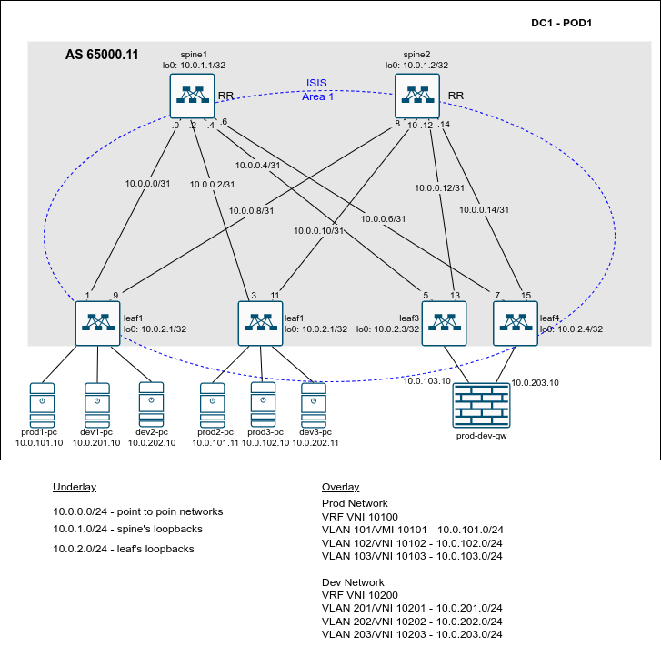

# Lesson 12
Домашняя работа к уроку № 11 "VxLAN. EVPN L3"

## Цели
* Построить overlay сети с помощью EVPN для обеспечения L3 связности внутри ЦОДа;

## Задачи
1. Разработать план IP нумерации для Датацентра (Для Underlay и Overlay сети) 
2. Выбрать протоколы маршрутизации и параметры протокола маршрутизации (зоны, тип соседства) для Underlay сети.
3. Выьрать тип соседства BGP для Overlay сети.
4. Выполнить настройку IP на интерфейсах коммутаторов. Проверить IP связность для Underlay сети.
5. Выполнить настройку протокола маршрутизации для Underlay сети на коммутаторах
6. Проверить установление соседства между коммутаторами и наличие маршрутов до префиксов loopback интерфейсов всех коммутаторов
7. Выполнить настройку протокола BGP для Overlay сети на коммутаторах
8. Проверить установление соседства между leaf коммутаторами, проверить распространения маршрутной информации для address family EVPN, проверить сетевую связность между ПК и маршрутизатором, выполняющим роль шлюза между сегментами

## Реализация
### План IP нумерации и распределение AS между коммутаторами
   10.0.0.0/24 - диапазон IP адресов для использования на линках между коммутаторами leaf и spine. На каждом линке планируется использовать сеть /31.
   10.0.1.0/24 - диапазон IP адресов для использования на Loopback интерфейсах коммутаторов уровня spine.
   10.0.2.0/24 - диапазон IP адресов для использования на Loopback интерфейсах коммутаторов уровня leaf.

### Выбор протокола маршрутизации для Underlay сети
для Underlay сети будем использовать протокол ISIS.
Для простоты конфигурации, и так как в нашем Датацентре не предполагается большого числа коммутаторов, планируется включить все коммутаторы в одну Area 1 протокола ISIS. Spine коммутаторы будут выполнять роль L2/L1 маршрутизаторов, leaf коммутаторы - L1 only маршрутизаторов. Для соединения PODов, super spine коммутаоры будут выполнять роль L2 only маршрутизаторов и находится в отдельной Aria. Данная схема позволит уменьшить базу LSDB на leaf коммутаторах.  

### Выбор тип соседства BGP для Overlay сети.
Для Overlay сети в пределах одно POD будем использовать соседство по протоколу iBGP. Spine коммутаторы будут выступать в роли Route Reflector.

### План IP нумерации для Overlay сети
В Overlay сети будем использовать два VRF: PROD и DEV. Маршрутизация между VRF не предполагается. Для "выхода" во внешнии сети будет использоваться МСЭ, подключенный к leaf коммутаторам, выполняющих функцию border leaf.
Для сервисных подключений в каждом VRF будем использовать два сегмента (VLAN 101 VLAN 102 - VRF PROD, VLAN 201 VLAN 202 - VRF DEV). Для подключения МСЭ, в каждом VRF,  будет использоваться отдельный сегмент (VLAN 103 - VRF PROD, VLAN 203 - VRF DEV).
IP адресация для сегментов будет следующая:
Prod Network
VRF VNI 10100
VLAN 101/VMI 10101 - 10.0.101.0/24
VLAN 102/VNI 10102 - 10.0.102.0/24
VLAN 103/VNI 10103 - 10.0.103.0/24

Dev Network
VRF VNI 10200
VLAN 201/VNI 10201 - 10.0.201.0/24
VLAN 202/VNI 10202 - 10.0.202.0/24
VLAN 203/VNI 10203 - 10.0.203.0/24

Настройки EVPN L2 будут выполняться в режиме VLAN Based Service.

## Сетевая схема


# Конфигурация коммутаторов
Конфигурация коммутаторов и МСЭ находится в каталоге lab/

## Проверка
С ПК в vrf PROD доступен интерфейс МСЭ и соседний ПК, в другом сегменте:

```
prod1-pc> show            

NAME   IP/MASK              GATEWAY                             GATEWAY
prod1-p10.0.101.10/24       10.0.101.1
       fe80::250:79ff:fe66:6806/64

prod1-pc> ping 10.0.103.10

84 bytes from 10.0.103.10 icmp_seq=1 ttl=253 time=16.677 ms
84 bytes from 10.0.103.10 icmp_seq=2 ttl=253 time=14.642 ms
84 bytes from 10.0.103.10 icmp_seq=3 ttl=253 time=14.236 ms
84 bytes from 10.0.103.10 icmp_seq=4 ttl=253 time=15.880 ms
84 bytes from 10.0.103.10 icmp_seq=5 ttl=253 time=16.720 ms

prod1-pc> ping 10.0.102.10

84 bytes from 10.0.102.10 icmp_seq=1 ttl=62 time=15.395 ms
84 bytes from 10.0.102.10 icmp_seq=2 ttl=62 time=13.079 ms
84 bytes from 10.0.102.10 icmp_seq=3 ttl=62 time=13.367 ms
84 bytes from 10.0.102.10 icmp_seq=4 ttl=62 time=13.708 ms
84 bytes from 10.0.102.10 icmp_seq=5 ttl=62 time=16.982 ms

prod1-pc> show arp

00:00:22:22:33:33  10.0.101.1 expires in 111 seconds 
```
Со второго ПК так-же доступен интерфейс МСЭ:
```
prod2-pc> ping 10.0.103.10

10.0.103.10 icmp_seq=1 timeout
84 bytes from 10.0.103.10 icmp_seq=2 ttl=253 time=14.777 ms
84 bytes from 10.0.103.10 icmp_seq=3 ttl=253 time=14.457 ms
84 bytes from 10.0.103.10 icmp_seq=4 ttl=253 time=15.666 ms
84 bytes from 10.0.103.10 icmp_seq=5 ttl=253 time=16.141 ms

prod2-pc> show arp

00:00:22:22:33:33  10.0.101.1 expires in 113 seconds 
```
Диагностическая информация с коммутаторов:

leaf1:
---
```
leaf1#show vxlan vtep detail 
Remote VTEPS for Vxlan1:

VTEP           Learned Via         MAC Address Learning       Tunnel Type(s) 
-------------- ------------------- -------------------------- -------------- 
10.0.2.2       control plane       control plane              flood          
10.0.2.3       control plane       control plane              unicast        

Total number of remote VTEPS:  2

leaf1#show bgp evpn route-type mac-ip 10.0.103.10 detail 
BGP routing table information for VRF default
Router identifier 10.0.2.1, local AS number 4259840011
BGP routing table entry for mac-ip 5000.000a.0001 10.0.103.10, Route Distinguisher: 10.0.2.3:10103
 Paths: 2 available
  Local
    10.0.2.3 from 10.0.1.1 (10.0.1.1)
      Origin IGP, metric -, localpref 100, weight 0, valid, internal, ECMP head, ECMP, best, ECMP contributor
      Originator: 10.0.2.3, Cluster list: 10.0.1.1 
      Extended Community: Route-Target-AS:11:10100 Route-Target-AS:11:10103 TunnelEncap:tunnelTypeVxlan EvpnRouterMac:50:00:00:15:f4:e8
      VNI: 10103 L3 VNI: 10100 ESI: 0000:0000:0000:0000:0000
  Local
    10.0.2.3 from 10.0.1.2 (10.0.1.2)
      Origin IGP, metric -, localpref 100, weight 0, valid, internal, ECMP, ECMP contributor
      Originator: 10.0.2.3, Cluster list: 10.0.1.2 
      Extended Community: Route-Target-AS:11:10100 Route-Target-AS:11:10103 TunnelEncap:tunnelTypeVxlan EvpnRouterMac:50:00:00:15:f4:e8
      VNI: 10103 L3 VNI: 10100 ESI: 0000:0000:0000:0000:0000

leaf1#show ip route vrf PROD 

VRF: PROD
Codes: C - connected, S - static, K - kernel, 
       O - OSPF, IA - OSPF inter area, E1 - OSPF external type 1,
       E2 - OSPF external type 2, N1 - OSPF NSSA external type 1,
       N2 - OSPF NSSA external type2, B - BGP, B I - iBGP, B E - eBGP,
       R - RIP, I L1 - IS-IS level 1, I L2 - IS-IS level 2,
       O3 - OSPFv3, A B - BGP Aggregate, A O - OSPF Summary,
       NG - Nexthop Group Static Route, V - VXLAN Control Service,
       DH - DHCP client installed default route, M - Martian,
       DP - Dynamic Policy Route, L - VRF Leaked,
       G  - gRIBI, RC - Route Cache Route

Gateway of last resort is not set

 B I      10.0.100.1/32 [200/0] via VTEP 10.0.2.3 VNI 10100 router-mac 50:00:00:15:f4:e8 local-interface Vxlan1
 C        10.0.101.0/24 is directly connected, Vlan101
 C        10.0.102.0/24 is directly connected, Vlan102
 B I      10.0.103.10/32 [200/0] via VTEP 10.0.2.3 VNI 10100 router-mac 50:00:00:15:f4:e8 local-interface Vxlan1
 B I      10.0.103.0/24 [200/0] via VTEP 10.0.2.3 VNI 10100 router-mac 50:00:00:15:f4:e8 local-interface Vxlan1
```
leaf3:
-----
```
leaf3#show vxlan vtep detail
Remote VTEPS for Vxlan1:

VTEP           Learned Via         MAC Address Learning       Tunnel Type(s) 
-------------- ------------------- -------------------------- -------------- 
10.0.2.1       control plane       control plane              unicast        
10.0.2.4       control plane       control plane              flood, unicast 

Total number of remote VTEPS:  2


leaf3#show bgp evpn route-type mac-ip 10.0.101.10 detail 
BGP routing table information for VRF default
Router identifier 10.0.2.3, local AS number 4259840011
BGP routing table entry for mac-ip 0050.7966.6806 10.0.101.10, Route Distinguisher: 10.0.2.1:10101
 Paths: 2 available
  Local
    10.0.2.1 from 10.0.1.2 (10.0.1.2)
      Origin IGP, metric -, localpref 100, weight 0, valid, internal, ECMP head, ECMP, best, ECMP contributor
      Originator: 10.0.2.1, Cluster list: 10.0.1.2 
      Extended Community: Route-Target-AS:11:10100 Route-Target-AS:11:10101 TunnelEncap:tunnelTypeVxlan EvpnRouterMac:50:00:00:d5:5d:c0
      VNI: 10101 L3 VNI: 10100 ESI: 0000:0000:0000:0000:0000
  Local
    10.0.2.1 from 10.0.1.1 (10.0.1.1)
      Origin IGP, metric -, localpref 100, weight 0, valid, internal, ECMP, ECMP contributor
      Originator: 10.0.2.1, Cluster list: 10.0.1.1 
      Extended Community: Route-Target-AS:11:10100 Route-Target-AS:11:10101 TunnelEncap:tunnelTypeVxlan EvpnRouterMac:50:00:00:d5:5d:c0
      VNI: 10101 L3 VNI: 10100 ESI: 0000:0000:0000:0000:0000

leaf3#show ip route vrf PROD

VRF: PROD
Codes: C - connected, S - static, K - kernel, 
       O - OSPF, IA - OSPF inter area, E1 - OSPF external type 1,
       E2 - OSPF external type 2, N1 - OSPF NSSA external type 1,
       N2 - OSPF NSSA external type2, B - BGP, B I - iBGP, B E - eBGP,
       R - RIP, I L1 - IS-IS level 1, I L2 - IS-IS level 2,
       O3 - OSPFv3, A B - BGP Aggregate, A O - OSPF Summary,
       NG - Nexthop Group Static Route, V - VXLAN Control Service,
       DH - DHCP client installed default route, M - Martian,
       DP - Dynamic Policy Route, L - VRF Leaked,
       G  - gRIBI, RC - Route Cache Route

Gateway of last resort is not set

 C        10.0.100.1/32 is directly connected, Loopback2
 B I      10.0.101.10/32 [200/0] via VTEP 10.0.2.1 VNI 10100 router-mac 50:00:00:d5:5d:c0 local-interface Vxlan1
 B I      10.0.101.11/32 [200/0] via VTEP 10.0.2.2 VNI 10100 router-mac 50:00:00:03:37:66 local-interface Vxlan1
 B I      10.0.101.0/24 [200/0] via VTEP 10.0.2.1 VNI 10100 router-mac 50:00:00:d5:5d:c0 local-interface Vxlan1
                                via VTEP 10.0.2.2 VNI 10100 router-mac 50:00:00:03:37:66 local-interface Vxlan1
 B I      10.0.102.10/32 [200/0] via VTEP 10.0.2.2 VNI 10100 router-mac 50:00:00:03:37:66 local-interface Vxlan1
 B I      10.0.102.0/24 [200/0] via VTEP 10.0.2.1 VNI 10100 router-mac 50:00:00:d5:5d:c0 local-interface Vxlan1
                                via VTEP 10.0.2.2 VNI 10100 router-mac 50:00:00:03:37:66 local-interface Vxlan1
 C        10.0.103.0/24 is directly connected, Vlan103

```

С МСЭ доступны ПК в различных сегментах vrf PROD

prod-dev-gw
----
```
prod-dev-gw# ping 10.0.101.10
Type escape sequence to abort.
Sending 5, 100-byte ICMP Echos to 10.0.101.10, timeout is 2 seconds:
!!!!!
Success rate is 100 percent (5/5), round-trip min/avg/max = 20/34/90 ms
prod-dev-gw# ping 10.0.101.11
Type escape sequence to abort.
Sending 5, 100-byte ICMP Echos to 10.0.101.11, timeout is 2 seconds:
!!!!!
Success rate is 100 percent (5/5), round-trip min/avg/max = 10/20/30 ms
prod-dev-gw# ping 10.0.102.10
Type escape sequence to abort.
Sending 5, 100-byte ICMP Echos to 10.0.102.10, timeout is 2 seconds:
!!!!!
Success rate is 100 percent (5/5), round-trip min/avg/max = 10/20/40 ms
```
