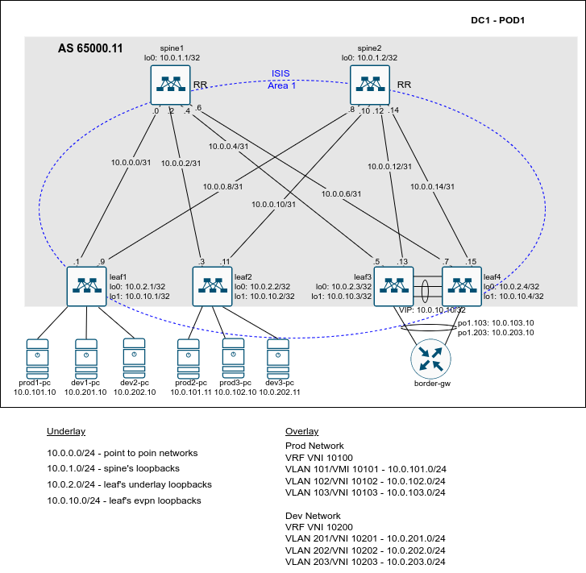

# Lesson 13
Домашняя работа к уроку № 13 "VxLAN. EVPN VPC"

## Цели
* Настроить отказоустойчивое подключение клиентов с использованием технологи VPC (MLAG)

## Задачи
1. Разработать план IP нумерации для Датацентра (Для Underlay и Overlay сети) 
2. Выбрать протоколы маршрутизации и параметры протокола маршрутизации (зоны, тип соседства) для Underlay сети.
3. Выьрать тип соседства BGP для Overlay сети.
4. Выполнить настройку IP на интерфейсах коммутаторов. Проверить IP связность для Underlay сети.
5. Выполнить настройку коммутаторов leaf3 и leaf4 для объединения в MLAG пару.
6. Выполнить настройку протокола маршрутизации для Underlay сети на коммутаторах.
7. Проверить установление соседства между коммутаторами и наличие маршрутов до префиксов loopback интерфейсов всех коммутаторов.
8. Выполнить настройку протокола BGP для Overlay сети на коммутаторах.
9. Проверить установление соседства между leaf коммутаторами, проверить распространения маршрутной информации для address family EVPN, проверить сетевую связность между ПК и маршрутизатором, выполняющим роль шлюза между сегментами.

## Реализация
### План IP нумерации и распределение AS между коммутаторами
   10.0.0.0/24 - диапазон IP адресов для использования на линках между коммутаторами leaf и spine. На каждом линке планируется использовать сеть /31.
   10.0.1.0/24 - диапазон IP адресов для использования на Loopback интерфейсах коммутаторов уровня spine.
   10.0.2.0/24 - диапазон IP адресов для использования на Loopback интерфейсах коммутаторов уровня leaf.
   10.0.10.0/24 - диапазон IP адресов для использования на Loopback интерфейсах коммутаторов уровня leaf для источкиков VxLAN тунелей.

### Выбор протокола маршрутизации для Underlay сети
для Underlay сети будем использовать протокол ISIS.
Для простоты конфигурации, и так как в нашем Датацентре не предполагается большого числа коммутаторов, планируется включить все коммутаторы в одну Area 1 протокола ISIS. Все коммутаторы будут выполнять роль L2 маршрутизаторов.  

### Выбор тип соседства BGP для Overlay сети.
Для Overlay сети в пределах одно POD будем использовать соседство по протоколу iBGP. Spine коммутаторы будут выступать в роли Route Reflector.

### План IP нумерации для Overlay сети
В Overlay сети будем использовать два VRF: PROD и DEV. Маршрутизация между VRF не предполагается. Для "выхода" во внешнии сети будет использоваться маршрутизатор, подключенный к leaf коммутаторам, выполняющих функцию border leaf.
Для сервисных подключений в каждом VRF будем использовать два сегмента (VLAN 101 VLAN 102 - VRF PROD, VLAN 201 VLAN 202 - VRF DEV). Для подключения маршрутизатора, в каждом VRF,  будет использоваться отдельный сегмент (VLAN 103 - VRF PROD, VLAN 203 - VRF DEV).
IP адресация для сегментов будет следующая:
Prod Network
VRF VNI 10100
VLAN 101/VMI 10101 - 10.0.101.0/24
VLAN 102/VNI 10102 - 10.0.102.0/24
VLAN 103/VNI 10103 - 10.0.103.0/24

Dev Network
VRF VNI 10200
VLAN 201/VNI 10201 - 10.0.201.0/24
VLAN 202/VNI 10202 - 10.0.202.0/24
VLAN 203/VNI 10203 - 10.0.203.0/24

Настройки EVPN L2 будут выполняться в режиме VLAN Based Service.

## Сетевая схема


# Конфигурация коммутаторов
Конфигурация коммутаторов и граничного маршрутизатора находится в каталоге lab/

## Проверка
1. Проверка доступности ПК между собой и доступность граничного маршрутизатора в каждом из vrf: 

### VRF: PROD - prod1-pc

```
prod1-pc> show

NAME   IP/MASK              GATEWAY                             GATEWAY
prod1-p10.0.101.10/24       10.0.101.1
       fe80::250:79ff:fe66:6807/64

prod1-pc> ping 10.0.101.11

84 bytes from 10.0.101.11 icmp_seq=1 ttl=64 time=61.088 ms
84 bytes from 10.0.101.11 icmp_seq=2 ttl=64 time=20.664 ms
84 bytes from 10.0.101.11 icmp_seq=3 ttl=64 time=29.623 ms
84 bytes from 10.0.101.11 icmp_seq=4 ttl=64 time=16.061 ms
84 bytes from 10.0.101.11 icmp_seq=5 ttl=64 time=13.539 ms

prod1-pc> ping 10.0.102.10

84 bytes from 10.0.102.10 icmp_seq=1 ttl=62 time=354.446 ms
84 bytes from 10.0.102.10 icmp_seq=2 ttl=62 time=17.681 ms
84 bytes from 10.0.102.10 icmp_seq=3 ttl=62 time=15.611 ms
84 bytes from 10.0.102.10 icmp_seq=4 ttl=62 time=16.318 ms
84 bytes from 10.0.102.10 icmp_seq=5 ttl=62 time=22.958 ms

prod1-pc> ping 10.0.103.10

84 bytes from 10.0.103.10 icmp_seq=1 ttl=253 time=25.505 ms
84 bytes from 10.0.103.10 icmp_seq=2 ttl=253 time=22.094 ms
84 bytes from 10.0.103.10 icmp_seq=3 ttl=253 time=18.286 ms
84 bytes from 10.0.103.10 icmp_seq=4 ttl=253 time=17.760 ms
84 bytes from 10.0.103.10 icmp_seq=5 ttl=253 time=20.154 ms

prod1-pc> show arp

00:50:79:66:68:08  10.0.101.11 expires in 101 seconds 
00:00:22:22:33:33  10.0.101.1 expires in 110 seconds 
```
### VRF: PROD - prod2-pc
```
prod2-pc> show

NAME   IP/MASK              GATEWAY                             GATEWAY
prod2-p10.0.101.11/24       10.0.101.1
       fe80::250:79ff:fe66:6808/64

prod2-pc> ping 10.0.101.10

84 bytes from 10.0.101.10 icmp_seq=1 ttl=64 time=18.329 ms
84 bytes from 10.0.101.10 icmp_seq=2 ttl=64 time=13.808 ms
84 bytes from 10.0.101.10 icmp_seq=3 ttl=64 time=14.003 ms
84 bytes from 10.0.101.10 icmp_seq=4 ttl=64 time=18.509 ms
84 bytes from 10.0.101.10 icmp_seq=5 ttl=64 time=17.190 ms

prod2-pc> ping 10.0.102.10

84 bytes from 10.0.102.10 icmp_seq=1 ttl=63 time=4.678 ms
84 bytes from 10.0.102.10 icmp_seq=2 ttl=63 time=5.767 ms
84 bytes from 10.0.102.10 icmp_seq=3 ttl=63 time=6.708 ms
84 bytes from 10.0.102.10 icmp_seq=4 ttl=63 time=6.928 ms
84 bytes from 10.0.102.10 icmp_seq=5 ttl=63 time=5.398 ms

prod2-pc> ping 10.0.103.10

84 bytes from 10.0.103.10 icmp_seq=1 ttl=253 time=40.936 ms
84 bytes from 10.0.103.10 icmp_seq=2 ttl=253 time=18.412 ms
84 bytes from 10.0.103.10 icmp_seq=3 ttl=253 time=16.567 ms
84 bytes from 10.0.103.10 icmp_seq=4 ttl=253 time=15.823 ms
84 bytes from 10.0.103.10 icmp_seq=5 ttl=253 time=23.054 ms

prod2-pc> show arp

00:50:79:66:68:07  10.0.101.10 expires in 30 seconds 
00:00:22:22:33:33  10.0.101.1 expires in 99 seconds 
```
### VRF: PROD - prod3-pc
```
prod3-pc> show

NAME   IP/MASK              GATEWAY                             GATEWAY
prod3-p10.0.102.10/24       10.0.102.1
       fe80::250:79ff:fe66:6809/64

prod3-pc> ping 10.0.101.10

84 bytes from 10.0.101.10 icmp_seq=1 ttl=62 time=20.127 ms
84 bytes from 10.0.101.10 icmp_seq=2 ttl=62 time=22.201 ms
84 bytes from 10.0.101.10 icmp_seq=3 ttl=62 time=19.074 ms
84 bytes from 10.0.101.10 icmp_seq=4 ttl=62 time=21.296 ms
84 bytes from 10.0.101.10 icmp_seq=5 ttl=62 time=22.258 ms

prod3-pc> ping 10.0.101.11

84 bytes from 10.0.101.11 icmp_seq=1 ttl=63 time=5.949 ms
84 bytes from 10.0.101.11 icmp_seq=2 ttl=63 time=7.158 ms
84 bytes from 10.0.101.11 icmp_seq=3 ttl=63 time=5.943 ms
84 bytes from 10.0.101.11 icmp_seq=4 ttl=63 time=5.693 ms
84 bytes from 10.0.101.11 icmp_seq=5 ttl=63 time=5.789 ms

prod3-pc> ping 10.0.103.10

84 bytes from 10.0.103.10 icmp_seq=1 ttl=253 time=18.718 ms
84 bytes from 10.0.103.10 icmp_seq=2 ttl=253 time=15.365 ms
84 bytes from 10.0.103.10 icmp_seq=3 ttl=253 time=17.093 ms
84 bytes from 10.0.103.10 icmp_seq=4 ttl=253 time=18.429 ms
84 bytes from 10.0.103.10 icmp_seq=5 ttl=253 time=16.167 ms

prod3-pc> show arp

00:00:22:22:33:33  10.0.102.1 expires in 96 seconds 
```
### VRF: DEV - dev1-pc
```
ev1-pc> show

NAME   IP/MASK              GATEWAY                             GATEWAY
dev1-pc10.0.201.10/24       10.0.201.1
       fe80::250:79ff:fe66:680b/64

dev1-pc> ping 10.0.202.10

84 bytes from 10.0.202.10 icmp_seq=1 ttl=63 time=103.243 ms
84 bytes from 10.0.202.10 icmp_seq=2 ttl=63 time=7.994 ms
84 bytes from 10.0.202.10 icmp_seq=3 ttl=63 time=8.923 ms
84 bytes from 10.0.202.10 icmp_seq=4 ttl=63 time=8.065 ms
84 bytes from 10.0.202.10 icmp_seq=5 ttl=63 time=12.111 ms

dev1-pc> ping 10.0.202.11

84 bytes from 10.0.202.11 icmp_seq=1 ttl=62 time=16.771 ms
84 bytes from 10.0.202.11 icmp_seq=2 ttl=62 time=17.219 ms
84 bytes from 10.0.202.11 icmp_seq=3 ttl=62 time=26.063 ms
84 bytes from 10.0.202.11 icmp_seq=4 ttl=62 time=26.368 ms
84 bytes from 10.0.202.11 icmp_seq=5 ttl=62 time=14.579 ms

dev1-pc> ping 10.0.203.10

84 bytes from 10.0.203.10 icmp_seq=1 ttl=253 time=93.864 ms
84 bytes from 10.0.203.10 icmp_seq=2 ttl=253 time=20.562 ms
84 bytes from 10.0.203.10 icmp_seq=3 ttl=253 time=19.686 ms
84 bytes from 10.0.203.10 icmp_seq=4 ttl=253 time=16.470 ms
84 bytes from 10.0.203.10 icmp_seq=5 ttl=253 time=18.045 ms

dev1-pc> show arp

00:00:22:22:33:33  10.0.201.1 expires in 49 seconds 
```
### VRF: DEV - dev2-pc
```
dev2-pc> show

NAME   IP/MASK              GATEWAY                             GATEWAY
dev2-pc10.0.202.10/24       10.0.202.1
       fe80::250:79ff:fe66:680c/64

dev2-pc> ping 10.0.201.10                    

84 bytes from 10.0.201.10 icmp_seq=1 ttl=63 time=8.630 ms
84 bytes from 10.0.201.10 icmp_seq=2 ttl=63 time=7.781 ms
84 bytes from 10.0.201.10 icmp_seq=3 ttl=63 time=8.121 ms
84 bytes from 10.0.201.10 icmp_seq=4 ttl=63 time=7.472 ms
84 bytes from 10.0.201.10 icmp_seq=5 ttl=63 time=7.194 ms

dev2-pc> ping 10.0.202.11

84 bytes from 10.0.202.11 icmp_seq=1 ttl=64 time=13.970 ms
84 bytes from 10.0.202.11 icmp_seq=2 ttl=64 time=13.049 ms
84 bytes from 10.0.202.11 icmp_seq=3 ttl=64 time=14.995 ms
84 bytes from 10.0.202.11 icmp_seq=4 ttl=64 time=12.889 ms
84 bytes from 10.0.202.11 icmp_seq=5 ttl=64 time=16.820 ms

dev2-pc> ping 10.0.203.10

84 bytes from 10.0.203.10 icmp_seq=1 ttl=253 time=21.594 ms
84 bytes from 10.0.203.10 icmp_seq=2 ttl=253 time=21.088 ms
84 bytes from 10.0.203.10 icmp_seq=3 ttl=253 time=18.720 ms
84 bytes from 10.0.203.10 icmp_seq=4 ttl=253 time=22.130 ms
84 bytes from 10.0.203.10 icmp_seq=5 ttl=253 time=17.397 ms

dev2-pc> show arp

00:00:22:22:33:33  10.0.202.1 expires in 42 seconds 
00:50:79:66:68:0d  10.0.202.11 expires in 102 seconds 
```
### VRF: DEV - dev3-pc
```
dev3-pc> show

NAME   IP/MASK              GATEWAY                             GATEWAY
dev3-pc10.0.202.11/24       10.0.202.1
       fe80::250:79ff:fe66:680d/64

dev3-pc> ping 10.0.201.10

84 bytes from 10.0.201.10 icmp_seq=1 ttl=62 time=29.587 ms
84 bytes from 10.0.201.10 icmp_seq=2 ttl=62 time=23.784 ms
84 bytes from 10.0.201.10 icmp_seq=3 ttl=62 time=16.996 ms
84 bytes from 10.0.201.10 icmp_seq=4 ttl=62 time=26.829 ms
84 bytes from 10.0.201.10 icmp_seq=5 ttl=62 time=23.811 ms

dev3-pc> ping 10.0.202.10

84 bytes from 10.0.202.10 icmp_seq=1 ttl=64 time=16.429 ms
84 bytes from 10.0.202.10 icmp_seq=2 ttl=64 time=15.046 ms
84 bytes from 10.0.202.10 icmp_seq=3 ttl=64 time=13.114 ms
84 bytes from 10.0.202.10 icmp_seq=4 ttl=64 time=20.150 ms
84 bytes from 10.0.202.10 icmp_seq=5 ttl=64 time=15.365 ms

dev3-pc> ping 10.0.203.10

84 bytes from 10.0.203.10 icmp_seq=1 ttl=253 time=18.972 ms
84 bytes from 10.0.203.10 icmp_seq=2 ttl=253 time=18.988 ms
84 bytes from 10.0.203.10 icmp_seq=3 ttl=253 time=18.462 ms
84 bytes from 10.0.203.10 icmp_seq=4 ttl=253 time=17.652 ms
84 bytes from 10.0.203.10 icmp_seq=5 ttl=253 time=16.853 ms

dev3-pc> show arp

00:00:22:22:33:33  10.0.202.1 expires in 96 seconds 
00:50:79:66:68:0c  10.0.202.10 expires in 105 seconds 
```

2. Проверка доступности каждого PC в каждом vrf c граничного маршрутизатора:
```
border-gw#ping vrf PROD 10.0.101.10
Type escape sequence to abort.
Sending 5, 100-byte ICMP Echos to 10.0.101.10, timeout is 2 seconds:
!!!!!
Success rate is 100 percent (5/5), round-trip min/avg/max = 18/19/23 ms
border-gw#ping vrf PROD 10.0.101.11
Type escape sequence to abort.
Sending 5, 100-byte ICMP Echos to 10.0.101.11, timeout is 2 seconds:
!!!!!
Success rate is 100 percent (5/5), round-trip min/avg/max = 16/17/19 ms
border-gw#ping vrf PROD 10.0.102.10
Type escape sequence to abort.
Sending 5, 100-byte ICMP Echos to 10.0.102.10, timeout is 2 seconds:
!!!!!
Success rate is 100 percent (5/5), round-trip min/avg/max = 17/84/352 ms
border-gw#ping vrf DEV 10.0.201.10 
Type escape sequence to abort.
Sending 5, 100-byte ICMP Echos to 10.0.201.10, timeout is 2 seconds:
!!!!!
Success rate is 100 percent (5/5), round-trip min/avg/max = 21/27/45 ms
border-gw#ping vrf DEV 10.0.202.10
Type escape sequence to abort.
Sending 5, 100-byte ICMP Echos to 10.0.202.10, timeout is 2 seconds:
!!!!!
Success rate is 100 percent (5/5), round-trip min/avg/max = 17/20/30 ms
border-gw#ping vrf DEV 10.0.202.11
Type escape sequence to abort.
Sending 5, 100-byte ICMP Echos to 10.0.202.11, timeout is 2 seconds:
!!!!!
Success rate is 100 percent (5/5), round-trip min/avg/max = 17/19/26 ms
```

3. Проверка настрйоки MLAG
```
leaf3#show mlag 
MLAG Configuration:               
domain-id                          :                  10
local-interface                    :            Vlan4094
peer-address                       :        10.255.255.4
peer-link                          :      Port-Channel10
hb-peer-address                    :          172.16.0.4
hb-peer-vrf                        :                mgmt
peer-config                        :          consistent
                                                        
MLAG Status:                      
state                              :              Active
negotiation status                 :           Connected
peer-link status                   :                  Up
local-int status                   :                  Up
system-id                          :   52:00:00:15:f4:e8
dual-primary detection             :          Configured
dual-primary interface errdisabled :               False
                                                        
MLAG Ports:                       
Disabled                           :                   0
Configured                         :                   0
Inactive                           :                   0
Active-partial                     :                   0
Active-full                        :                   1

leaf4#show mlag 
MLAG Configuration:               
domain-id                          :                  10
local-interface                    :            Vlan4094
peer-address                       :        10.255.255.3
peer-link                          :      Port-Channel10
hb-peer-address                    :          172.16.0.3
hb-peer-vrf                        :                mgmt
peer-config                        :          consistent
                                                        
MLAG Status:                      
state                              :              Active
negotiation status                 :           Connected
peer-link status                   :                  Up
local-int status                   :                  Up
system-id                          :   52:00:00:15:f4:e8
dual-primary detection             :          Configured
dual-primary interface errdisabled :               False
                                                        
MLAG Ports:                       
Disabled                           :                   0
Configured                         :                   0
Inactive                           :                   0
Active-partial                     :                   0
Active-full                        :                   1
```

4. Просмотре информации на каждом коммутаторе:

### На коммутаторе leaf1:
```
leaf1#show interfaces vxlan 1
Vxlan1 is up, line protocol is up (connected)
  Hardware is Vxlan
  Source interface is Loopback1 and is active with 10.0.10.1
  Replication/Flood Mode is headend with Flood List Source: EVPN
  Remote MAC learning via EVPN
  VNI mapping to VLANs
  Static VLAN to VNI mapping is 
    [101, 10101]      [102, 10102]      [201, 10201]      [202, 10202]     
   
  Dynamic VLAN to VNI mapping for 'evpn' is
    [4093, 10100]     [4094, 10200]    
  Note: All Dynamic VLANs used by VCS are internal VLANs.
        Use 'show vxlan vni' for details.
  Static VRF to VNI mapping is 
   [DEV, 10200]
   [PROD, 10100]
  Headend replication flood vtep list is:
   101 10.0.10.2      
   102 10.0.10.2      
   201 10.0.10.2      
   202 10.0.10.2      
  MLAG Shared Router MAC is 0000.0000.0000

leaf1#show vxlan vtep 
Remote VTEPS for Vxlan1:

VTEP             Tunnel Type(s) 
---------------- -------------- 
10.0.10.2        unicast, flood 
10.0.10.10       unicast        

Total number of remote VTEPS:  2

leaf1#show bgp evpn summary 
BGP summary information for VRF default
Router identifier 10.0.2.1, local AS number 4259840011
Neighbor Status Codes: m - Under maintenance
  Neighbor         V AS           MsgRcvd   MsgSent  InQ OutQ  Up/Down State   PfxRcd PfxAcc
  10.0.1.1         4 4259840011      1899      1859    0    0 00:52:19 Estab   30     30
  10.0.1.2         4 4259840011      1904      1853    0    0 00:52:19 Estab   30     30
```
Информация об IP адресах маршрутизатора, подключенного к MLAG паре:
```
leaf1#show bgp evpn route-type mac-ip 10.0.103.10 detail 
BGP routing table information for VRF default
Router identifier 10.0.2.1, local AS number 4259840011
BGP routing table entry for mac-ip 001e.7a82.f1c0 10.0.103.10, Route Distinguisher: 10.0.2.3:10103
 Paths: 2 available
  Local
    10.0.10.10 from 10.0.1.1 (10.0.1.1)
      Origin IGP, metric -, localpref 100, wleaf4#
eight 0, valid, internal, ECMP head, ECMP, best, ECMP contributor
      Originator: 10.0.2.3, Cluster list: 10.0.1.1 
      Extended Community: Route-Target-AS:11:10100 Route-Target-AS:11:10103 TunnelEncap:tunnelTypeVxlan EvpnRouterMac:52:00:00:15:f4:e8
      VNI: 10103 L3 VNI: 10100 ESI: 0000:0000:0000:0000:0000
  Local
    10.0.10.10 from 10.0.1.2 (10.0.1.2)
      Origin IGP, metric -, localpref 100, weight 0, valid, internal, ECMP, ECMP contributor
      Originator: 10.0.2.3, Cluster list: 10.0.1.2 
      Extended Community: Route-Target-AS:11:10100 Route-Target-AS:11:10103 TunnelEncap:tunnelTypeVxlan EvpnRouterMac:52:00:00:15:f4:e8
      VNI: 10103 L3 VNI: 10100 ESI: 0000:0000:0000:0000:0000
BGP routing table entry for mac-ip 001e.7a82.f1c0 10.0.103.10, Route Distinguisher: 10.0.2.4:10103
 Paths: 2 available
  Local
    10.0.10.10 from 10.0.1.1 (10.0.1.1)
      Origin IGP, metric -, localpref 100, weight 0, valid, internal, ECMP head, ECMP, best, ECMP contributor
      Originator: 10.0.2.4, Cluster list: 10.0.1.1 
      Extended Community: Route-Target-AS:11:10100 Route-Target-AS:11:10103 TunnelEncap:tunnelTypeVxlan EvpnRouterMac:52:00:00:15:f4:e8
      VNI: 10103 L3 VNI: 10100 ESI: 0000:0000:0000:0000:0000
  Local
    10.0.10.10 from 10.0.1.2 (10.0.1.2)
      Origin IGP, metric -, localpref 100, weight 0, valid, internal, ECMP, ECMP contributor
      Originator: 10.0.2.4, Cluster list: 10.0.1.2 
      Extended Community: Route-Target-AS:11:10100 Route-Target-AS:11:10103 TunnelEncap:tunnelTypeVxlan EvpnRouterMac:52:00:00:15:f4:e8
      VNI: 10103 L3 VNI: 10100 ESI: 0000:0000:0000:0000:0000

leaf1#show bgp evpn route-type mac-ip 10.0.203.10 detail
BGP routing table information for VRF default
Router identifier 10.0.2.1, local AS number 4259840011
BGP routing table entry for mac-ip 001e.7a82.f1c0 10.0.203.10, Route Distinguisher: 10.0.2.3:10203
 Paths: 2 available
  Local
    10.0.10.10 from 10.0.1.1 (10.0.1.1)
      Origin IGP, metric -, localpref 100, weight 0, valid, internal, ECMP head, ECMP, best, ECMP contributor
      Originator: 10.0.2.3, Cluster list: 10.0.1.1 
      Extended Community: Route-Target-AS:11:10200 Route-Target-AS:11:10203 TunnelEncap:tunnelTypeVxlan EvpnRouterMac:52:00:00:15:f4:e8
      VNI: 10203 L3 VNI: 10200 ESI: 0000:0000:0000:0000:0000
  Local
    10.0.10.10 from 10.0.1.2 (10.0.1.2)
      Origin IGP, metric -, localpref 100, weight 0, valid, internal, ECMP, ECMP contributor
      Originator: 10.0.2.3, Cluster list: 10.0.1.2 
      Extended Community: Route-Target-AS:11:10200 Route-Target-AS:11:10203 TunnelEncap:tunnelTypeVxlan EvpnRouterMac:52:00:00:15:f4:e8
      VNI: 10203 L3 VNI: 10200 ESI: 0000:0000:0000:0000:0000
BGP routing table entry for mac-ip 001e.7a82.f1c0 10.0.203.10, Route Distinguisher: 10.0.2.4:10203
 Paths: 2 available
  Local
    10.0.10.10 from 10.0.1.2 (10.0.1.2)
      Origin IGP, metric -, localpref 100, weight 0, valid, internal, ECMP head, ECMP, best, ECMP contributor
      Originator: 10.0.2.4, Cluster list: 10.0.1.2 
      Extended Community: Route-Target-AS:11:10200 Route-Target-AS:11:10203 TunnelEncap:tunnelTypeVxlan EvpnRouterMac:52:00:00:15:f4:e8
      VNI: 10203 L3 VNI: 10200 ESI: 0000:0000:0000:0000:0000
  Local
    10.0.10.10 from 10.0.1.1 (10.0.1.1)
      Origin IGP, metric -, localpref 100, weight 0, valid, internal, ECMP, ECMP contributor
      Originator: 10.0.2.4, Cluster list: 10.0.1.1 
      Extended Community: Route-Target-AS:11:10200 Route-Target-AS:11:10203 TunnelEncap:tunnelTypeVxlan EvpnRouterMac:52:00:00:15:f4:e8
      VNI: 10203 L3 VNI: 10200 ESI: 0000:0000:0000:0000:0000
```

### На коммутаторе leaf2:
```
leaf2#show int vxlan 1
Vxlan1 is up, line protocol is up (connected)
  Hardware is Vxlan
  Source interface is Loopback1 and is active with 10.0.10.2
  Replication/Flood Mode is headend with Flood List Source: EVPN
  Remote MAC learning via EVPN
  VNI mapping to VLANs
  Static VLAN to VNI mapping is 
    [101, 10101]      [102, 10102]      [201, 10201]      [202, 10202]     
   
  Dynamic VLAN to VNI mapping for 'evpn' is
    [4093, 10200]     [4094, 10100]    
  Note: All Dynamic VLANs used by VCS are internal VLANs.
        Use 'show vxlan vni' for details.
  Static VRF to VNI mapping is 
   [DEV, 10200]
   [PROD, 10100]
  Headend replication flood vtep list is:
   101 10.0.10.1      
   102 10.0.10.1      
   201 10.0.10.1      
   202 10.0.10.1      
  MLAG Shared Router MAC is 0000.0000.0000

leaf2#show vxlan vtep 
Remote VTEPS for Vxlan1:

VTEP             Tunnel Type(s) 
---------------- -------------- 
10.0.10.1        flood, unicast 
10.0.10.10       unicast        

Total number of remote VTEPS:  2

leaf2#show bgp evpn summary 
BGP summary information for VRF default
Router identifier 10.0.2.2, local AS number 4259840011
Neighbor Status Codes: m - Under maintenance
  Neighbor         V AS           MsgRcvd   MsgSent  InQ OutQ  Up/Down State   PfxRcd PfxAcc
  10.0.1.1         4 4259840011      1976      1941    0    0 00:54:34 Estab   24     24
  10.0.1.2         4 4259840011      1970      1948    0    0 00:54:25 Estab   24     24
```
Информация об IP адресах маршрутизатора, подключенного к MLAG паре:
```
leaf2#show bgp evpn route-type mac-ip 10.0.103.10 detail
BGP routing table information for VRF default
Router identifier 10.0.2.2, local AS number 4259840011
BGP routing table entry for mac-ip 001e.7a82.f1c0 10.0.103.10, Route Distinguisher: 10.0.2.3:10103
 Paths: 2 available
  Local
    10.0.10.10 from 10.0.1.1 (10.0.1.1)
      Origin IGP, metric -, localpref 100, weight 0, valid, internal, ECMP head, ECMP, best, ECMP contributor
      Originator: 10.0.2.3, Cluster list: 10.0.1.1 
      Extended Community: Route-Target-AS:11:10100 Route-Target-AS:11:10103 TunnelEncap:tunnelTypeVxlan EvpnRouterMac:52:00:00:15:f4:e8
      VNI: 10103 L3 VNI: 10100 ESI: 0000:0000:0000:0000:0000
  Local
    10.0.10.10 from 10.0.1.2 (10.0.1.2)
      Origin IGP, metric -, localpref 100, weight 0, valid, internal, ECMP, ECMP contributor
      Originator: 10.0.2.3, Cluster list: 10.0.1.2 
      Extended Community: Route-Target-AS:11:10100 Route-Target-AS:11:10103 TunnelEncap:tunnelTypeVxlan EvpnRouterMac:52:00:00:15:f4:e8
      VNI: 10103 L3 VNI: 10100 ESI: 0000:0000:0000:0000:0000
BGP routing table entry for mac-ip 001e.7a82.f1c0 10.0.103.10, Route Distinguisher: 10.0.2.4:10103
 Paths: 2 available
  Local
    10.0.10.10 from 10.0.1.1 (10.0.1.1)
      Origin IGP, metric -, localpref 100, weight 0, valid, internal, ECMP head, ECMP, best, ECMP contributor
      Originator: 10.0.2.4, Cluster list: 10.0.1.1 
      Extended Community: Route-Target-AS:11:10100 Route-Target-AS:11:10103 TunnelEncap:tunnelTypeVxlan EvpnRouterMac:52:00:00:15:f4:e8
      VNI: 10103 L3 VNI: 10100 ESI: 0000:0000:0000:0000:0000
  Local
    10.0.10.10 from 10.0.1.2 (10.0.1.2)
      Origin IGP, metric -, localpref 100, weight 0, valid, internal, ECMP, ECMP contributor
      Originator: 10.0.2.4, Cluster list: 10.0.1.2 
      Extended Community: Route-Target-AS:11:10100 Route-Target-AS:11:10103 TunnelEncap:tunnelTypeVxlan EvpnRouterMac:52:00:00:15:f4:e8
      VNI: 10103 L3 VNI: 10100 ESI: 0000:0000:0000:0000:0000
leaf2#show bgp evpn route-type mac-ip 10.0.203.10 detail
BGP routing table information for VRF default
Router identifier 10.0.2.2, local AS number 4259840011
BGP routing table entry for mac-ip 001e.7a82.f1c0 10.0.203.10, Route Distinguisher: 10.0.2.3:10203
 Paths: 2 available
  Local
    10.0.10.10 from 10.0.1.1 (10.0.1.1)
      Origin IGP, metric -, localpref 100, weight 0, valid, internal, ECMP head, ECMP, best, ECMP contributor
      Originator: 10.0.2.3, Cluster list: 10.0.1.1 
      Extended Community: Route-Target-AS:11:10200 Route-Target-AS:11:10203 TunnelEncap:tunnelTypeVxlan EvpnRouterMac:52:00:00:15:f4:e8
      VNI: 10203 L3 VNI: 10200 ESI: 0000:0000:0000:0000:0000
  Local
    10.0.10.10 from 10.0.1.2 (10.0.1.2)
      Origin IGP, metric -, localpref 100, weight 0, valid, internal, ECMP, ECMP contributor
      Originator: 10.0.2.3, Cluster list: 10.0.1.2 
      Extended Community: Route-Target-AS:11:10200 Route-Target-AS:11:10203 TunnelEncap:tunnelTypeVxlan EvpnRouterMac:52:00:00:15:f4:e8
      VNI: 10203 L3 VNI: 10200 ESI: 0000:0000:0000:0000:0000
BGP routing table entry for mac-ip 001e.7a82.f1c0 10.0.203.10, Route Distinguisher: 10.0.2.4:10203
 Paths: 2 available
  Local
    10.0.10.10 from 10.0.1.1 (10.0.1.1)
      Origin IGP, metric -, localpref 100, weight 0, valid, internal, ECMP head, ECMP, best, ECMP contributor
      Originator: 10.0.2.4, Cluster list: 10.0.1.1 
      Extended Community: Route-Target-AS:11:10200 Route-Target-AS:11:10203 TunnelEncap:tunnelTypeVxlan EvpnRouterMac:52:00:00:15:f4:e8
      VNI: 10203 L3 VNI: 10200 ESI: 0000:0000:0000:0000:0000
  Local
    10.0.10.10 from 10.0.1.2 (10.0.1.2)
      Origin IGP, metric -, localpref 100, weight 0, valid, internal, ECMP, ECMP contributor
      Originator: 10.0.2.4, Cluster list: 10.0.1.2 
      Extended Community: Route-Target-AS:11:10200 Route-Target-AS:11:10203 TunnelEncap:tunnelTypeVxlan EvpnRouterMac:52:00:00:15:f4:e8
      VNI: 10203 L3 VNI: 10200 ESI: 0000:0000:0000:0000:0000
```

### На коммутаторе leaf3:
 Статус MLAG пары:
```
leaf3#show mlag 
MLAG Configuration:               
domain-id                          :                  10
local-interface                    :            Vlan4094
peer-address                       :        10.255.255.4
peer-link                          :      Port-Channel10
hb-peer-address                    :          172.16.0.4
hb-peer-vrf                        :                mgmt
peer-config                        :          consistent
                                                        
MLAG Status:                      
state                              :              Active
negotiation status                 :           Connected
peer-link status                   :                  Up
local-int status                   :                  Up
system-id                          :   52:00:00:15:f4:e8
dual-primary detection             :          Configured
dual-primary interface errdisabled :               False
                                                        
MLAG Ports:                       leaf4#

Disabled                           :                   0
Configured                         :                   0
Inactive                           :                   0
Active-partial                     :                   0
Active-full                        :                   1
```
Информация о VxLAN
```
leaf3#show int vxlan 1
Vxlan1 is up, line protocol is up (connected)
  Hardware is Vxlan
  Source interface is Loopback1 and is active with 10.0.10.10
  Replication/Flood Mode is headend with Flood List Source: EVPN
  Remote MAC learning via EVPN
  VNI mapping to VLANs
  Static VLAN to VNI mapping is 
    [103, 10103]      [203, 10203]     
  Dynamic VLAN to VNI mapping for 'evpn' is
    [4091, 10200]     [4092, 10100]    
  Note: All Dynamic VLANs used by VCS are internal VLANs.
        Use 'show vxlan vni' for details.
  Static VRF to VNI mapping is 
   [DEV, 10200]
   [PROD, 10100]
  MLAG Shared Router MAC is 5200.0015.f4e8

leaf3#show vxlan vtep 
Remote VTEPS for Vxlan1:

VTEP            Tunnel Type(s) 
--------------- -------------- 
10.0.10.1       unicast        
10.0.10.2       unicast        

Total number of remote VTEPS:  2
leaf3#show bgp evpn summary 
BGP summary information for VRF default
Router identifier 10.0.2.3, local AS number 4259840011
Neighbor Status Codes: m - Under maintenance
  Neighbor         V AS           MsgRcvd   MsgSent  InQ OutQ  Up/Down State   PfxRcd PfxAcc
  10.0.1.1         4 4259840011      1975      1928    0    0 00:54:15 Estab   28     28
  10.0.1.2         4 4259840011      1978      1930    0    0 00:54:16 Estab   28     28
```

### На коммутаторе leaf4:
Информация о VxLAN
```
leaf4#show int vxlan1
Vxlan1 is up, line protocol is up (connected)
  Hardware is Vxlan
  Source interface is Loopback1 and is active with 10.0.10.10
  Replication/Flood Mode is headend with Flood List Source: EVPN
  Remote MAC learning via EVPN
  VNI mapping to VLANs
  Static VLAN to VNI mapping is 
    [103, 10103]      [203, 10203]     
  Dynamic VLAN to VNI mapping for 'evpn' is
    [4091, 10200]     [4092, 10100]    
  Note: All Dynamic VLANs used by VCS are internal VLANs.
        Use 'show vxlan vni' for details.
  Static VRF to VNI mapping is leaf4#

   [DEV, 10200]
   [PROD, 10100]
  MLAG Shared Router MAC is 5200.0015.f4e8

leaf4#show vxlan vni 
VNI to VLAN Mapping for Vxlan1
VNI         VLAN       Source       Interface           802.1Q Tag 
----------- ---------- ------------ --------leaf4#
----------- ---------- 
10103       103        static       Port-Channel5       103        
                                    Vxlan1              103        
10203       203        static       Port-Channel5       203        
                                    Vxlan1              203        

VNI to dynamic VLAN Mapping for Vxlan1
VNI         VLAN       VRF        Source        
----------- ---------- ---------- ------------  
10100       4092       PROD       evpn          
10200       4091       DEV        evpn          

leaf4#show bgp evpn summary 
BGP summary information for VRF default
Router identifier 10.0.2.4, local AS number 4259840011
Neighbor Status Codes: m - Under maintenance
  Neighbor         V AS           MsgRcvd   MsgSent  InQ OutQ  Up/Down State   PfxRcd PfxAcc
  10.0.1.1         4 4259840011      2035      1985    0    0 00:55:51 Estab   28     28
  10.0.1.2         4 4259840011      2034      1982    0    0 00:55:51 Estab   28     28
```