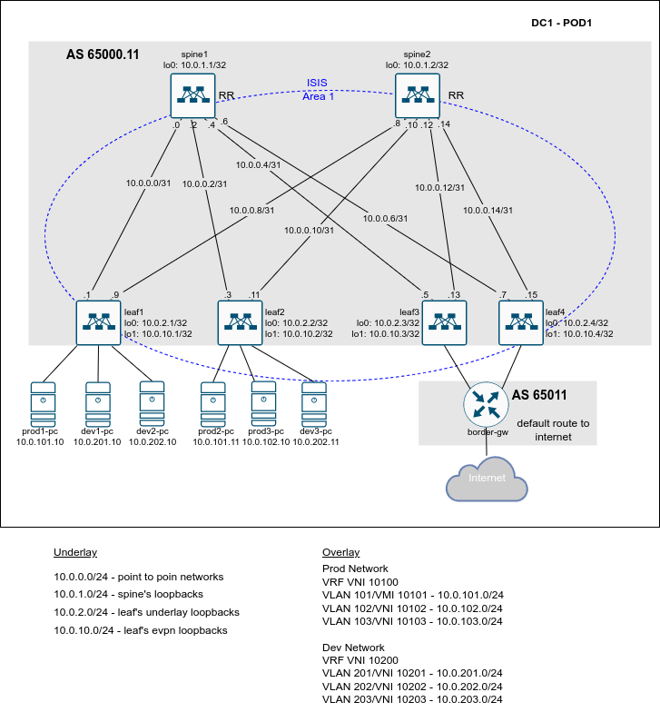

# Lesson 16
Домашняя работа к уроку № 16 ""VxLAN. Оптимизация таблиц маршрутизации""

## Цели
* Реализовать передачу суммарных префиксов через EVPN route-type 5

## Задачи
1. Разработать план IP нумерации для Датацентра (Для Underlay и Overlay сети) 
2. Выбрать протоколы маршрутизации и параметры протокола маршрутизации (зоны, тип соседства) для Underlay сети.
3. Выьрать тип соседства BGP для Overlay сети.
4. Выполнить настройку IP на интерфейсах коммутаторов. Проверить IP связность для Underlay сети.
5. Выполнить настройку протокола маршрутизации для Underlay сети на коммутаторах.
6. Проверить установление соседства между коммутаторами и наличие маршрутов до префиксов loopback интерфейсов всех коммутаторов.
7. Выполнить настройку протокола BGP для Overlay сети на коммутаторах.
8. Проверить установление соседства между leaf коммутаторами, проверить распространения маршрутной информации для address family EVPN, проверить сетевую связность между ПК и маршрутизатором, выполняющим роль граничного маршрутизатора.
9. Настроить передачу маршрута по умолчанию в vrf PROD и DEV из vrf INET на граничном маршрутизаторе.
10. Настроить передачу на граничном маршрутизаторе маршрутов между vrf PROD и DEV, выполнив агрегацию до длины префикса /22

## Реализация
### План IP нумерации и распределение AS между коммутаторами
   10.0.0.0/24 - диапазон IP адресов для использования на линках между коммутаторами leaf и spine. На каждом линке планируется использовать сеть /31.
   10.0.1.0/24 - диапазон IP адресов для использования на Loopback интерфейсах коммутаторов уровня spine.
   10.0.2.0/24 - диапазон IP адресов для использования на Loopback интерфейсах коммутаторов уровня leaf.
   10.0.10.0/24 - диапазон IP адресов для использования на Loopback интерфейсах коммутаторов уровня leaf для источкиков VxLAN тунелей.

### Выбор протокола маршрутизации для Underlay сети
для Underlay сети будем использовать протокол ISIS.
Для простоты конфигурации, и так как в нашем Датацентре не предполагается большого числа коммутаторов, планируется включить все коммутаторы в одну Area 1 протокола ISIS. Все коммутаторы будут выполнять роль L2 маршрутизаторов.  

### Выбор тип соседства BGP для Overlay сети.
Для Overlay сети в пределах одно POD будем использовать соседство по протоколу iBGP. Spine коммутаторы будут выступать в роли Route Reflector.

### План IP нумерации для Overlay сети
В Overlay сети будем использовать два VRF: PROD и DEV. Для "выхода" во внешнии сети будет использоваться маршрутизатор, подключенный к leaf коммутаторам, выполняющих функцию border leaf. Граничный маршрутизатор будет анонсировать в оба vrf маршрут по умолчанию. Маршрутизация между VRF реализуется на граничном маршрутизаторе путем передачи маршрутов между vrf. Для уменьшения маршрутной информации, на граничном маршрутизаторе выполняется агрегированием маршрутов, при передачи их в другой vrf.
Для сервисных подключений в каждом VRF будем использовать два сегмента (VLAN 101 VLAN 102 - VRF PROD, VLAN 201 VLAN 202 - VRF DEV). Для подключения маршрутизатора, в каждом VRF, будут использоваться отдельные сегменты (на leaf3 VLAN 103 - VRF PROD и VLAN 203 - VRF DEV; на leaf4 VLAN104 - VRF PROD и VLAN204 - VRF DEV).
IP адресация для сегментов будет следующая:
Prod Network
VRF VNI 10100
VLAN 101/VMI 10101 - 10.0.101.0/24
VLAN 102/VNI 10102 - 10.0.102.0/24
VLAN 103/VNI 10103 - 10.0.103.0/24
VLAN 104/VNI 10104 - 10.0.104.0/24

Dev Network
VRF VNI 10200
VLAN 201/VNI 10201 - 10.0.201.0/24
VLAN 202/VNI 10202 - 10.0.202.0/24
VLAN 203/VNI 10203 - 10.0.203.0/24
VLAN 204/VNI 10204 - 10.0.204.0/24

Настройки EVPN L2 будут выполняться в режиме VLAN Based Service.

## Сетевая схема


# Конфигурация коммутаторов
Конфигурация коммутаторов и граничного маршрутизатора находится в каталоге lab/

## Проверка
1. Проверка доступности ПК между собой и доступность ПК во внешней сети в каждом из vrf: 

### VRF: PROD - prod1-pc

```
prod1-pc> show

NAME   IP/MASK              GATEWAY                             GATEWAY
prod1-p10.0.101.10/24       10.0.101.1
       fe80::250:79ff:fe66:6807/64

prod1-pc> ping 10.0.101.11

84 bytes from 10.0.101.11 icmp_seq=1 ttl=64 time=61.088 ms
84 bytes from 10.0.101.11 icmp_seq=2 ttl=64 time=20.664 ms
84 bytes from 10.0.101.11 icmp_seq=3 ttl=64 time=29.623 ms
84 bytes from 10.0.101.11 icmp_seq=4 ttl=64 time=16.061 ms
84 bytes from 10.0.101.11 icmp_seq=5 ttl=64 time=13.539 ms

prod1-pc> ping 10.0.102.10

84 bytes from 10.0.102.10 icmp_seq=1 ttl=62 time=354.446 ms
84 bytes from 10.0.102.10 icmp_seq=2 ttl=62 time=17.681 ms
84 bytes from 10.0.102.10 icmp_seq=3 ttl=62 time=15.611 ms
84 bytes from 10.0.102.10 icmp_seq=4 ttl=62 time=16.318 ms
84 bytes from 10.0.102.10 icmp_seq=5 ttl=62 time=22.958 ms

prod1-pc> ping 192.168.1.10

84 bytes from 192.168.1.10 icmp_seq=1 ttl=61 time=37.279 ms
84 bytes from 192.168.1.10 icmp_seq=2 ttl=61 time=16.391 ms
84 bytes from 192.168.1.10 icmp_seq=3 ttl=61 time=20.440 ms
84 bytes from 192.168.1.10 icmp_seq=4 ttl=61 time=19.018 ms
84 bytes from 192.168.1.10 icmp_seq=5 ttl=61 time=15.893 ms

prod1-pc> show arp

00:50:79:66:68:08  10.0.101.11 expires in 101 seconds 
00:00:22:22:33:33  10.0.101.1 expires in 110 seconds 
```
### VRF: PROD - prod2-pc
```
prod2-pc> show

NAME   IP/MASK              GATEWAY                             GATEWAY
prod2-p10.0.101.11/24       10.0.101.1
       fe80::250:79ff:fe66:6808/64

prod2-pc> ping 10.0.101.10

84 bytes from 10.0.101.10 icmp_seq=1 ttl=64 time=18.329 ms
84 bytes from 10.0.101.10 icmp_seq=2 ttl=64 time=13.808 ms
84 bytes from 10.0.101.10 icmp_seq=3 ttl=64 time=14.003 ms
84 bytes from 10.0.101.10 icmp_seq=4 ttl=64 time=18.509 ms
84 bytes from 10.0.101.10 icmp_seq=5 ttl=64 time=17.190 ms

prod2-pc> ping 10.0.102.10

84 bytes from 10.0.102.10 icmp_seq=1 ttl=63 time=4.678 ms
84 bytes from 10.0.102.10 icmp_seq=2 ttl=63 time=5.767 ms
84 bytes from 10.0.102.10 icmp_seq=3 ttl=63 time=6.708 ms
84 bytes from 10.0.102.10 icmp_seq=4 ttl=63 time=6.928 ms
84 bytes from 10.0.102.10 icmp_seq=5 ttl=63 time=5.398 ms

rod2-pc> ping 192.168.1.10

84 bytes from 192.168.1.10 icmp_seq=1 ttl=61 time=30.767 ms
84 bytes from 192.168.1.10 icmp_seq=2 ttl=61 time=19.173 ms
84 bytes from 192.168.1.10 icmp_seq=3 ttl=61 time=15.738 ms
84 bytes from 192.168.1.10 icmp_seq=4 ttl=61 time=15.292 ms
84 bytes from 192.168.1.10 icmp_seq=5 ttl=61 time=14.422 ms

prod2-pc> show arp

00:50:79:66:68:07  10.0.101.10 expires in 30 seconds 
00:00:22:22:33:33  10.0.101.1 expires in 99 seconds 
```
### VRF: PROD - prod3-pc
```
prod3-pc> show

NAME   IP/MASK              GATEWAY                             GATEWAY
prod3-p10.0.102.10/24       10.0.102.1
       fe80::250:79ff:fe66:6809/64

prod3-pc> ping 10.0.101.10

84 bytes from 10.0.101.10 icmp_seq=1 ttl=62 time=20.127 ms
84 bytes from 10.0.101.10 icmp_seq=2 ttl=62 time=22.201 ms
84 bytes from 10.0.101.10 icmp_seq=3 ttl=62 time=19.074 ms
84 bytes from 10.0.101.10 icmp_seq=4 ttl=62 time=21.296 ms
84 bytes from 10.0.101.10 icmp_seq=5 ttl=62 time=22.258 ms

prod3-pc> ping 10.0.101.11

84 bytes from 10.0.101.11 icmp_seq=1 ttl=63 time=5.949 ms
84 bytes from 10.0.101.11 icmp_seq=2 ttl=63 time=7.158 ms
84 bytes from 10.0.101.11 icmp_seq=3 ttl=63 time=5.943 ms
84 bytes from 10.0.101.11 icmp_seq=4 ttl=63 time=5.693 ms
84 bytes from 10.0.101.11 icmp_seq=5 ttl=63 time=5.789 ms

prod3-pc> ping 192.168.1.10

84 bytes from 192.168.1.10 icmp_seq=1 ttl=61 time=48.651 ms
84 bytes from 192.168.1.10 icmp_seq=2 ttl=61 time=16.601 ms
84 bytes from 192.168.1.10 icmp_seq=3 ttl=61 time=18.458 ms
84 bytes from 192.168.1.10 icmp_seq=4 ttl=61 time=21.501 ms
84 bytes from 192.168.1.10 icmp_seq=5 ttl=61 time=15.870 ms

prod3-pc> show arp

00:00:22:22:33:33  10.0.102.1 expires in 96 seconds 
```
### VRF: DEV - dev1-pc
```
ev1-pc> show

NAME   IP/MASK              GATEWAY                             GATEWAY
dev1-pc10.0.201.10/24       10.0.201.1
       fe80::250:79ff:fe66:680b/64

dev1-pc> ping 10.0.202.10

84 bytes from 10.0.202.10 icmp_seq=1 ttl=63 time=103.243 ms
84 bytes from 10.0.202.10 icmp_seq=2 ttl=63 time=7.994 ms
84 bytes from 10.0.202.10 icmp_seq=3 ttl=63 time=8.923 ms
84 bytes from 10.0.202.10 icmp_seq=4 ttl=63 time=8.065 ms
84 bytes from 10.0.202.10 icmp_seq=5 ttl=63 time=12.111 ms

dev1-pc> ping 10.0.202.11

84 bytes from 10.0.202.11 icmp_seq=1 ttl=62 time=16.771 ms
84 bytes from 10.0.202.11 icmp_seq=2 ttl=62 time=17.219 ms
84 bytes from 10.0.202.11 icmp_seq=3 ttl=62 time=26.063 ms
84 bytes from 10.0.202.11 icmp_seq=4 ttl=62 time=26.368 ms
84 bytes from 10.0.202.11 icmp_seq=5 ttl=62 time=14.579 ms

dev1-pc> ping 192.168.1.10

84 bytes from 192.168.1.10 icmp_seq=1 ttl=61 time=33.173 ms
84 bytes from 192.168.1.10 icmp_seq=2 ttl=61 time=15.955 ms
84 bytes from 192.168.1.10 icmp_seq=3 ttl=61 time=14.956 ms
84 bytes from 192.168.1.10 icmp_seq=4 ttl=61 time=17.061 ms
84 bytes from 192.168.1.10 icmp_seq=5 ttl=61 time=17.521 ms

dev1-pc> show arp

00:00:22:22:33:33  10.0.201.1 expires in 49 seconds 
```
### VRF: DEV - dev2-pc
```
dev2-pc> show

NAME   IP/MASK              GATEWAY                             GATEWAY
dev2-pc10.0.202.10/24       10.0.202.1
       fe80::250:79ff:fe66:680c/64

dev2-pc> ping 10.0.201.10                    

84 bytes from 10.0.201.10 icmp_seq=1 ttl=63 time=8.630 ms
84 bytes from 10.0.201.10 icmp_seq=2 ttl=63 time=7.781 ms
84 bytes from 10.0.201.10 icmp_seq=3 ttl=63 time=8.121 ms
84 bytes from 10.0.201.10 icmp_seq=4 ttl=63 time=7.472 ms
84 bytes from 10.0.201.10 icmp_seq=5 ttl=63 time=7.194 ms

dev2-pc> ping 10.0.202.11

84 bytes from 10.0.202.11 icmp_seq=1 ttl=64 time=13.970 ms
84 bytes from 10.0.202.11 icmp_seq=2 ttl=64 time=13.049 ms
84 bytes from 10.0.202.11 icmp_seq=3 ttl=64 time=14.995 ms
84 bytes from 10.0.202.11 icmp_seq=4 ttl=64 time=12.889 ms
84 bytes from 10.0.202.11 icmp_seq=5 ttl=64 time=16.820 ms

dev2-pc> ping 192.168.1.10

84 bytes from 192.168.1.10 icmp_seq=1 ttl=61 time=36.469 ms
84 bytes from 192.168.1.10 icmp_seq=2 ttl=61 time=16.167 ms
84 bytes from 192.168.1.10 icmp_seq=3 ttl=61 time=17.432 ms
84 bytes from 192.168.1.10 icmp_seq=4 ttl=61 time=16.709 ms
84 bytes from 192.168.1.10 icmp_seq=5 ttl=61 time=16.136 ms

dev2-pc> show arp

00:00:22:22:33:33  10.0.202.1 expires in 42 seconds 
00:50:79:66:68:0d  10.0.202.11 expires in 102 seconds 
```
### VRF: DEV - dev3-pc
```
dev3-pc> show

NAME   IP/MASK              GATEWAY                             GATEWAY
dev3-pc10.0.202.11/24       10.0.202.1
       fe80::250:79ff:fe66:680d/64

dev3-pc> ping 10.0.201.10

84 bytes from 10.0.201.10 icmp_seq=1 ttl=62 time=29.587 ms
84 bytes from 10.0.201.10 icmp_seq=2 ttl=62 time=23.784 ms
84 bytes from 10.0.201.10 icmp_seq=3 ttl=62 time=16.996 ms
84 bytes from 10.0.201.10 icmp_seq=4 ttl=62 time=26.829 ms
84 bytes from 10.0.201.10 icmp_seq=5 ttl=62 time=23.811 ms

dev3-pc> ping 10.0.202.10

84 bytes from 10.0.202.10 icmp_seq=1 ttl=64 time=16.429 ms
84 bytes from 10.0.202.10 icmp_seq=2 ttl=64 time=15.046 ms
84 bytes from 10.0.202.10 icmp_seq=3 ttl=64 time=13.114 ms
84 bytes from 10.0.202.10 icmp_seq=4 ttl=64 time=20.150 ms
84 bytes from 10.0.202.10 icmp_seq=5 ttl=64 time=15.365 ms

dev3-pc> ping 192.168.1.10

84 bytes from 192.168.1.10 icmp_seq=1 ttl=61 time=32.292 ms
84 bytes from 192.168.1.10 icmp_seq=2 ttl=61 time=23.204 ms
84 bytes from 192.168.1.10 icmp_seq=3 ttl=61 time=16.348 ms
84 bytes from 192.168.1.10 icmp_seq=4 ttl=61 time=20.652 ms
84 bytes from 192.168.1.10 icmp_seq=5 ttl=61 time=17.535 ms

dev3-pc> show arp

00:00:22:22:33:33  10.0.202.1 expires in 96 seconds 
00:50:79:66:68:0c  10.0.202.10 expires in 105 seconds 
```

2. Проверка доступности ПК из разных vrf и проверка пути трафика:
```
prod1-pc> ping 10.0.201.10

84 bytes from 10.0.201.10 icmp_seq=1 ttl=59 time=38.155 ms
84 bytes from 10.0.201.10 icmp_seq=2 ttl=59 time=37.746 ms
84 bytes from 10.0.201.10 icmp_seq=3 ttl=59 time=29.764 ms
84 bytes from 10.0.201.10 icmp_seq=4 ttl=59 time=31.770 ms
84 bytes from 10.0.201.10 icmp_seq=5 ttl=59 time=31.046 ms

prod1-pc> trace 10.0.201.10
trace to 10.0.201.10, 8 hops max, press Ctrl+C to stop
 1   10.0.101.1   3.139 ms  2.855 ms  2.979 ms
 2   10.0.103.1   17.209 ms  12.052 ms  16.057 ms
 3   10.0.103.10   20.081 ms  16.856 ms  14.436 ms
 4   10.0.204.1   20.983 ms  20.797 ms  17.573 ms
 5   10.0.202.1   31.139 ms  25.610 ms  26.442 ms
 6   *10.0.201.10   33.056 ms (ICMP type:3, code:3, Destination port unreachable)

dev1-pc> ping 10.0.101.10

84 bytes from 10.0.101.10 icmp_seq=1 ttl=59 time=37.390 ms
84 bytes from 10.0.101.10 icmp_seq=2 ttl=59 time=28.982 ms
84 bytes from 10.0.101.10 icmp_seq=3 ttl=59 time=32.731 ms
84 bytes from 10.0.101.10 icmp_seq=4 ttl=59 time=42.567 ms
84 bytes from 10.0.101.10 icmp_seq=5 ttl=59 time=34.174 ms

dev1-pc> trace 10.0.101.10
trace to 10.0.101.10, 8 hops max, press Ctrl+C to stop
 1   10.0.201.1   4.140 ms  2.628 ms  2.280 ms
 2   10.0.203.1   14.194 ms  11.873 ms  12.391 ms
 3   10.0.203.10   14.949 ms  14.303 ms  15.137 ms
 4   10.0.104.1   24.432 ms  25.802 ms  20.207 ms
 5   10.0.102.1   31.558 ms  28.648 ms  30.597 ms
 6   *10.0.101.10   32.805 ms (ICMP type:3, code:3, Destination port unreachable)

```

3. Проверка таблицы маршрутизации на leaf коммутаторах для каждого vrf
### На коммутаторе leaf1:
```
leaf1#show ip route vrf PROD

VRF: PROD
Codes: C - connected, S - static, K - kernel, 
       O - OSPF, IA - OSPF inter area, E1 - OSPF external type 1,
       E2 - OSPF external type 2, N1 - OSPF NSSA external type 1,
       N2 - OSPF NSSA external type2, B - BGP, B I - iBGP, B E - eBGP,
       R - RIP, I L1 - IS-IS level 1, I L2 - IS-IS level 2,
       O3 - OSPFv3, A B - BGP Aggregate, A O - OSPF Summary,
       NG - Nexthop Group Static Route, V - VXLAN Control Service,
       DH - DHCP client installed default route, M - Martian,
       DP - Dynamic Policy Route, L - VRF Leaked,
       G  - gRIBI, RC - Route Cache Route

Gateway of last resort:
 B I      0.0.0.0/0 [200/0] via VTEP 10.0.10.3 VNI 10100 router-mac 50:00:00:15:f4:e8 local-interface Vxlan1
                            via VTEP 10.0.10.4 VNI 10100 router-mac 50:00:00:72:8b:31 local-interface Vxlan1

 C        10.0.101.0/24 is directly connected, Vlan101
 C        10.0.102.0/24 is directly connected, Vlan102
 B I      10.0.103.10/32 [200/0] via VTEP 10.0.10.3 VNI 10100 router-mac 50:00:00:15:f4:e8 local-interface Vxlan1
 B I      10.0.103.0/24 [200/0] via VTEP 10.0.10.3 VNI 10100 router-mac 50:00:00:15:f4:e8 local-interface Vxlan1
 B I      10.0.100.0/22 [200/0] via VTEP 10.0.10.3 VNI 10100 router-mac 50:00:00:15:f4:e8 local-interface Vxlan1
                                via VTEP 10.0.10.4 VNI 10100 router-mac 50:00:00:72:8b:31 local-interface Vxlan1
 B I      10.0.104.10/32 [200/0] via VTEP 10.0.10.4 VNI 10100 router-mac 50:00:00:72:8b:31 local-interface Vxlan1
 B I      10.0.104.0/24 [200/0] via VTEP 10.0.10.4 VNI 10100 router-mac 50:00:00:72:8b:31 local-interface Vxlan1
 B I      10.0.200.0/22 [200/0] via VTEP 10.0.10.3 VNI 10100 router-mac 50:00:00:15:f4:e8 local-interface Vxlan1
                                via VTEP 10.0.10.4 VNI 10100 router-mac 50:00:00:72:8b:31 local-interface Vxlan1
 B I      10.0.204.0/24 [200/0] via VTEP 10.0.10.3 VNI 10100 router-mac 50:00:00:15:f4:e8 local-interface Vxlan1
                                via VTEP 10.0.10.4 VNI 10100 router-mac 50:00:00:72:8b:31 local-interface Vxlan1

leaf1#show ip route vrf DEV

VRF: DEV
Codes: C - connected, S - static, K - kernel, 
       O - OSPF, IA - OSPF inter area, E1 - OSPF external type 1,
       E2 - OSPF external type 2, N1 - OSPF NSSA external type 1,
       N2 - OSPF NSSA external type2, B - BGP, B I - iBGP, B E - eBGP,
       R - RIP, I L1 - IS-IS level 1, I L2 - IS-IS level 2,
       O3 - OSPFv3, A B - BGP Aggregate, A O - OSPF Summary,
       NG - Nexthop Group Static Route, V - VXLAN Control Service,
       DH - DHCP client installed default route, M - Martian,
       DP - Dynamic Policy Route, L - VRF Leaked,
       G  - gRIBI, RC - Route Cache Route

Gateway of last resort:
 B I      0.0.0.0/0 [200/0] via VTEP 10.0.10.3 VNI 10200 router-mac 50:00:00:15:f4:e8 local-interface Vxlan1
                            via VTEP 10.0.10.4 VNI 10200 router-mac 50:00:00:72:8b:31 local-interface Vxlan1

 B I      10.0.100.0/22 [200/0] via VTEP 10.0.10.3 VNI 10200 router-mac 50:00:00:15:f4:e8 local-interface Vxlan1
                                via VTEP 10.0.10.4 VNI 10200 router-mac 50:00:00:72:8b:31 local-interface Vxlan1
 B I      10.0.104.0/24 [200/0] via VTEP 10.0.10.3 VNI 10200 router-mac 50:00:00:15:f4:e8 local-interface Vxlan1
                                via VTEP 10.0.10.4 VNI 10200 router-mac 50:00:00:72:8b:31 local-interface Vxlan1
 C        10.0.201.0/24 is directly connected, Vlan201
 C        10.0.202.0/24 is directly connected, Vlan202
 B I      10.0.203.10/32 [200/0] via VTEP 10.0.10.3 VNI 10200 router-mac 50:00:00:15:f4:e8 local-interface Vxlan1
 B I      10.0.203.0/24 [200/0] via VTEP 10.0.10.3 VNI 10200 router-mac 50:00:00:15:f4:e8 local-interface Vxlan1
 B I      10.0.200.0/22 [200/0] via VTEP 10.0.10.3 VNI 10200 router-mac 50:00:00:15:f4:e8 local-interface Vxlan1
                                via VTEP 10.0.10.4 VNI 10200 router-mac 50:00:00:72:8b:31 local-interface Vxlan1
 B I      10.0.204.10/32 [200/0] via VTEP 10.0.10.4 VNI 10200 router-mac 50:00:00:72:8b:31 local-interface Vxlan1
 B I      10.0.204.0/24 [200/0] via VTEP 10.0.10.4 VNI 10200 router-mac 50:00:00:72:8b:31 local-interface Vxlan1
```

### На коммутаторе leaf2:
```
leaf2#show ip route vrf PROD

VRF: PROD
Codes: C - connected, S - static, K - kernel, 
       O - OSPF, IA - OSPF inter area, E1 - OSPF external type 1,
       E2 - OSPF external type 2, N1 - OSPF NSSA external type 1,
       N2 - OSPF NSSA external type2, B - BGP, B I - iBGP, B E - eBGP,
       R - RIP, I L1 - IS-IS level 1, I L2 - IS-IS level 2,
       O3 - OSPFv3, A B - BGP Aggregate, A O - OSPF Summary,
       NG - Nexthop Group Static Route, V - VXLAN Control Service,
       DH - DHCP client installed default route, M - Martian,
       DP - Dynamic Policy Route, L - VRF Leaked,
       G  - gRIBI, RC - Route Cache Route

Gateway of last resort:
 B I      0.0.0.0/0 [200/0] via VTEP 10.0.10.3 VNI 10100 router-mac 50:00:00:15:f4:e8 local-interface Vxlan1
                            via VTEP 10.0.10.4 VNI 10100 router-mac 50:00:00:72:8b:31 local-interface Vxlan1

 B I      10.0.101.10/32 [200/0] via VTEP 10.0.10.1 VNI 10100 router-mac 50:00:00:d5:5d:c0 local-interface Vxlan1
 C        10.0.101.0/24 is directly connected, Vlan101
 C        10.0.102.0/24 is directly connected, Vlan102
 B I      10.0.103.10/32 [200/0] via VTEP 10.0.10.3 VNI 10100 router-mac 50:00:00:15:f4:e8 local-interface Vxlan1
 B I      10.0.103.0/24 [200/0] via VTEP 10.0.10.3 VNI 10100 router-mac 50:00:00:15:f4:e8 local-interface Vxlan1
 B I      10.0.100.0/22 [200/0] via VTEP 10.0.10.3 VNI 10100 router-mac 50:00:00:15:f4:e8 local-interface Vxlan1
                                via VTEP 10.0.10.4 VNI 10100 router-mac 50:00:00:72:8b:31 local-interface Vxlan1
 B I      10.0.104.10/32 [200/0] via VTEP 10.0.10.4 VNI 10100 router-mac 50:00:00:72:8b:31 local-interface Vxlan1
 B I      10.0.104.0/24 [200/0] via VTEP 10.0.10.4 VNI 10100 router-mac 50:00:00:72:8b:31 local-interface Vxlan1
 B I      10.0.200.0/22 [200/0] via VTEP 10.0.10.3 VNI 10100 router-mac 50:00:00:15:f4:e8 local-interface Vxlan1
                                via VTEP 10.0.10.4 VNI 10100 router-mac 50:00:00:72:8b:31 local-interface Vxlan1
 B I      10.0.204.0/24 [200/0] via VTEP 10.0.10.3 VNI 10100 router-mac 50:00:00:15:f4:e8 local-interface Vxlan1
                                via VTEP 10.0.10.4 VNI 10100 router-mac 50:00:00:72:8b:31 local-interface Vxlan1

leaf2#show ip route vrf DEV

VRF: DEV
Codes: C - connected, S - static, K - kernel, 
       O - OSPF, IA - OSPF inter area, E1 - OSPF external type 1,
       E2 - OSPF external type 2, N1 - OSPF NSSA external type 1,
       N2 - OSPF NSSA external type2, B - BGP, B I - iBGP, B E - eBGP,
       R - RIP, I L1 - IS-IS level 1, I L2 - IS-IS level 2,
       O3 - OSPFv3, A B - BGP Aggregate, A O - OSPF Summary,
       NG - Nexthop Group Static Route, V - VXLAN Control Service,
       DH - DHCP client installed default route, M - Martian,
       DP - Dynamic Policy Route, L - VRF Leaked,
       G  - gRIBI, RC - Route Cache Route

Gateway of last resort:
 B I      0.0.0.0/0 [200/0] via VTEP 10.0.10.3 VNI 10200 router-mac 50:00:00:15:f4:e8 local-interface Vxlan1
                            via VTEP 10.0.10.4 VNI 10200 router-mac 50:00:00:72:8b:31 local-interface Vxlan1

 B I      10.0.100.0/22 [200/0] via VTEP 10.0.10.3 VNI 10200 router-mac 50:00:00:15:f4:e8 local-interface Vxlan1
                                via VTEP 10.0.10.4 VNI 10200 router-mac 50:00:00:72:8b:31 local-interface Vxlan1
 B I      10.0.104.0/24 [200/0] via VTEP 10.0.10.3 VNI 10200 router-mac 50:00:00:15:f4:e8 local-interface Vxlan1
                                via VTEP 10.0.10.4 VNI 10200 router-mac 50:00:00:72:8b:31 local-interface Vxlan1
 B I      10.0.201.10/32 [200/0] via VTEP 10.0.10.1 VNI 10200 router-mac 50:00:00:d5:5d:c0 local-interface Vxlan1
 C        10.0.201.0/24 is directly connected, Vlan201
 C        10.0.202.0/24 is directly connected, Vlan202
 B I      10.0.203.10/32 [200/0] via VTEP 10.0.10.3 VNI 10200 router-mac 50:00:00:15:f4:e8 local-interface Vxlan1
 B I      10.0.203.0/24 [200/0] via VTEP 10.0.10.3 VNI 10200 router-mac 50:00:00:15:f4:e8 local-interface Vxlan1
 B I      10.0.200.0/22 [200/0] via VTEP 10.0.10.3 VNI 10200 router-mac 50:00:00:15:f4:e8 local-interface Vxlan1
                                via VTEP 10.0.10.4 VNI 10200 router-mac 50:00:00:72:8b:31 local-interface Vxlan1
 B I      10.0.204.10/32 [200/0] via VTEP 10.0.10.4 VNI 10200 router-mac 50:00:00:72:8b:31 local-interface Vxlan1
 B I      10.0.204.0/24 [200/0] via VTEP 10.0.10.4 VNI 10200 router-mac 50:00:00:72:8b:31 local-interface Vxlan1
```

### На коммутаторе leaf3:
```
leaf3#show ip route vrf PROD

VRF: PROD
Codes: C - connected, S - static, K - kernel, 
       O - OSPF, IA - OSPF inter area, E1 - OSPF external type 1,
       E2 - OSPF external type 2, N1 - OSPF NSSA external type 1,
       N2 - OSPF NSSA external type2, B - BGP, B I - iBGP, B E - eBGP,
       R - RIP, I L1 - IS-IS level 1, I L2 - IS-IS level 2,
       O3 - OSPFv3, A B - BGP Aggregate, A O - OSPF Summary,
       NG - Nexthop Group Static Route, V - VXLAN Control Service,
       DH - DHCP client installed default route, M - Martian,
       DP - Dynamic Policy Route, L - VRF Leaked,
       G  - gRIBI, RC - Route Cache Route

Gateway of last resort:
 B E      0.0.0.0/0 [200/0] via 10.0.103.10, Vlan103

 B I      10.0.101.10/32 [200/0] via VTEP 10.0.10.1 VNI 10100 router-mac 50:00:00:d5:5d:c0 local-interface Vxlan1
 B I      10.0.101.0/24 [200/0] via VTEP 10.0.10.2 VNI 10100 router-mac 50:00:00:03:37:66 local-interface Vxlan1
                                via VTEP 10.0.10.1 VNI 10100 router-mac 50:00:00:d5:5d:c0 local-interface Vxlan1
 B I      10.0.102.0/24 [200/0] via VTEP 10.0.10.2 VNI 10100 router-mac 50:00:00:03:37:66 local-interface Vxlan1
                                via VTEP 10.0.10.1 VNI 10100 router-mac 50:00:00:d5:5d:c0 local-interface Vxlan1
 C        10.0.103.0/24 is directly connected, Vlan103
 B E      10.0.100.0/22 [200/0] via 10.0.103.10, Vlan103
 B I      10.0.104.10/32 [200/0] via VTEP 10.0.10.4 VNI 10100 router-mac 50:00:00:72:8b:31 local-interface Vxlan1
 B I      10.0.104.0/24 [200/0] via VTEP 10.0.10.4 VNI 10100 router-mac 50:00:00:72:8b:31 local-interface Vxlan1
 B E      10.0.200.0/22 [200/0] via 10.0.103.10, Vlan103
 B E      10.0.204.0/24 [200/0] via 10.0.103.10, Vlan103

leaf3#show ip route vrf DEV

VRF: DEV
Codes: C - connected, S - static, K - kernel, 
       O - OSPF, IA - OSPF inter area, E1 - OSPF external type 1,
       E2 - OSPF external type 2, N1 - OSPF NSSA external type 1,
       N2 - OSPF NSSA external type2, B - BGP, B I - iBGP, B E - eBGP,
       R - RIP, I L1 - IS-IS level 1, I L2 - IS-IS level 2,
       O3 - OSPFv3, A B - BGP Aggregate, A O - OSPF Summary,
       NG - Nexthop Group Static Route, V - VXLAN Control Service,
       DH - DHCP client installed default route, M - Martian,
       DP - Dynamic Policy Route, L - VRF Leaked,
       G  - gRIBI, RC - Route Cache Route

Gateway of last resort:
 B E      0.0.0.0/0 [200/0] via 10.0.203.10, Vlan203

 B E      10.0.100.0/22 [200/0] via 10.0.203.10, Vlan203
 B E      10.0.104.0/24 [200/0] via 10.0.203.10, Vlan203
 B I      10.0.201.10/32 [200/0] via VTEP 10.0.10.1 VNI 10200 router-mac 50:00:00:d5:5d:c0 local-interface Vxlan1
 B I      10.0.201.0/24 [200/0] via VTEP 10.0.10.2 VNI 10200 router-mac 50:00:00:03:37:66 local-interface Vxlan1
                                via VTEP 10.0.10.1 VNI 10200 router-mac 50:00:00:d5:5d:c0 local-interface Vxlan1
 B I      10.0.202.0/24 [200/0] via VTEP 10.0.10.2 VNI 10200 router-mac 50:00:00:03:37:66 local-interface Vxlan1
                                via VTEP 10.0.10.1 VNI 10200 router-mac 50:00:00:d5:5d:c0 local-interface Vxlan1
 C        10.0.203.0/24 is directly connected, Vlan203
 B E      10.0.200.0/22 [200/0] via 10.0.203.10, Vlan203
 B I      10.0.204.10/32 [200/0] via VTEP 10.0.10.4 VNI 10200 router-mac 50:00:00:72:8b:31 local-interface Vxlan1
 B I      10.0.204.0/24 [200/0] via VTEP 10.0.10.4 VNI 10200 router-mac 50:00:00:72:8b:31 local-interface Vxlan1
```

### На коммутаторе leaf4:
```
leaf4#show ip route vrf PROD

VRF: PROD
Codes: C - connected, S - static, K - kernel, 
       O - OSPF, IA - OSPF inter area, E1 - OSPF external type 1,
       E2 - OSPF external type 2, N1 - OSPF NSSA external type 1,
       N2 - OSPF NSSA external type2, B - BGP, B I - iBGP, B E - eBGP,
       R - RIP, I L1 - IS-IS level 1, I L2 - IS-IS level 2,
       O3 - OSPFv3, A B - BGP Aggregate, A O - OSPF Summary,
       NG - Nexthop Group Static Route, V - VXLAN Control Service,
       DH - DHCP client installed default route, M - Martian,
       DP - Dynamic Policy Route, L - VRF Leaked,
       G  - gRIBI, RC - Route Cache Route

Gateway of last resort:
 B E      0.0.0.0/0 [200/0] via 10.0.104.10, Vlan104

 B I      10.0.101.0/24 [200/0] via VTEP 10.0.10.2 VNI 10100 router-mac 50:00:00:03:37:66 local-interface Vxlan1
                                via VTEP 10.0.10.1 VNI 10100 router-mac 50:00:00:d5:5d:c0 local-interface Vxlan1
 B I      10.0.102.0/24 [200/0] via VTEP 10.0.10.2 VNI 10100 router-mac 50:00:00:03:37:66 local-interface Vxlan1
                                via VTEP 10.0.10.1 VNI 10100 router-mac 50:00:00:d5:5d:c0 local-interface Vxlan1
 B I      10.0.103.10/32 [200/0] via VTEP 10.0.10.3 VNI 10100 router-mac 50:00:00:15:f4:e8 local-interface Vxlan1
 B I      10.0.103.0/24 [200/0] via VTEP 10.0.10.3 VNI 10100 router-mac 50:00:00:15:f4:e8 local-interface Vxlan1
 B E      10.0.100.0/22 [200/0] via 10.0.104.10, Vlan104
 C        10.0.104.0/24 is directly connected, Vlan104
 B E      10.0.200.0/22 [200/0] via 10.0.104.10, Vlan104
 B E      10.0.204.0/24 [200/0] via 10.0.104.10, Vlan104

leaf4#show ip route vrf DEV

VRF: DEV
Codes: C - connected, S - static, K - kernel, 
       O - OSPF, IA - OSPF inter area, E1 - OSPF external type 1,
       E2 - OSPF external type 2, N1 - OSPF NSSA external type 1,
       N2 - OSPF NSSA external type2, B - BGP, B I - iBGP, B E - eBGP,
       R - RIP, I L1 - IS-IS level 1, I L2 - IS-IS level 2,
       O3 - OSPFv3, A B - BGP Aggregate, A O - OSPF Summary,
       NG - Nexthop Group Static Route, V - VXLAN Control Service,
       DH - DHCP client installed default route, M - Martian,
       DP - Dynamic Policy Route, L - VRF Leaked,
       G  - gRIBI, RC - Route Cache Route

Gateway of last resort:
 B E      0.0.0.0/0 [200/0] via 10.0.204.10, Vlan204

 B E      10.0.100.0/22 [200/0] via 10.0.204.10, Vlan204
 B E      10.0.104.0/24 [200/0] via 10.0.204.10, Vlan204
 B I      10.0.201.0/24 [200/0] via VTEP 10.0.10.1 VNI 10200 router-mac 50:00:00:d5:5d:c0 local-interface Vxlan1
                                via VTEP 10.0.10.2 VNI 10200 router-mac 50:00:00:03:37:66 local-interface Vxlan1
 B I      10.0.202.0/24 [200/0] via VTEP 10.0.10.1 VNI 10200 router-mac 50:00:00:d5:5d:c0 local-interface Vxlan1
                                via VTEP 10.0.10.2 VNI 10200 router-mac 50:00:00:03:37:66 local-interface Vxlan1
 B I      10.0.203.10/32 [200/0] via VTEP 10.0.10.3 VNI 10200 router-mac 50:00:00:15:f4:e8 local-interface Vxlan1
 B I      10.0.203.0/24 [200/0] via VTEP 10.0.10.3 VNI 10200 router-mac 50:00:00:15:f4:e8 local-interface Vxlan1
 B E      10.0.200.0/22 [200/0] via 10.0.204.10, Vlan204
 C        10.0.204.0/24 is directly connected, Vlan204
```

4. Просмотре информации о внешних type5 маршрутах на каждом  leaf коммутаторе:

### На коммутаторе leaf1:
```
leaf1#show bgp evpn route-type ip-prefix 0.0.0.0/0
BGP routing table information for VRF default
Router identifier 10.0.2.1, local AS number 4259840011
BGP routing table entry for ip-prefix 0.0.0.0/0, Route Distinguisher: 10.0.2.3:100
 Paths: 2 available
  65011
    10.0.10.3 from 10.0.1.2 (10.0.1.2)
      Origin INCOMPLETE, metric -, localpref 100, weight 0, valid, internal, ECMP head, ECMP, best, ECMP contributor
      Originator: 10.0.2.3, Cluster list: 10.0.1.2 
      Extended Community: Route-Target-AS:11:10100 TunnelEncap:tunnelTypeVxlan EvpnRouterMac:50:00:00:15:f4:e8
      VNI: 10100
  65011
    10.0.10.3 from 10.0.1.1 (10.0.1.1)
      Origin INCOMPLETE, metric -, localpref 100, weight 0, valid, internal, ECMP, ECMP contributor
      Originator: 10.0.2.3, Cluster list: 10.0.1.1 
      Extended Community: Route-Target-AS:11:10100 TunnelEncap:tunnelTypeVxlan EvpnRouterMac:50:00:00:15:f4:e8
      VNI: 10100
BGP routing table entry for ip-prefix 0.0.0.0/0, Route Distinguisher: 10.0.2.3:200
 Paths: 2 available
  65011
    10.0.10.3 from 10.0.1.2 (10.0.1.2)
      Origin INCOMPLETE, metric -, localpref 100, weight 0, valid, internal, ECMP head, ECMP, best, ECMP contributor
      Originator: 10.0.2.3, Cluster list: 10.0.1.2 
      Extended Community: Route-Target-AS:11:10200 TunnelEncap:tunnelTypeVxlan EvpnRouterMac:50:00:00:15:f4:e8
      VNI: 10200
  65011
    10.0.10.3 from 10.0.1.1 (10.0.1.1)
      Origin INCOMPLETE, metric -, localpref 100, weight 0, valid, internal, ECMP, ECMP contributor
      Originator: 10.0.2.3, Cluster list: 10.0.1.1 
      Extended Community: Route-Target-AS:11:10200 TunnelEncap:tunnelTypeVxlan EvpnRouterMac:50:00:00:15:f4:e8
      VNI: 10200
BGP routing table entry for ip-prefix 0.0.0.0/0, Route Distinguisher: 10.0.2.4:100
 Paths: 2 available
  65011
    10.0.10.4 from 10.0.1.2 (10.0.1.2)
      Origin INCOMPLETE, metric -, localpref 100, weight 0, valid, internal, ECMP head, ECMP, best, ECMP contributor
      Originator: 10.0.2.4, Cluster list: 10.0.1.2 
      Extended Community: Route-Target-AS:11:10100 TunnelEncap:tunnelTypeVxlan EvpnRouterMac:50:00:00:72:8b:31
      VNI: 10100
  65011
    10.0.10.4 from 10.0.1.1 (10.0.1.1)
      Origin INCOMPLETE, metric -, localpref 100, weight 0, valid, internal, ECMP, ECMP contributor
      Originator: 10.0.2.4, Cluster list: 10.0.1.1 
      Extended Community: Route-Target-AS:11:10100 TunnelEncap:tunnelTypeVxlan EvpnRouterMac:50:00:00:72:8b:31
      VNI: 10100
BGP routing table entry for ip-prefix 0.0.0.0/0, Route Distinguisher: 10.0.2.4:200
 Paths: 2 available
  65011
    10.0.10.4 from 10.0.1.2 (10.0.1.2)
      Origin INCOMPLETE, metric -, localpref 100, weight 0, valid, internal, ECMP head, ECMP, best, ECMP contributor
      Originator: 10.0.2.4, Cluster list: 10.0.1.2 
      Extended Community: Route-Target-AS:11:10200 TunnelEncap:tunnelTypeVxlan EvpnRouterMac:50:00:00:72:8b:31
      VNI: 10200
  65011
    10.0.10.4 from 10.0.1.1 (10.0.1.1)
      Origin INCOMPLETE, metric -, localpref 100, weight 0, valid, internal, ECMP, ECMP contributor
      Originator: 10.0.2.4, Cluster list: 10.0.1.1 
      Extended Community: Route-Target-AS:11:10200 TunnelEncap:tunnelTypeVxlan EvpnRouterMac:50:00:00:72:8b:31
      VNI: 10200

leaf1#show bgp evpn route-type ip-prefix 10.0.100.0/22
BGP routing table information for VRF default
Router identifier 10.0.2.1, local AS number 4259840011
BGP routing table entry for ip-prefix 10.0.100.0/22, Route Distinguisher: 10.0.2.3:100
 Paths: 2 available
  65011 (aggregated by 65011 10.255.255.10)
    10.0.10.3 from 10.0.1.1 (10.0.1.1)
      Origin IGP, metric 0, localpref 100, weight 0, valid, internal, ECMP head, ECMP, best, ECMP contributor, atomic-aggregate
      Originator: 10.0.2.3, Cluster list: 10.0.1.1 
      Extended Community: Route-Target-AS:11:10100 TunnelEncap:tunnelTypeVxlan EvpnRouterMac:50:00:00:15:f4:e8
      VNI: 10100
  65011 (aggregated by 65011 10.255.255.10)
    10.0.10.3 from 10.0.1.2 (10.0.1.2)
      Origin IGP, metric 0, localpref 100, weight 0, valid, internal, ECMP, ECMP contributor, atomic-aggregate
      Originator: 10.0.2.3, Cluster list: 10.0.1.2 
      Extended Community: Route-Target-AS:11:10100 TunnelEncap:tunnelTypeVxlan EvpnRouterMac:50:00:00:15:f4:e8
      VNI: 10100
BGP routing table entry for ip-prefix 10.0.100.0/22, Route Distinguisher: 10.0.2.3:200
 Paths: 2 available
  65011 (aggregated by 65011 10.255.255.10)
    10.0.10.3 from 10.0.1.1 (10.0.1.1)
      Origin IGP, metric 0, localpref 100, weight 0, valid, internal, ECMP head, ECMP, best, ECMP contributor, atomic-aggregate
      Originator: 10.0.2.3, Cluster list: 10.0.1.1 
      Extended Community: Route-Target-AS:11:10200 TunnelEncap:tunnelTypeVxlan EvpnRouterMac:50:00:00:15:f4:e8
      VNI: 10200
  65011 (aggregated by 65011 10.255.255.10)
    10.0.10.3 from 10.0.1.2 (10.0.1.2)
      Origin IGP, metric 0, localpref 100, weight 0, valid, internal, ECMP, ECMP contributor, atomic-aggregate
      Originator: 10.0.2.3, Cluster list: 10.0.1.2 
      Extended Community: Route-Target-AS:11:10200 TunnelEncap:tunnelTypeVxlan EvpnRouterMac:50:00:00:15:f4:e8
      VNI: 10200
BGP routing table entry for ip-prefix 10.0.100.0/22, Route Distinguisher: 10.0.2.4:100
 Paths: 2 available
  65011 (aggregated by 65011 10.255.255.10)
    10.0.10.4 from 10.0.1.2 (10.0.1.2)
      Origin IGP, metric 0, localpref 100, weight 0, valid, internal, ECMP head, ECMP, best, ECMP contributor, atomic-aggregate
      Originator: 10.0.2.4, Cluster list: 10.0.1.2 
      Extended Community: Route-Target-AS:11:10100 TunnelEncap:tunnelTypeVxlan EvpnRouterMac:50:00:00:72:8b:31
      VNI: 10100
  65011 (aggregated by 65011 10.255.255.10)
    10.0.10.4 from 10.0.1.1 (10.0.1.1)
      Origin IGP, metric 0, localpref 100, weight 0, valid, internal, ECMP, ECMP contributor, atomic-aggregate
      Originator: 10.0.2.4, Cluster list: 10.0.1.1 
      Extended Community: Route-Target-AS:11:10100 TunnelEncap:tunnelTypeVxlan EvpnRouterMac:50:00:00:72:8b:31
      VNI: 10100
BGP routing table entry for ip-prefix 10.0.100.0/22, Route Distinguisher: 10.0.2.4:200
 Paths: 2 available
  65011 (aggregated by 65011 10.255.255.10)
    10.0.10.4 from 10.0.1.2 (10.0.1.2)
      Origin IGP, metric 0, localpref 100, weight 0, valid, internal, ECMP head, ECMP, best, ECMP contributor, atomic-aggregate
      Originator: 10.0.2.4, Cluster list: 10.0.1.2 
      Extended Community: Route-Target-AS:11:10200 TunnelEncap:tunnelTypeVxlan EvpnRouterMac:50:00:00:72:8b:31
      VNI: 10200
  65011 (aggregated by 65011 10.255.255.10)
    10.0.10.4 from 10.0.1.1 (10.0.1.1)
      Origin IGP, metric 0, localpref 100, weight 0, valid, internal, ECMP, ECMP contributor, atomic-aggregate
      Originator: 10.0.2.4, Cluster list: 10.0.1.1 
      Extended Community: Route-Target-AS:11:10200 TunnelEncap:tunnelTypeVxlan EvpnRouterMac:50:00:00:72:8b:31
      VNI: 10200

leaf1#show bgp evpn route-type ip-prefix 10.0.200.0/22
BGP routing table information for VRF default
Router identifier 10.0.2.1, local AS number 4259840011
BGP routing table entry for ip-prefix 10.0.200.0/22, Route Distinguisher: 10.0.2.3:100
 Paths: 2 available
  65011 (aggregated by 65011 10.255.255.10)
    10.0.10.3 from 10.0.1.1 (10.0.1.1)
      Origin IGP, metric 0, localpref 100, weight 0, valid, internal, ECMP head, ECMP, best, ECMP contributor, atomic-aggregate
      Originator: 10.0.2.3, Cluster list: 10.0.1.1 
      Extended Community: Route-Target-AS:11:10100 TunnelEncap:tunnelTypeVxlan EvpnRouterMac:50:00:00:15:f4:e8
      VNI: 10100
  65011 (aggregated by 65011 10.255.255.10)
    10.0.10.3 from 10.0.1.2 (10.0.1.2)
      Origin IGP, metric 0, localpref 100, weight 0, valid, internal, ECMP, ECMP contributor, atomic-aggregate
      Originator: 10.0.2.3, Cluster list: 10.0.1.2 
      Extended Community: Route-Target-AS:11:10100 TunnelEncap:tunnelTypeVxlan EvpnRouterMac:50:00:00:15:f4:e8
      VNI: 10100
BGP routing table entry for ip-prefix 10.0.200.0/22, Route Distinguisher: 10.0.2.3:200
 Paths: 2 available
  65011 (aggregated by 65011 10.255.255.10)
    10.0.10.3 from 10.0.1.1 (10.0.1.1)
      Origin IGP, metric 0, localpref 100, weight 0, valid, internal, ECMP head, ECMP, best, ECMP contributor, atomic-aggregate
      Originator: 10.0.2.3, Cluster list: 10.0.1.1 
      Extended Community: Route-Target-AS:11:10200 TunnelEncap:tunnelTypeVxlan EvpnRouterMac:50:00:00:15:f4:e8
      VNI: 10200
  65011 (aggregated by 65011 10.255.255.10)
    10.0.10.3 from 10.0.1.2 (10.0.1.2)
      Origin IGP, metric 0, localpref 100, weight 0, valid, internal, ECMP, ECMP contributor, atomic-aggregate
      Originator: 10.0.2.3, Cluster list: 10.0.1.2 
      Extended Community: Route-Target-AS:11:10200 TunnelEncap:tunnelTypeVxlan EvpnRouterMac:50:00:00:15:f4:e8
      VNI: 10200
BGP routing table entry for ip-prefix 10.0.200.0/22, Route Distinguisher: 10.0.2.4:100
 Paths: 2 available
  65011 (aggregated by 65011 10.255.255.10)
    10.0.10.4 from 10.0.1.2 (10.0.1.2)
      Origin IGP, metric 0, localpref 100, weight 0, valid, internal, ECMP head, ECMP, best, ECMP contributor, atomic-aggregate
      Originator: 10.0.2.4, Cluster list: 10.0.1.2 
      Extended Community: Route-Target-AS:11:10100 TunnelEncap:tunnelTypeVxlan EvpnRouterMac:50:00:00:72:8b:31
      VNI: 10100
  65011 (aggregated by 65011 10.255.255.10)
    10.0.10.4 from 10.0.1.1 (10.0.1.1)
      Origin IGP, metric 0, localpref 100, weight 0, valid, internal, ECMP, ECMP contributor, atomic-aggregate
      Originator: 10.0.2.4, Cluster list: 10.0.1.1 
      Extended Community: Route-Target-AS:11:10100 TunnelEncap:tunnelTypeVxlan EvpnRouterMac:50:00:00:72:8b:31
      VNI: 10100
BGP routing table entry for ip-prefix 10.0.200.0/22, Route Distinguisher: 10.0.2.4:200
 Paths: 2 available
  65011 (aggregated by 65011 10.255.255.10)
    10.0.10.4 from 10.0.1.2 (10.0.1.2)
      Origin IGP, metric 0, localpref 100, weight 0, valid, internal, ECMP head, ECMP, best, ECMP contributor, atomic-aggregate
      Originator: 10.0.2.4, Cluster list: 10.0.1.2 
      Extended Community: Route-Target-AS:11:10200 TunnelEncap:tunnelTypeVxlan EvpnRouterMac:50:00:00:72:8b:31
      VNI: 10200
  65011 (aggregated by 65011 10.255.255.10)
    10.0.10.4 from 10.0.1.1 (10.0.1.1)
      Origin IGP, metric 0, localpref 100, weight 0, valid, internal, ECMP, ECMP contributor, atomic-aggregate
      Originator: 10.0.2.4, Cluster list: 10.0.1.1 
      Extended Community: Route-Target-AS:11:10200 TunnelEncap:tunnelTypeVxlan EvpnRouterMac:50:00:00:72:8b:31
      VNI: 10200
```

### На коммутаторе leaf2:
```
leaf2#show bgp evpn route-type ip-prefix 0.0.0.0/0
BGP routing table information for VRF default
Router identifier 10.0.2.2, local AS number 4259840011
BGP routing table entry for ip-prefix 0.0.0.0/0, Route Distinguisher: 10.0.2.3:100
 Paths: 2 available
  65011
    10.0.10.3 from 10.0.1.1 (10.0.1.1)
      Origin INCOMPLETE, metric -, localpref 100, weight 0, valid, internal, ECMP head, ECMP, best, ECMP contributor
      Originator: 10.0.2.3, Cluster list: 10.0.1.1 
      Extended Community: Route-Target-AS:11:10100 TunnelEncap:tunnelTypeVxlan EvpnRouterMac:50:00:00:15:f4:e8
      VNI: 10100
  65011
    10.0.10.3 from 10.0.1.2 (10.0.1.2)
      Origin INCOMPLETE, metric -, localpref 100, weight 0, valid, internal, ECMP, ECMP contributor
      Originator: 10.0.2.3, Cluster list: 10.0.1.2 
      Extended Community: Route-Target-AS:11:10100 TunnelEncap:tunnelTypeVxlan EvpnRouterMac:50:00:00:15:f4:e8
      VNI: 10100
BGP routing table entry for ip-prefix 0.0.0.0/0, Route Distinguisher: 10.0.2.3:200
 Paths: 2 available
  65011
    10.0.10.3 from 10.0.1.1 (10.0.1.1)
      Origin INCOMPLETE, metric -, localpref 100, weight 0, valid, internal, ECMP head, ECMP, best, ECMP contributor
      Originator: 10.0.2.3, Cluster list: 10.0.1.1 
      Extended Community: Route-Target-AS:11:10200 TunnelEncap:tunnelTypeVxlan EvpnRouterMac:50:00:00:15:f4:e8
      VNI: 10200
  65011
    10.0.10.3 from 10.0.1.2 (10.0.1.2)
      Origin INCOMPLETE, metric -, localpref 100, weight 0, valid, internal, ECMP, ECMP contributor
      Originator: 10.0.2.3, Cluster list: 10.0.1.2 
      Extended Community: Route-Target-AS:11:10200 TunnelEncap:tunnelTypeVxlan EvpnRouterMac:50:00:00:15:f4:e8
      VNI: 10200
BGP routing table entry for ip-prefix 0.0.0.0/0, Route Distinguisher: 10.0.2.4:100
 Paths: 2 available
  65011
    10.0.10.4 from 10.0.1.1 (10.0.1.1)
      Origin INCOMPLETE, metric -, localpref 100, weight 0, valid, internal, ECMP head, ECMP, best, ECMP contributor
      Originator: 10.0.2.4, Cluster list: 10.0.1.1 
      Extended Community: Route-Target-AS:11:10100 TunnelEncap:tunnelTypeVxlan EvpnRouterMac:50:00:00:72:8b:31
      VNI: 10100
  65011
    10.0.10.4 from 10.0.1.2 (10.0.1.2)
      Origin INCOMPLETE, metric -, localpref 100, weight 0, valid, internal, ECMP, ECMP contributor
      Originator: 10.0.2.4, Cluster list: 10.0.1.2 
      Extended Community: Route-Target-AS:11:10100 TunnelEncap:tunnelTypeVxlan EvpnRouterMac:50:00:00:72:8b:31
      VNI: 10100
BGP routing table entry for ip-prefix 0.0.0.0/0, Route Distinguisher: 10.0.2.4:200
 Paths: 2 available
  65011
    10.0.10.4 from 10.0.1.1 (10.0.1.1)
      Origin INCOMPLETE, metric -, localpref 100, weight 0, valid, internal, ECMP head, ECMP, best, ECMP contributor
      Originator: 10.0.2.4, Cluster list: 10.0.1.1 
      Extended Community: Route-Target-AS:11:10200 TunnelEncap:tunnelTypeVxlan EvpnRouterMac:50:00:00:72:8b:31
      VNI: 10200
  65011
    10.0.10.4 from 10.0.1.2 (10.0.1.2)
      Origin INCOMPLETE, metric -, localpref 100, weight 0, valid, internal, ECMP, ECMP contributor
      Originator: 10.0.2.4, Cluster list: 10.0.1.2 
      Extended Community: Route-Target-AS:11:10200 TunnelEncap:tunnelTypeVxlan EvpnRouterMac:50:00:00:72:8b:31
      VNI: 10200

leaf2#show bgp evpn route-type ip-prefix 10.0.100.0/22
BGP routing table information for VRF default
Router identifier 10.0.2.2, local AS number 4259840011
BGP routing table entry for ip-prefix 10.0.100.0/22, Route Distinguisher: 10.0.2.3:100
 Paths: 2 available
  65011 (aggregated by 65011 10.255.255.10)
    10.0.10.3 from 10.0.1.1 (10.0.1.1)
      Origin IGP, metric 0, localpref 100, weight 0, valid, internal, ECMP head, ECMP, best, ECMP contributor, atomic-aggregate
      Originator: 10.0.2.3, Cluster list: 10.0.1.1 
      Extended Community: Route-Target-AS:11:10100 TunnelEncap:tunnelTypeVxlan EvpnRouterMac:50:00:00:15:f4:e8
      VNI: 10100
  65011 (aggregated by 65011 10.255.255.10)
    10.0.10.3 from 10.0.1.2 (10.0.1.2)
      Origin IGP, metric 0, localpref 100, weight 0, valid, internal, ECMP, ECMP contributor, atomic-aggregate
      Originator: 10.0.2.3, Cluster list: 10.0.1.2 
      Extended Community: Route-Target-AS:11:10100 TunnelEncap:tunnelTypeVxlan EvpnRouterMac:50:00:00:15:f4:e8
      VNI: 10100
BGP routing table entry for ip-prefix 10.0.100.0/22, Route Distinguisher: 10.0.2.3:200
 Paths: 2 available
  65011 (aggregated by 65011 10.255.255.10)
    10.0.10.3 from 10.0.1.1 (10.0.1.1)
      Origin IGP, metric 0, localpref 100, weight 0, valid, internal, ECMP head, ECMP, best, ECMP contributor, atomic-aggregate
      Originator: 10.0.2.3, Cluster list: 10.0.1.1 
      Extended Community: Route-Target-AS:11:10200 TunnelEncap:tunnelTypeVxlan EvpnRouterMac:50:00:00:15:f4:e8
      VNI: 10200
  65011 (aggregated by 65011 10.255.255.10)
    10.0.10.3 from 10.0.1.2 (10.0.1.2)
      Origin IGP, metric 0, localpref 100, weight 0, valid, internal, ECMP, ECMP contributor, atomic-aggregate
      Originator: 10.0.2.3, Cluster list: 10.0.1.2 
      Extended Community: Route-Target-AS:11:10200 TunnelEncap:tunnelTypeVxlan EvpnRouterMac:50:00:00:15:f4:e8
      VNI: 10200
BGP routing table entry for ip-prefix 10.0.100.0/22, Route Distinguisher: 10.0.2.4:100
 Paths: 2 available
  65011 (aggregated by 65011 10.255.255.10)
    10.0.10.4 from 10.0.1.1 (10.0.1.1)
      Origin IGP, metric 0, localpref 100, weight 0, valid, internal, ECMP head, ECMP, best, ECMP contributor, atomic-aggregate
      Originator: 10.0.2.4, Cluster list: 10.0.1.1 
      Extended Community: Route-Target-AS:11:10100 TunnelEncap:tunnelTypeVxlan EvpnRouterMac:50:00:00:72:8b:31
      VNI: 10100
  65011 (aggregated by 65011 10.255.255.10)
    10.0.10.4 from 10.0.1.2 (10.0.1.2)
      Origin IGP, metric 0, localpref 100, weight 0, valid, internal, ECMP, ECMP contributor, atomic-aggregate
      Originator: 10.0.2.4, Cluster list: 10.0.1.2 
      Extended Community: Route-Target-AS:11:10100 TunnelEncap:tunnelTypeVxlan EvpnRouterMac:50:00:00:72:8b:31
      VNI: 10100
BGP routing table entry for ip-prefix 10.0.100.0/22, Route Distinguisher: 10.0.2.4:200
 Paths: 2 available
  65011 (aggregated by 65011 10.255.255.10)
    10.0.10.4 from 10.0.1.1 (10.0.1.1)
      Origin IGP, metric 0, localpref 100, weight 0, valid, internal, ECMP head, ECMP, best, ECMP contributor, atomic-aggregate
      Originator: 10.0.2.4, Cluster list: 10.0.1.1 
      Extended Community: Route-Target-AS:11:10200 TunnelEncap:tunnelTypeVxlan EvpnRouterMac:50:00:00:72:8b:31
      VNI: 10200
  65011 (aggregated by 65011 10.255.255.10)
    10.0.10.4 from 10.0.1.2 (10.0.1.2)
      Origin IGP, metric 0, localpref 100, weight 0, valid, internal, ECMP, ECMP contributor, atomic-aggregate
      Originator: 10.0.2.4, Cluster list: 10.0.1.2 
      Extended Community: Route-Target-AS:11:10200 TunnelEncap:tunnelTypeVxlan EvpnRouterMac:50:00:00:72:8b:31
      VNI: 10200

leaf2#show bgp evpn route-type ip-prefix 10.0.200.0/22
BGP routing table information for VRF default
Router identifier 10.0.2.2, local AS number 4259840011
BGP routing table entry for ip-prefix 10.0.200.0/22, Route Distinguisher: 10.0.2.3:100
 Paths: 2 available
  65011 (aggregated by 65011 10.255.255.10)
    10.0.10.3 from 10.0.1.1 (10.0.1.1)
      Origin IGP, metric 0, localpref 100, weight 0, valid, internal, ECMP head, ECMP, best, ECMP contributor, atomic-aggregate
      Originator: 10.0.2.3, Cluster list: 10.0.1.1 
      Extended Community: Route-Target-AS:11:10100 TunnelEncap:tunnelTypeVxlan EvpnRouterMac:50:00:00:15:f4:e8
      VNI: 10100
  65011 (aggregated by 65011 10.255.255.10)
    10.0.10.3 from 10.0.1.2 (10.0.1.2)
      Origin IGP, metric 0, localpref 100, weight 0, valid, internal, ECMP, ECMP contributor, atomic-aggregate
      Originator: 10.0.2.3, Cluster list: 10.0.1.2 
      Extended Community: Route-Target-AS:11:10100 TunnelEncap:tunnelTypeVxlan EvpnRouterMac:50:00:00:15:f4:e8
      VNI: 10100
BGP routing table entry for ip-prefix 10.0.200.0/22, Route Distinguisher: 10.0.2.3:200
 Paths: 2 available
  65011 (aggregated by 65011 10.255.255.10)
    10.0.10.3 from 10.0.1.1 (10.0.1.1)
      Origin IGP, metric 0, localpref 100, weight 0, valid, internal, ECMP head, ECMP, best, ECMP contributor, atomic-aggregate
      Originator: 10.0.2.3, Cluster list: 10.0.1.1 
      Extended Community: Route-Target-AS:11:10200 TunnelEncap:tunnelTypeVxlan EvpnRouterMac:50:00:00:15:f4:e8
      VNI: 10200
  65011 (aggregated by 65011 10.255.255.10)
    10.0.10.3 from 10.0.1.2 (10.0.1.2)
      Origin IGP, metric 0, localpref 100, weight 0, valid, internal, ECMP, ECMP contributor, atomic-aggregate
      Originator: 10.0.2.3, Cluster list: 10.0.1.2 
      Extended Community: Route-Target-AS:11:10200 TunnelEncap:tunnelTypeVxlan EvpnRouterMac:50:00:00:15:f4:e8
      VNI: 10200
BGP routing table entry for ip-prefix 10.0.200.0/22, Route Distinguisher: 10.0.2.4:100
 Paths: 2 available
  65011 (aggregated by 65011 10.255.255.10)
    10.0.10.4 from 10.0.1.1 (10.0.1.1)
      Origin IGP, metric 0, localpref 100, weight 0, valid, internal, ECMP head, ECMP, best, ECMP contributor, atomic-aggregate
      Originator: 10.0.2.4, Cluster list: 10.0.1.1 
      Extended Community: Route-Target-AS:11:10100 TunnelEncap:tunnelTypeVxlan EvpnRouterMac:50:00:00:72:8b:31
      VNI: 10100
  65011 (aggregated by 65011 10.255.255.10)
    10.0.10.4 from 10.0.1.2 (10.0.1.2)
      Origin IGP, metric 0, localpref 100, weight 0, valid, internal, ECMP, ECMP contributor, atomic-aggregate
      Originator: 10.0.2.4, Cluster list: 10.0.1.2 
      Extended Community: Route-Target-AS:11:10100 TunnelEncap:tunnelTypeVxlan EvpnRouterMac:50:00:00:72:8b:31
      VNI: 10100
BGP routing table entry for ip-prefix 10.0.200.0/22, Route Distinguisher: 10.0.2.4:200
 Paths: 2 available
  65011 (aggregated by 65011 10.255.255.10)
    10.0.10.4 from 10.0.1.1 (10.0.1.1)
      Origin IGP, metric 0, localpref 100, weight 0, valid, internal, ECMP head, ECMP, best, ECMP contributor, atomic-aggregate
      Originator: 10.0.2.4, Cluster list: 10.0.1.1 
      Extended Community: Route-Target-AS:11:10200 TunnelEncap:tunnelTypeVxlan EvpnRouterMac:50:00:00:72:8b:31
      VNI: 10200
  65011 (aggregated by 65011 10.255.255.10)
    10.0.10.4 from 10.0.1.2 (10.0.1.2)
      Origin IGP, metric 0, localpref 100, weight 0, valid, internal, ECMP, ECMP contributor, atomic-aggregate
      Originator: 10.0.2.4, Cluster list: 10.0.1.2 
      Extended Community: Route-Target-AS:11:10200 TunnelEncap:tunnelTypeVxlan EvpnRouterMac:50:00:00:72:8b:31
      VNI: 10200
```

### На коммутаторе leaf3:
```
leaf3#show bgp evpn route-type ip-prefix 0.0.0.0/0
BGP routing table information for VRF default
Router identifier 10.0.2.3, local AS number 4259840011
BGP routing table entry for ip-prefix 0.0.0.0/0, Route Distinguisher: 10.0.2.3:100
 Paths: 1 available
  65011
    - from - (0.0.0.0)
      Origin INCOMPLETE, metric -, localpref 100, weight 0, valid, external, best
      Extended Community: Route-Target-AS:11:10100 TunnelEncap:tunnelTypeVxlan EvpnRouterMac:50:00:00:15:f4:e8
      VNI: 10100
BGP routing table entry for ip-prefix 0.0.0.0/0, Route Distinguisher: 10.0.2.3:200
 Paths: 1 available
  65011
    - from - (0.0.0.0)
      Origin INCOMPLETE, metric -, localpref 100, weight 0, valid, external, best
      Extended Community: Route-Target-AS:11:10200 TunnelEncap:tunnelTypeVxlan EvpnRouterMac:50:00:00:15:f4:e8
      VNI: 10200
BGP routing table entry for ip-prefix 0.0.0.0/0, Route Distinguisher: 10.0.2.4:100
 Paths: 2 available
  65011
    10.0.10.4 from 10.0.1.2 (10.0.1.2)
      Origin INCOMPLETE, metric -, localpref 100, weight 0, valid, internal, ECMP head, ECMP, best, ECMP contributor
      Originator: 10.0.2.4, Cluster list: 10.0.1.2 
      Extended Community: Route-Target-AS:11:10100 TunnelEncap:tunnelTypeVxlan EvpnRouterMac:50:00:00:72:8b:31
      VNI: 10100
  65011
    10.0.10.4 from 10.0.1.1 (10.0.1.1)
      Origin INCOMPLETE, metric -, localpref 100, weight 0, valid, internal, ECMP, ECMP contributor
      Originator: 10.0.2.4, Cluster list: 10.0.1.1 
      Extended Community: Route-Target-AS:11:10100 TunnelEncap:tunnelTypeVxlan EvpnRouterMac:50:00:00:72:8b:31
      VNI: 10100
BGP routing table entry for ip-prefix 0.0.0.0/0, Route Distinguisher: 10.0.2.4:200
 Paths: 2 available
  65011
    10.0.10.4 from 10.0.1.2 (10.0.1.2)
      Origin INCOMPLETE, metric -, localpref 100, weight 0, valid, internal, ECMP head, ECMP, best, ECMP contributor
      Originator: 10.0.2.4, Cluster list: 10.0.1.2 
      Extended Community: Route-Target-AS:11:10200 TunnelEncap:tunnelTypeVxlan EvpnRouterMac:50:00:00:72:8b:31
      VNI: 10200
  65011
    10.0.10.4 from 10.0.1.1 (10.0.1.1)
      Origin INCOMPLETE, metric -, localpref 100, weight 0, valid, internal, ECMP, ECMP contributor
      Originator: 10.0.2.4, Cluster list: 10.0.1.1 
      Extended Community: Route-Target-AS:11:10200 TunnelEncap:tunnelTypeVxlan EvpnRouterMac:50:00:00:72:8b:31
      VNI: 10200

leaf3#show bgp evpn route-type ip-prefix 10.0.100.0/22
BGP routing table information for VRF default
Router identifier 10.0.2.3, local AS number 4259840011
BGP routing table entry for ip-prefix 10.0.100.0/22, Route Distinguisher: 10.0.2.3:100
 Paths: 1 available
  65011 (aggregated by 65011 10.255.255.10)
    - from - (0.0.0.0)
      Origin IGP, metric 0, localpref 100, weight 0, valid, external, best, atomic-aggregate
      Extended Community: Route-Target-AS:11:10100 TunnelEncap:tunnelTypeVxlan EvpnRouterMac:50:00:00:15:f4:e8
      VNI: 10100
BGP routing table entry for ip-prefix 10.0.100.0/22, Route Distinguisher: 10.0.2.3:200
 Paths: 1 available
  65011 (aggregated by 65011 10.255.255.10)
    - from - (0.0.0.0)
      Origin IGP, metric 0, localpref 100, weight 0, valid, external, best, atomic-aggregate
      Extended Community: Route-Target-AS:11:10200 TunnelEncap:tunnelTypeVxlan EvpnRouterMac:50:00:00:15:f4:e8
      VNI: 10200
BGP routing table entry for ip-prefix 10.0.100.0/22, Route Distinguisher: 10.0.2.4:100
 Paths: 2 available
  65011 (aggregated by 65011 10.255.255.10)
    10.0.10.4 from 10.0.1.1 (10.0.1.1)
      Origin IGP, metric 0, localpref 100, weight 0, valid, internal, ECMP head, ECMP, best, ECMP contributor, atomic-aggregate
      Originator: 10.0.2.4, Cluster list: 10.0.1.1 
      Extended Community: Route-Target-AS:11:10100 TunnelEncap:tunnelTypeVxlan EvpnRouterMac:50:00:00:72:8b:31
      VNI: 10100
  65011 (aggregated by 65011 10.255.255.10)
    10.0.10.4 from 10.0.1.2 (10.0.1.2)
      Origin IGP, metric 0, localpref 100, weight 0, valid, internal, ECMP, ECMP contributor, atomic-aggregate
      Originator: 10.0.2.4, Cluster list: 10.0.1.2 
      Extended Community: Route-Target-AS:11:10100 TunnelEncap:tunnelTypeVxlan EvpnRouterMac:50:00:00:72:8b:31
      VNI: 10100
BGP routing table entry for ip-prefix 10.0.100.0/22, Route Distinguisher: 10.0.2.4:200
 Paths: 2 available
  65011 (aggregated by 65011 10.255.255.10)
    10.0.10.4 from 10.0.1.1 (10.0.1.1)
      Origin IGP, metric 0, localpref 100, weight 0, valid, internal, ECMP head, ECMP, best, ECMP contributor, atomic-aggregate
      Originator: 10.0.2.4, Cluster list: 10.0.1.1 
      Extended Community: Route-Target-AS:11:10200 TunnelEncap:tunnelTypeVxlan EvpnRouterMac:50:00:00:72:8b:31
      VNI: 10200
  65011 (aggregated by 65011 10.255.255.10)
    10.0.10.4 from 10.0.1.2 (10.0.1.2)
      Origin IGP, metric 0, localpref 100, weight 0, valid, internal, ECMP, ECMP contributor, atomic-aggregate
      Originator: 10.0.2.4, Cluster list: 10.0.1.2 
      Extended Community: Route-Target-AS:11:10200 TunnelEncap:tunnelTypeVxlan EvpnRouterMac:50:00:00:72:8b:31
      VNI: 10200

leaf3#show bgp evpn route-type ip-prefix 10.0.200.0/22
BGP routing table information for VRF default
Router identifier 10.0.2.3, local AS number 4259840011
BGP routing table entry for ip-prefix 10.0.200.0/22, Route Distinguisher: 10.0.2.3:100
 Paths: 1 available
  65011 (aggregated by 65011 10.255.255.10)
    - from - (0.0.0.0)
      Origin IGP, metric 0, localpref 100, weight 0, valid, external, best, atomic-aggregate
      Extended Community: Route-Target-AS:11:10100 TunnelEncap:tunnelTypeVxlan EvpnRouterMac:50:00:00:15:f4:e8
      VNI: 10100
BGP routing table entry for ip-prefix 10.0.200.0/22, Route Distinguisher: 10.0.2.3:200
 Paths: 1 available
  65011 (aggregated by 65011 10.255.255.10)
    - from - (0.0.0.0)
      Origin IGP, metric 0, localpref 100, weight 0, valid, external, best, atomic-aggregate
      Extended Community: Route-Target-AS:11:10200 TunnelEncap:tunnelTypeVxlan EvpnRouterMac:50:00:00:15:f4:e8
      VNI: 10200
BGP routing table entry for ip-prefix 10.0.200.0/22, Route Distinguisher: 10.0.2.4:100
 Paths: 2 available
  65011 (aggregated by 65011 10.255.255.10)
    10.0.10.4 from 10.0.1.1 (10.0.1.1)
      Origin IGP, metric 0, localpref 100, weight 0, valid, internal, ECMP head, ECMP, best, ECMP contributor, atomic-aggregate
      Originator: 10.0.2.4, Cluster list: 10.0.1.1 
      Extended Community: Route-Target-AS:11:10100 TunnelEncap:tunnelTypeVxlan EvpnRouterMac:50:00:00:72:8b:31
      VNI: 10100
  65011 (aggregated by 65011 10.255.255.10)
    10.0.10.4 from 10.0.1.2 (10.0.1.2)
      Origin IGP, metric 0, localpref 100, weight 0, valid, internal, ECMP, ECMP contributor, atomic-aggregate
      Originator: 10.0.2.4, Cluster list: 10.0.1.2 
      Extended Community: Route-Target-AS:11:10100 TunnelEncap:tunnelTypeVxlan EvpnRouterMac:50:00:00:72:8b:31
      VNI: 10100
BGP routing table entry for ip-prefix 10.0.200.0/22, Route Distinguisher: 10.0.2.4:200
 Paths: 2 available
  65011 (aggregated by 65011 10.255.255.10)
    10.0.10.4 from 10.0.1.1 (10.0.1.1)
      Origin IGP, metric 0, localpref 100, weight 0, valid, internal, ECMP head, ECMP, best, ECMP contributor, atomic-aggregate
      Originator: 10.0.2.4, Cluster list: 10.0.1.1 
      Extended Community: Route-Target-AS:11:10200 TunnelEncap:tunnelTypeVxlan EvpnRouterMac:50:00:00:72:8b:31
      VNI: 10200
  65011 (aggregated by 65011 10.255.255.10)
    10.0.10.4 from 10.0.1.2 (10.0.1.2)
      Origin IGP, metric 0, localpref 100, weight 0, valid, internal, ECMP, ECMP contributor, atomic-aggregate
      Originator: 10.0.2.4, Cluster list: 10.0.1.2 
      Extended Community: Route-Target-AS:11:10200 TunnelEncap:tunnelTypeVxlan EvpnRouterMac:50:00:00:72:8b:31
      VNI: 10200
```

### На коммутаторе leaf4:
```
leaf4#show bgp evpn route-type ip-prefix 0.0.0.0/0
BGP routing table information for VRF default
Router identifier 10.0.2.4, local AS number 4259840011
BGP routing table entry for ip-prefix 0.0.0.0/0, Route Distinguisher: 10.0.2.3:100
 Paths: 2 available
  65011
    10.0.10.3 from 10.0.1.2 (10.0.1.2)
      Origin INCOMPLETE, metric -, localpref 100, weight 0, valid, internal, ECMP head, ECMP, best, ECMP contributor
      Originator: 10.0.2.3, Cluster list: 10.0.1.2 
      Extended Community: Route-Target-AS:11:10100 TunnelEncap:tunnelTypeVxlan EvpnRouterMac:50:00:00:15:f4:e8
      VNI: 10100
  65011
    10.0.10.3 from 10.0.1.1 (10.0.1.1)
      Origin INCOMPLETE, metric -, localpref 100, weight 0, valid, internal, ECMP, ECMP contributor
      Originator: 10.0.2.3, Cluster list: 10.0.1.1 
      Extended Community: Route-Target-AS:11:10100 TunnelEncap:tunnelTypeVxlan EvpnRouterMac:50:00:00:15:f4:e8
      VNI: 10100
BGP routing table entry for ip-prefix 0.0.0.0/0, Route Distinguisher: 10.0.2.3:200
 Paths: 2 available
  65011
    10.0.10.3 from 10.0.1.2 (10.0.1.2)
      Origin INCOMPLETE, metric -, localpref 100, weight 0, valid, internal, ECMP head, ECMP, best, ECMP contributor
      Originator: 10.0.2.3, Cluster list: 10.0.1.2 
      Extended Community: Route-Target-AS:11:10200 TunnelEncap:tunnelTypeVxlan EvpnRouterMac:50:00:00:15:f4:e8
      VNI: 10200
  65011
    10.0.10.3 from 10.0.1.1 (10.0.1.1)
      Origin INCOMPLETE, metric -, localpref 100, weight 0, valid, internal, ECMP, ECMP contributor
      Originator: 10.0.2.3, Cluster list: 10.0.1.1 
      Extended Community: Route-Target-AS:11:10200 TunnelEncap:tunnelTypeVxlan EvpnRouterMac:50:00:00:15:f4:e8
      VNI: 10200
BGP routing table entry for ip-prefix 0.0.0.0/0, Route Distinguisher: 10.0.2.4:100
 Paths: 1 available
  65011
    - from - (0.0.0.0)
      Origin INCOMPLETE, metric -, localpref 100, weight 0, valid, external, best
      Extended Community: Route-Target-AS:11:10100 TunnelEncap:tunnelTypeVxlan EvpnRouterMac:50:00:00:72:8b:31
      VNI: 10100
BGP routing table entry for ip-prefix 0.0.0.0/0, Route Distinguisher: 10.0.2.4:200
 Paths: 1 available
  65011
    - from - (0.0.0.0)
      Origin INCOMPLETE, metric -, localpref 100, weight 0, valid, external, best
      Extended Community: Route-Target-AS:11:10200 TunnelEncap:tunnelTypeVxlan EvpnRouterMac:50:00:00:72:8b:31
      VNI: 10200

leaf4#show bgp evpn route-type ip-prefix 10.0.100.0/22
BGP routing table information for VRF default
Router identifier 10.0.2.4, local AS number 4259840011
BGP routing table entry for ip-prefix 10.0.100.0/22, Route Distinguisher: 10.0.2.3:100
 Paths: 2 available
  65011 (aggregated by 65011 10.255.255.10)
    10.0.10.3 from 10.0.1.1 (10.0.1.1)
      Origin IGP, metric 0, localpref 100, weight 0, valid, internal, ECMP head, ECMP, best, ECMP contributor, atomic-aggregate
      Originator: 10.0.2.3, Cluster list: 10.0.1.1 
      Extended Community: Route-Target-AS:11:10100 TunnelEncap:tunnelTypeVxlan EvpnRouterMac:50:00:00:15:f4:e8
      VNI: 10100
  65011 (aggregated by 65011 10.255.255.10)
    10.0.10.3 from 10.0.1.2 (10.0.1.2)
      Origin IGP, metric 0, localpref 100, weight 0, valid, internal, ECMP, ECMP contributor, atomic-aggregate
      Originator: 10.0.2.3, Cluster list: 10.0.1.2 
      Extended Community: Route-Target-AS:11:10100 TunnelEncap:tunnelTypeVxlan EvpnRouterMac:50:00:00:15:f4:e8
      VNI: 10100
BGP routing table entry for ip-prefix 10.0.100.0/22, Route Distinguisher: 10.0.2.3:200
 Paths: 2 available
  65011 (aggregated by 65011 10.255.255.10)
    10.0.10.3 from 10.0.1.1 (10.0.1.1)
      Origin IGP, metric 0, localpref 100, weight 0, valid, internal, ECMP head, ECMP, best, ECMP contributor, atomic-aggregate
      Originator: 10.0.2.3, Cluster list: 10.0.1.1 
      Extended Community: Route-Target-AS:11:10200 TunnelEncap:tunnelTypeVxlan EvpnRouterMac:50:00:00:15:f4:e8
      VNI: 10200
  65011 (aggregated by 65011 10.255.255.10)
    10.0.10.3 from 10.0.1.2 (10.0.1.2)
      Origin IGP, metric 0, localpref 100, weight 0, valid, internal, ECMP, ECMP contributor, atomic-aggregate
      Originator: 10.0.2.3, Cluster list: 10.0.1.2 
      Extended Community: Route-Target-AS:11:10200 TunnelEncap:tunnelTypeVxlan EvpnRouterMac:50:00:00:15:f4:e8
      VNI: 10200
BGP routing table entry for ip-prefix 10.0.100.0/22, Route Distinguisher: 10.0.2.4:100
 Paths: 1 available
  65011 (aggregated by 65011 10.255.255.10)
    - from - (0.0.0.0)
      Origin IGP, metric 0, localpref 100, weight 0, valid, external, best, atomic-aggregate
      Extended Community: Route-Target-AS:11:10100 TunnelEncap:tunnelTypeVxlan EvpnRouterMac:50:00:00:72:8b:31
      VNI: 10100
BGP routing table entry for ip-prefix 10.0.100.0/22, Route Distinguisher: 10.0.2.4:200
 Paths: 1 available
  65011 (aggregated by 65011 10.255.255.10)
    - from - (0.0.0.0)
      Origin IGP, metric 0, localpref 100, weight 0, valid, external, best, atomic-aggregate
      Extended Community: Route-Target-AS:11:10200 TunnelEncap:tunnelTypeVxlan EvpnRouterMac:50:00:00:72:8b:31
      VNI: 10200

leaf4#show bgp evpn route-type ip-prefix 10.0.200.0/22
BGP routing table information for VRF default
Router identifier 10.0.2.4, local AS number 4259840011
BGP routing table entry for ip-prefix 10.0.200.0/22, Route Distinguisher: 10.0.2.3:100
 Paths: 2 available
  65011 (aggregated by 65011 10.255.255.10)
    10.0.10.3 from 10.0.1.1 (10.0.1.1)
      Origin IGP, metric 0, localpref 100, weight 0, valid, internal, ECMP head, ECMP, best, ECMP contributor, atomic-aggregate
      Originator: 10.0.2.3, Cluster list: 10.0.1.1 
      Extended Community: Route-Target-AS:11:10100 TunnelEncap:tunnelTypeVxlan EvpnRouterMac:50:00:00:15:f4:e8
      VNI: 10100
  65011 (aggregated by 65011 10.255.255.10)
    10.0.10.3 from 10.0.1.2 (10.0.1.2)
      Origin IGP, metric 0, localpref 100, weight 0, valid, internal, ECMP, ECMP contributor, atomic-aggregate
      Originator: 10.0.2.3, Cluster list: 10.0.1.2 
      Extended Community: Route-Target-AS:11:10100 TunnelEncap:tunnelTypeVxlan EvpnRouterMac:50:00:00:15:f4:e8
      VNI: 10100
BGP routing table entry for ip-prefix 10.0.200.0/22, Route Distinguisher: 10.0.2.3:200
 Paths: 2 available
  65011 (aggregated by 65011 10.255.255.10)
    10.0.10.3 from 10.0.1.1 (10.0.1.1)
      Origin IGP, metric 0, localpref 100, weight 0, valid, internal, ECMP head, ECMP, best, ECMP contributor, atomic-aggregate
      Originator: 10.0.2.3, Cluster list: 10.0.1.1 
      Extended Community: Route-Target-AS:11:10200 TunnelEncap:tunnelTypeVxlan EvpnRouterMac:50:00:00:15:f4:e8
      VNI: 10200
  65011 (aggregated by 65011 10.255.255.10)
    10.0.10.3 from 10.0.1.2 (10.0.1.2)
      Origin IGP, metric 0, localpref 100, weight 0, valid, internal, ECMP, ECMP contributor, atomic-aggregate
      Originator: 10.0.2.3, Cluster list: 10.0.1.2 
      Extended Community: Route-Target-AS:11:10200 TunnelEncap:tunnelTypeVxlan EvpnRouterMac:50:00:00:15:f4:e8
      VNI: 10200
BGP routing table entry for ip-prefix 10.0.200.0/22, Route Distinguisher: 10.0.2.4:100
 Paths: 1 available
  65011 (aggregated by 65011 10.255.255.10)
    - from - (0.0.0.0)
      Origin IGP, metric 0, localpref 100, weight 0, valid, external, best, atomic-aggregate
      Extended Community: Route-Target-AS:11:10100 TunnelEncap:tunnelTypeVxlan EvpnRouterMac:50:00:00:72:8b:31
      VNI: 10100
BGP routing table entry for ip-prefix 10.0.200.0/22, Route Distinguisher: 10.0.2.4:200
 Paths: 1 available
  65011 (aggregated by 65011 10.255.255.10)
    - from - (0.0.0.0)
      Origin IGP, metric 0, localpref 100, weight 0, valid, external, best, atomic-aggregate
      Extended Community: Route-Target-AS:11:10200 TunnelEncap:tunnelTypeVxlan EvpnRouterMac:50:00:00:72:8b:31
      VNI: 10200
```
