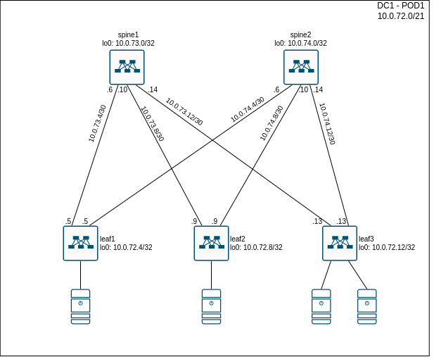
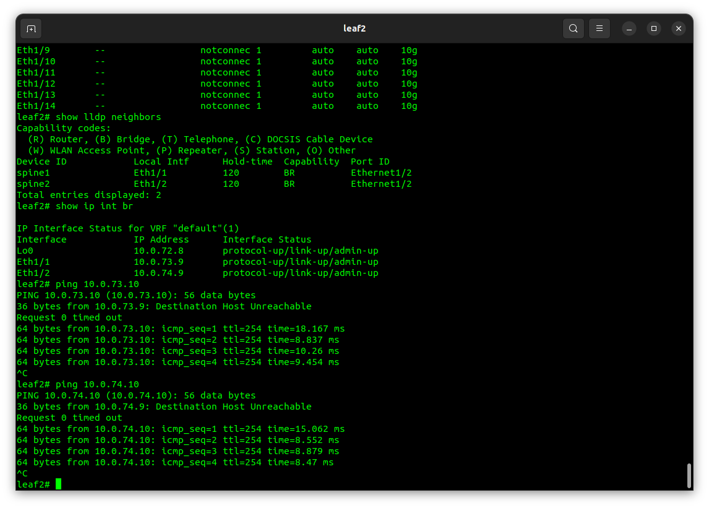

# Lesson 3
Домашняя работа к уроку № 3 "Основы проектирования сети"

## Цели
* Собрать схему CLOS;
* Распределить адресное пространство;

## Задачи
1. Разработать принципы IP нумерации для Датацентра
2. Подключить коммутаторы согласно схемы
3. Выполнить базовую настройку коммутаторов
4. Настроить IP адреса на интерфейсах, согласно разрабатанной схемы IP адресации
5. Проверить сетевую связность между коммутаторами

## Реализация
### Приципы IP адресации в Underlay сети в Датацентре

Для адресации в Underlay сети в датацентрах нашего предприятия выбираем диапазон адресов 10.0.0.0/16
Вторые 16 бит, используемые для адресации хостов, распределяются следующим образом:
* 17 - 18 - 2 бита определяют номер Датацентра (DC Number). Это позволит использовать 3 Датацентров (Значение 0 не используется для номера Датацентра и может быть использовано для общих служебных сетей).
* 19 - 21 - 3 бита определяют номер блока в Датацентре (POD Number). Это позволит использовать 7 блоков (POD) в пределах Датацентра (Значение 0 не используется для номера POD и может быть использовано для служебных сетей внутри датацентра).
* 22 -24 - 3 бита определяю номер spine коммутатора внутри POD. Это позволит использовать 7 spine коммутаторов внутри одного POD (Значение 0 зарезервировано для IP адресов Loopback интерфейсов).
* 25 - 30 - 6 битов определяют номер leaf коммут
атора внутри POD. Это позволит использовать 63 leaf коммутатор внутри одного POD (Значение 0 зарезервировано для IP адресов Loopback интерфейсов).
* 31 - 32 - 2 бита для IP адресов P2P линков между коммутаторами (Для коммутаторов уровня spine, 31 бит устанавливается в значение 1, 32 бит в значение 0. Для коммутаторов уровня leaf - 31 бит устанавливается в значение 0, 32 - в значение 1)
В данной схеме нумерации, IP адресация линком между коммутаторами, будет определяться установкой номеров коммутаторов в соответсвующих полях и установкой последних двух битов в значение 0 или 1. IP адресация Loopback интерфейсов формируется установкой номера коммутатора в соттветсвующие поля, значения 0 в поля, отведенные для коммутаторов другого уровня и значением 0 в поледних двух битах.

Например:

Для DC1 - POD1 будет использоваться битовая маска: 01001000.00000000, что соответсвует сети: 10.72.0.0/21
Для линка между коммутатором spine 1 и leaf 2 в DC 1, POD 1 будет использоваться битовое значение (вторые 16 бит): 01 001 001.000010 00 что соответсвует подсети: 10.0.73.8/30. У интерфейс на spine коммутаторе будет IP адрес: 10.0.73.10/30, У интерфейс на leaf коммутаторе будет IP адрес: 10.0.73.9/30. IP адрес Loopback интерфейса на коммутаторе spine1 будет: 10.0.73.0/32, а у коммутатора leaf2 - будет: 10.0.72.8/32

## Схема соединений коммутаторов


## Конфигурация коммутаторов
На коммутаторах выполнена следующая конфигурация:
* spine1:
```
hostname spine1

feature lldp

no ip domain-lookup

interface Ethernet1/1
  description -- spine1  --
  no switchport
  ip address 10.0.73.6/30
  no shutdown

interface Ethernet1/2
  description -- spine2  --
  no switchport
  ip address 10.0.73.10/30
  no shutdown

interface Ethernet1/3
  description -- spine3  --
  no switchport
  ip address 10.0.73.14/30
  no shutdown

interface loopback0
  ip address 10.0.73.0/32

end
```

* spine2
```
hostname spine2

feature lldp

no ip domain-lookup

interface Ethernet1/1
  description -- leaf1 --
  no switchport
  ip address 10.0.74.6/30
  no shutdown

interface Ethernet1/2
  description -- leaf2 --
  no switchport
  ip address 10.0.74.10/30
  no shutdown

interface Ethernet1/3
  description -- leaf3 --
  no switchport
  ip address 10.0.74.14/30
  no shutdown

interface loopback0
  ip address 10.0.74.0/32

end
```

* leaf1
```
hostname leaf1

feature lldp

no ip domain-lookup

interface Ethernet1/1
  description -- spine1 --
  no switchport
  ip address 10.0.73.5/30
  no shutdown

interface Ethernet1/2
  description -- spine2 --
  no switchport
  ip address 10.0.74.5/30
  no shutdown

interface loopback0
  ip address 10.0.72.4/32

end
```

* leaf2
```
hostname leaf2

feature lldp

no ip domain-lookup

interface Ethernet1/1
  description -- spine1 --
  no switchport
  ip address 10.0.73.9/30
  no shutdown

interface Ethernet1/2
  description -- spine2 --
  no switchport
  ip address 10.0.74.9/30
  no shutdown

interface loopback0
  ip address 10.0.72.8/32

end
```

* leaf3
```
hostname leaf3

feature lldp

no ip domain-lookup

interface Ethernet1/1
  description -- spine1 --
  no switchport
  ip address 10.0.73.13/30
  no shutdown

interface Ethernet1/2
  description -- spine2 --
  no switchport
  ip address 10.0.74.13/30
  no shutdown

interface loopback0
  ip address 10.0.72.12/32

end
```

## Проверка результатов настройки





