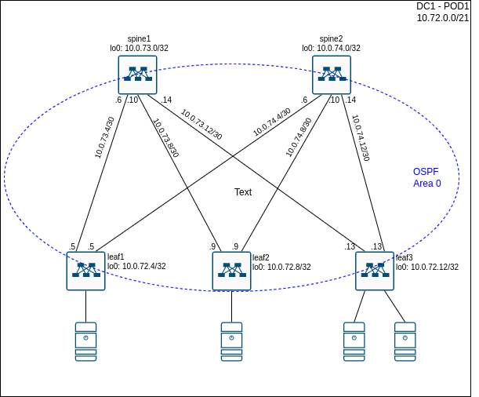
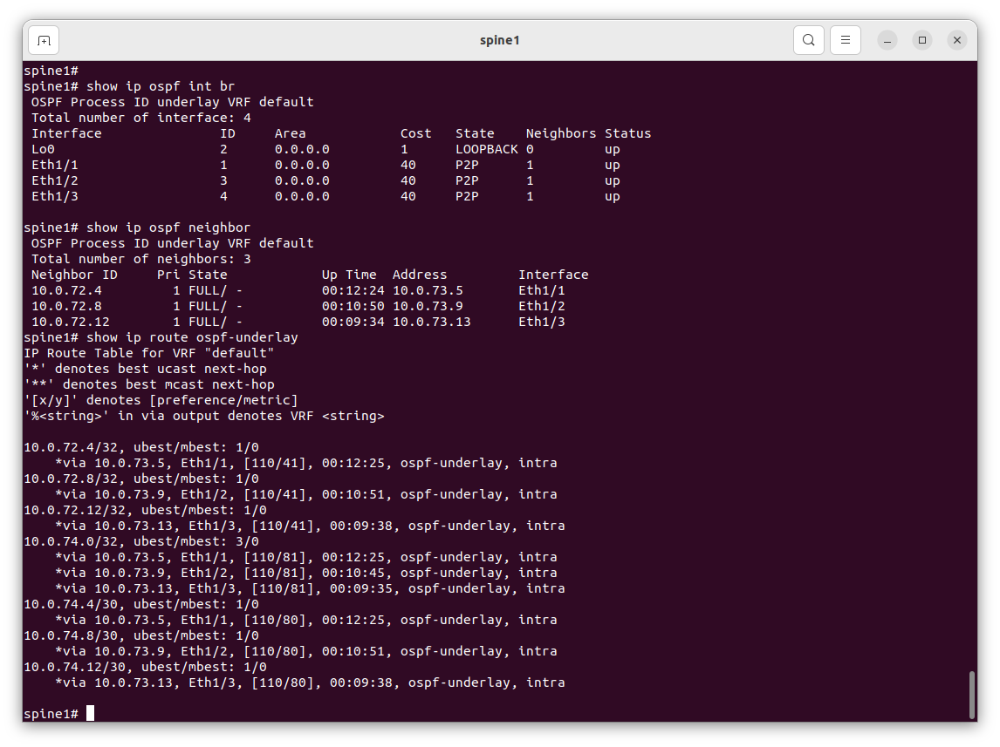
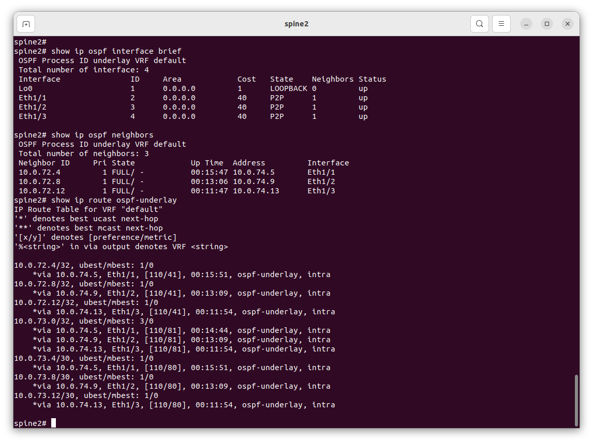
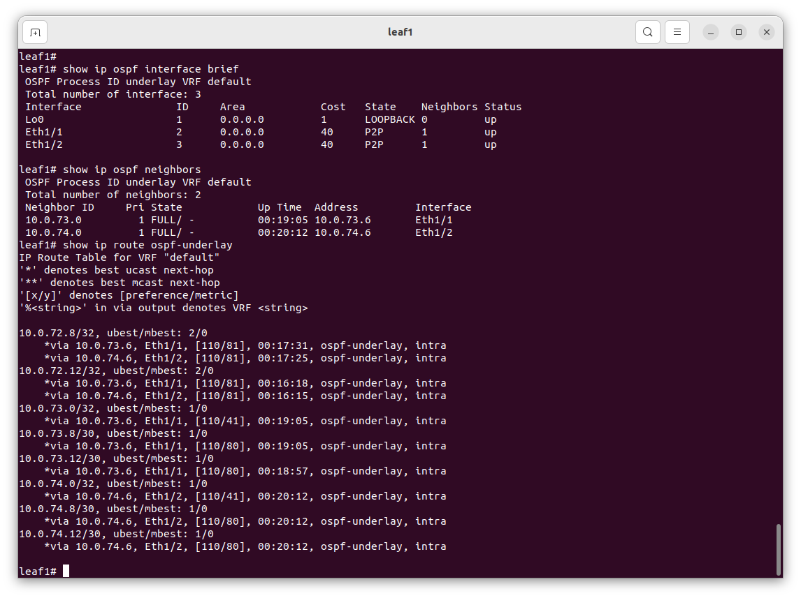
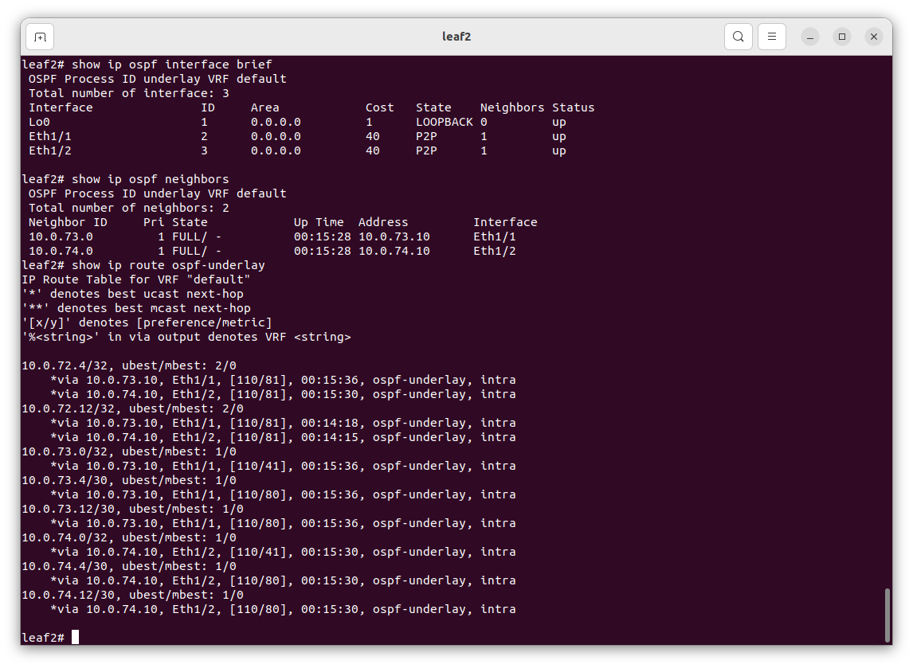
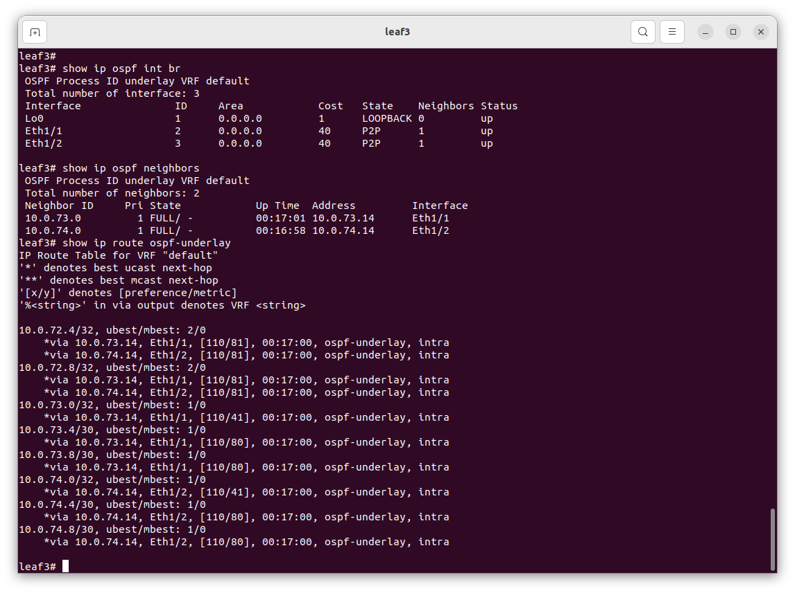

# Lesson 5
Домашняя работа по уроку № 5 "Построение Underlay сети(OSPF)"

## Цели
* Настроить OSPF для Underlay сети;

## Задачи
   Предполагается, что IP адресация уже спланирована и оборудование подключено согласно схеме из задания №3  
1. Разработать схему областей OSPF, используемой в нашем датацентре
2. Выполнить настройку протокола OSPF на коммутаторах
   * Настроить протокол OSPF глобально на коммутаоре
   * Настроить протокол OSPF на интерфесах, соединяющих коммутаторы друг с другом, включив аутентификацию
   * Настроить протокол OSPF на Loopback интерфейсах 
3. Проверить сетевую установление соседства между коммутаторами и наличие маршрутов до префиксов loopback интерфейсов всех коммутаторов

## Реализация
### Схема использование областей протокола OSPF в underlay сети датацентра

Для простоты конфигурации, и так как в нашем Датацентре не предполагается большого числа коммутаторов, планируется включить все коммутаторы в одну Backbone Area 0 протокола OSPF. Все коммутаторы будут в домене OSPF будут выполнять функцию Backbone router (BR).

## Схема OSPF


## Конфигурация коммутаторов
На коммутаторах выполнена следующая конфигурация:
* spine1:
```
feature ospf

router ospf underlay
 router-id 10.0.73.0
exit

interface lo0
 ip router ospf underlay area 0.0.0.0
exit

interface eth1/1
 ip ospf authentication message-digest
 ip ospf message-digest-key 1 md5 0 otus
 ip ospf network point-to-point
 ip router ospf underlay area 0.0.0.0
exit
interface eth1/2
 ip ospf authentication message-digest
 ip ospf message-digest-key 1 md5 0 otus
 ip ospf network point-to-point
 ip router ospf underlay area 0.0.0.0
exit
interface eth1/3
 ip ospf authentication message-digest
 ip ospf message-digest-key 1 md5 0 otus
 ip ospf network point-to-point
 ip router ospf underlay area 0.0.0.0
end
```

* spine2
```
feature ospf

router ospf underlay
 router-id 10.0.74.0
exit

interface lo0
 ip router ospf underlay area 0.0.0.0
exit

interface eth1/1
 ip ospf authentication message-digest
 ip ospf message-digest-key 1 md5 0 otus
 ip ospf network point-to-point
 ip router ospf underlay area 0.0.0.0
exit
interface eth1/2
 ip ospf authentication message-digest
 ip ospf message-digest-key 1 md5 0 otus
 ip ospf network point-to-point
 ip router ospf underlay area 0.0.0.0
exit
interface eth1/3
 ip ospf authentication message-digest
 ip ospf message-digest-key 1 md5 0 otus
 ip ospf network point-to-point
 ip router ospf underlay area 0.0.0.0
end
```

* leaf1
```
feature ospf

router ospf underlay
 router-id 10.0.72.4
exit

interface lo0
 ip router ospf underlay area 0.0.0.0
exit

interface eth1/1
 ip ospf authentication message-digest
 ip ospf message-digest-key 1 md5 0 otus
 ip ospf network point-to-point
 ip router ospf underlay area 0.0.0.0
exit
interface eth1/2
 ip ospf authentication message-digest
 ip ospf message-digest-key 1 md5 0 otus
 ip ospf network point-to-point
 ip router ospf underlay area 0.0.0.0
end

```

* leaf2
```
feature ospf

router ospf underlay
 router-id 10.0.72.8
exit

interface lo0
 ip router ospf underlay area 0.0.0.0
exit

interface eth1/1
 ip ospf authentication message-digest
 ip ospf message-digest-key 1 md5 0 otus
 ip ospf network point-to-point
 ip router ospf underlay area 0.0.0.0
exit
interface eth1/2
 ip ospf authentication message-digest
 ip ospf message-digest-key 1 md5 0 otus
 ip ospf network point-to-point
 ip router ospf underlay area 0.0.0.0
end
```

* leaf3
```
feature ospf

router ospf underlay
 router-id 10.0.72.12
exit

interface lo0
 ip router ospf underlay area 0.0.0.0
exit

interface eth1/1
 ip ospf authentication message-digest
 ip ospf message-digest-key 1 md5 0 otus
 ip ospf network point-to-point
 ip router ospf underlay area 0.0.0.0
exit
interface eth1/2
 ip ospf authentication message-digest
 ip ospf message-digest-key 1 md5 0 otus
 ip ospf network point-to-point
 ip router ospf underlay area 0.0.0.0
end
```

## Проверка результатов настройки
Коммутатор spine1:

Коммутатор spine2

Коммутатор leaf1

Коммутатор leaf2

Коммутатор leaf3

