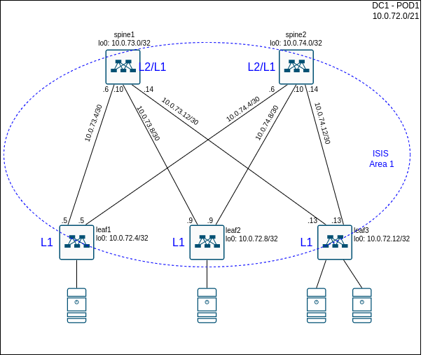
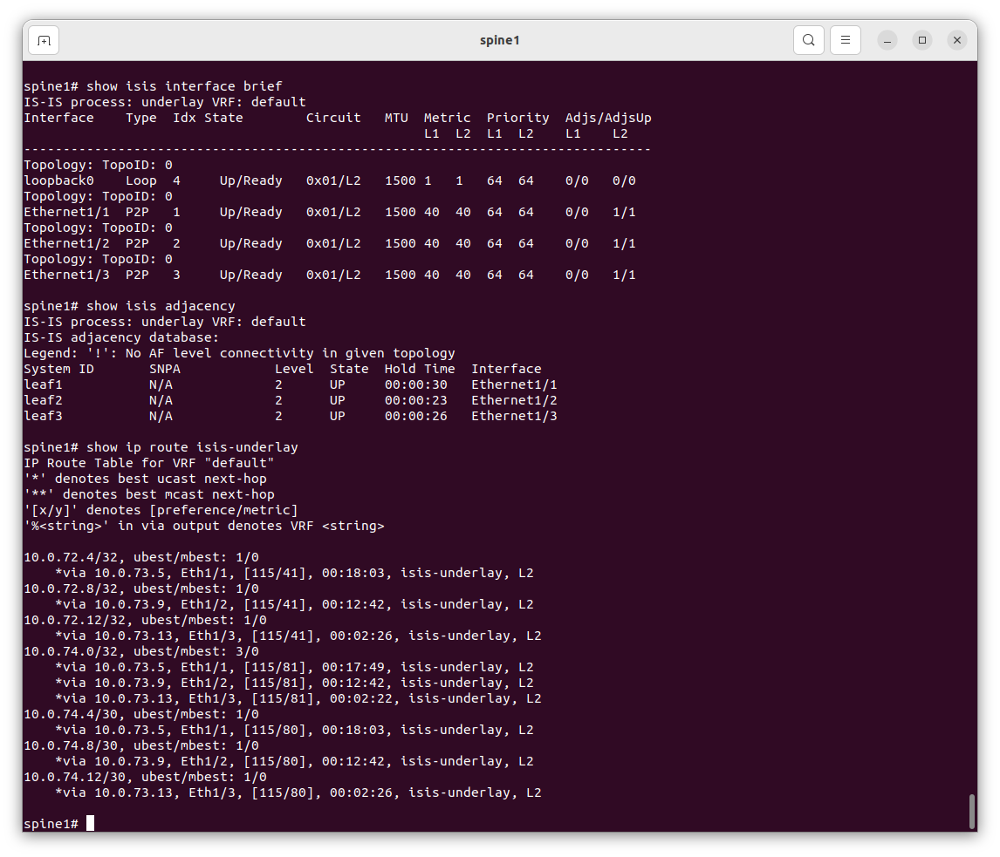
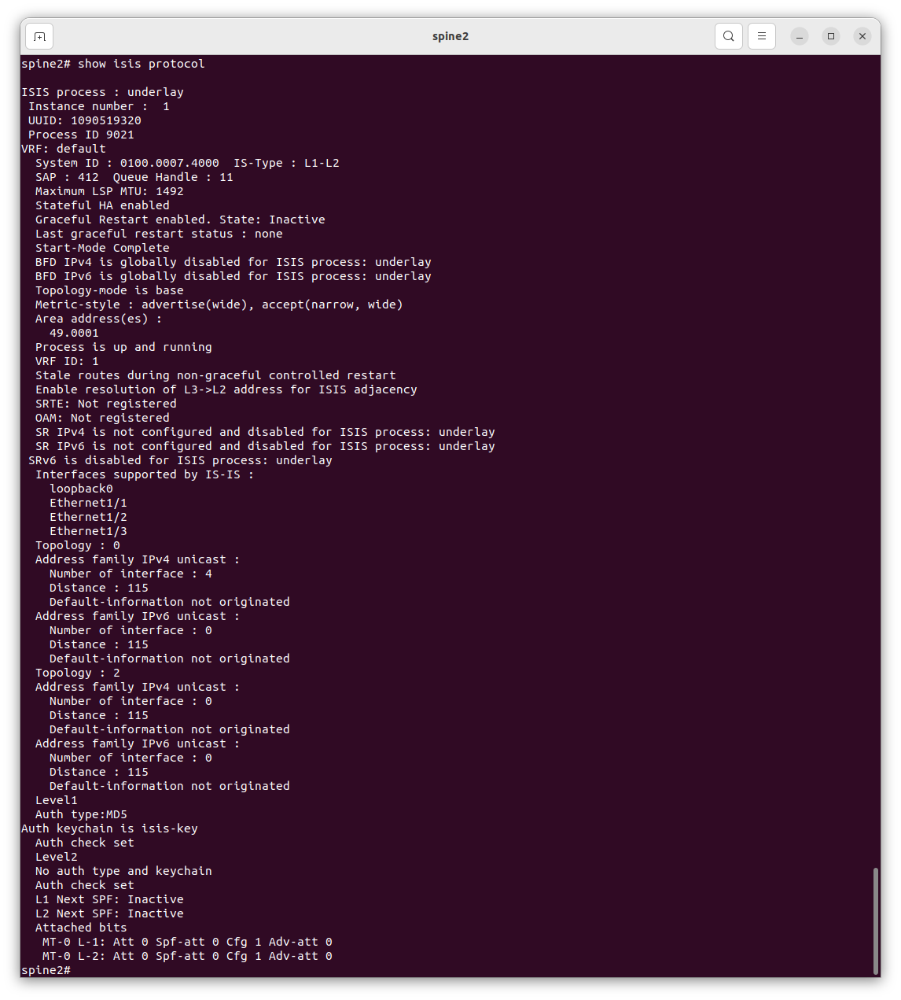
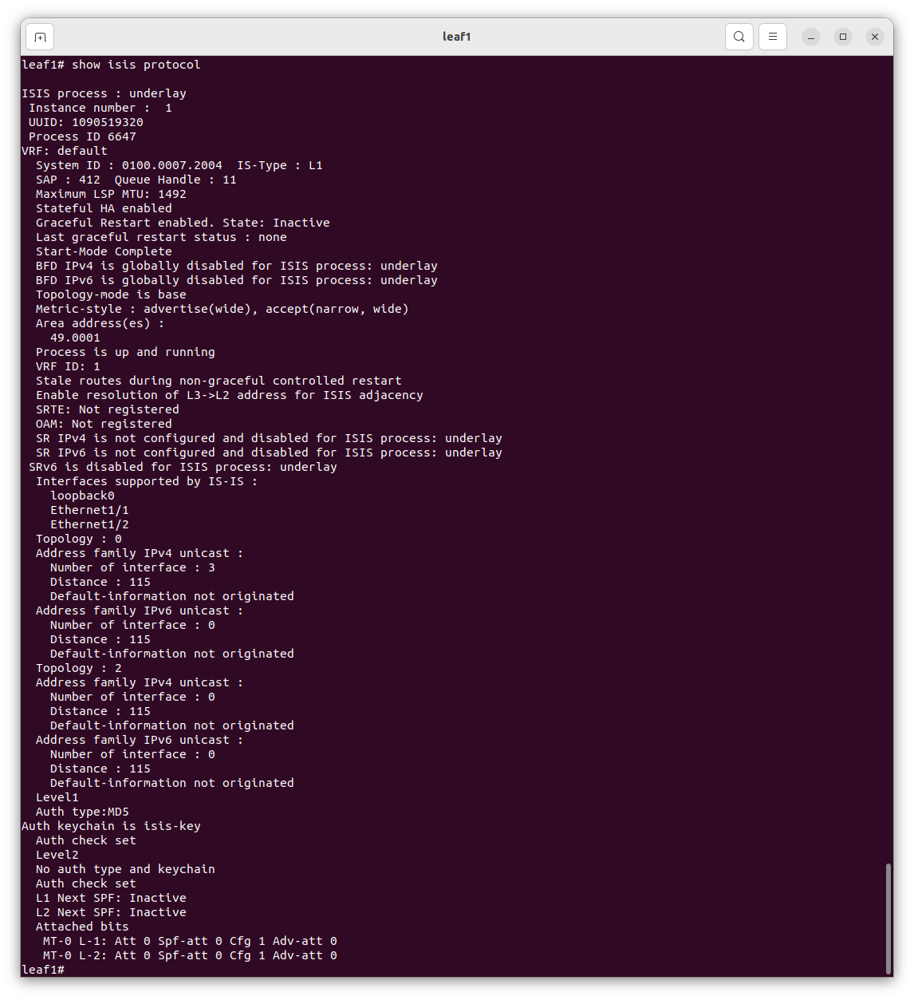
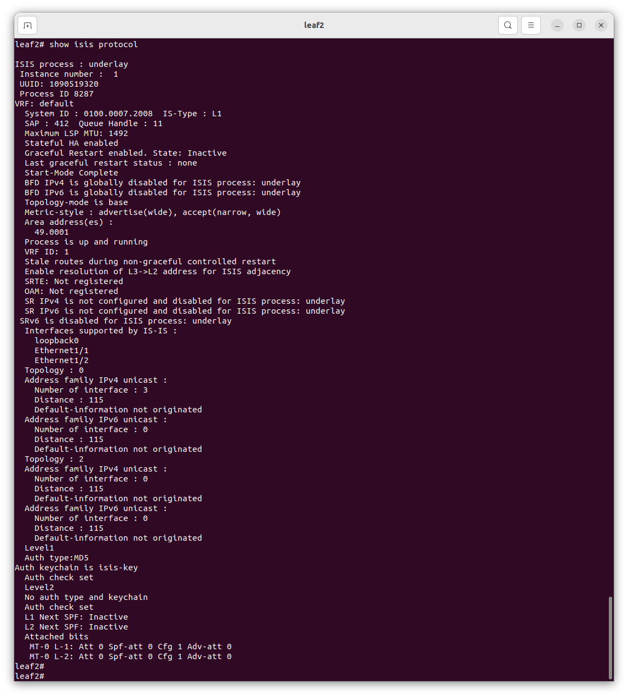
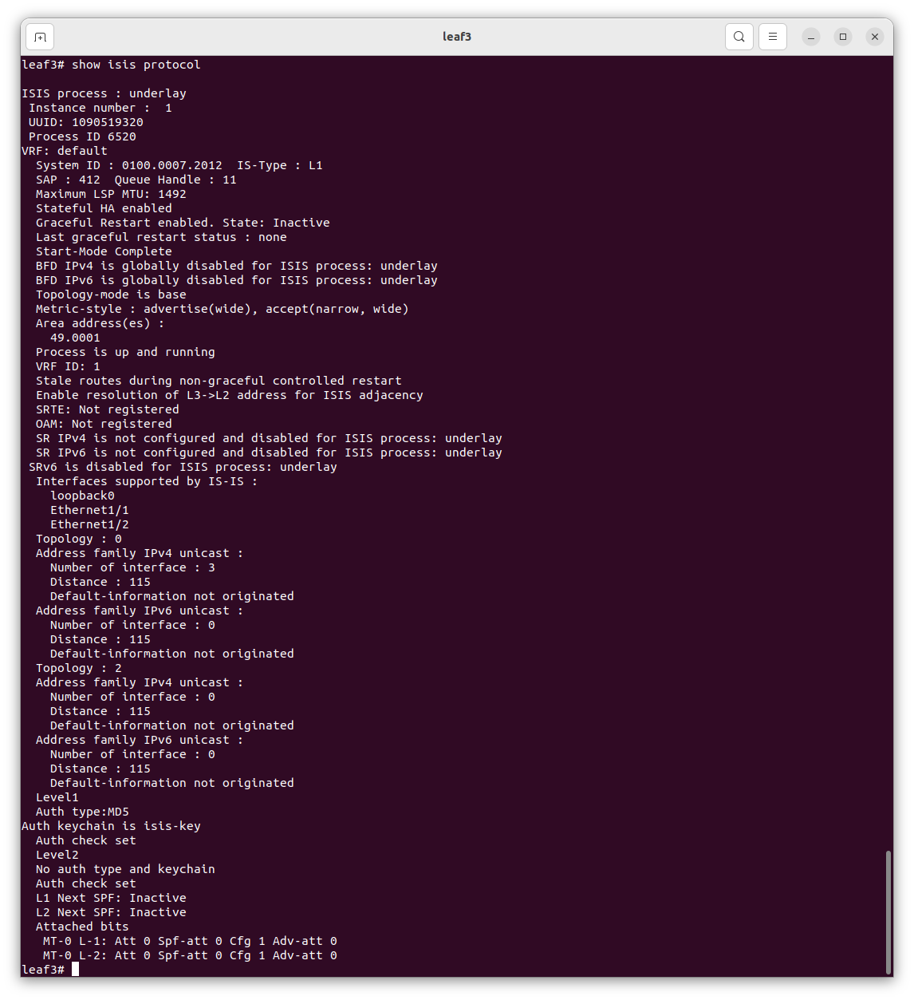

# Lesson 6
Домашняя работа к уроку № 6 "Построение Underlay сети(ISIS)"

## Цели
* Настроить ISIS для Underlay сети;

## Задачи
   Предполагается, что IP адресация уже спланирована и оборудование подключено согласно схеме из задания №3  
1. Разработать схему областей ISIS и выбрать типы маршрутизаторов, используемых в нашем датацентре
2. Выполнить настройку протокола ISIS на коммутаторах
   * Настроить протокол ISIS глобально на коммутаоре
   * Настроить протокол ISISна интерфесах, соединяющих коммутаторы друг с другом, включив аутентификацию
   * Настроить протокол ISIS на Loopback интерфейсах 
3. Проверить установление соседства между коммутаторами и наличие маршрутов до префиксов loopback интерфейсов всех коммутаторов

## Реализация
### Схема использование областей протокола ISIS и типы маршрутизаторов в underlay сети датацентра

Для простоты конфигурации, и так как в нашем Датацентре не предполагается большого числа коммутаторов, планируется включить все коммутаторы в одну Area 1 протокола ISIS. Spine коммутаторы будут выполнять роль L2 only маршрутизаторов, leaf коммутаторы - L1/L2 маршрутизаторов. 

## Схема OSPF


## Конфигурация коммутаторов
На коммутаторах выполнена следующая конфигурация:
* spine1:
```
feature isis

key chain isis-key
  key 1
    key-string 0 otus

router isis underlay
  net 49.0001.0100.0007.3000.00
  is-type level-2
  authentication-type md5 level-2
  authentication key-chain isis-key level-2

interface loopback0
  ip router isis underlay

interface Ethernet1/1
  isis network point-to-point
  ip router isis underlay

interface Ethernet1/2
  isis network point-to-point
  ip router isis underlay

interface Ethernet1/3
  isis network point-to-point
  ip router isis underlay
end
```

* spine2
```
feature isis

key chain isis-key
  key 1
    key-string 0 otus

router isis underlay
  net 49.0001.0100.0007.4000.00
  is-type level-2
  authentication-type md5 level-2
  authentication key-chain isis-key level-2

interface loopback0
  ip router isis underlay

interface Ethernet1/1
  isis network point-to-point
  ip router isis underlay

interface Ethernet1/2
  isis network point-to-point
  ip router isis underlay

interface Ethernet1/3
  isis network point-to-point
  ip router isis underlay
end
```

* leaf1
```
feature isis

key chain isis-key
  key 1
    key-string 0 otus

router isis underlay
  net 49.0001.0100.0007.2004.00
  is-type level-1-2
  authentication-type md5 level-2
  authentication key-chain isis-key level-2

interface loopback0
  ip router isis underlay

interface Ethernet1/1
  isis network point-to-point
  ip router isis underlay

interface Ethernet1/2
  isis network point-to-point
  ip router isis underlay
end
```

* leaf2
```
feature isis

key chain isis-key
  key 1
    key-string 0 otus

router isis underlay
  net 49.0001.0100.0007.2008.00
  is-type level-1-2
  authentication-type md5 level-2
  authentication key-chain isis-key level-2

interface loopback0
  ip router isis underlay

interface Ethernet1/1
  isis network point-to-point
  ip router isis underlay

interface Ethernet1/2
  isis network point-to-point
  ip router isis underlay
end
```

* leaf3
```
feature isis

key chain isis-key
  key 1
    key-string 0 otus

router isis underlay
  net 49.0001.0100.0007.2012.00
  is-type level-1-2
  authentication-type md5 level-2
  authentication key-chain isis-key level-2

interface loopback0
  ip router isis underlay

interface Ethernet1/1
  isis network point-to-point
  ip router isis underlay

interface Ethernet1/2
  isis network point-to-point
  ip router isis underlay
end
```

## Проверка результатов настройки
Коммутатор spine1:

Коммутатор spine2

Коммутатор leaf1

Коммутатор leaf2

Коммутатор leaf3

