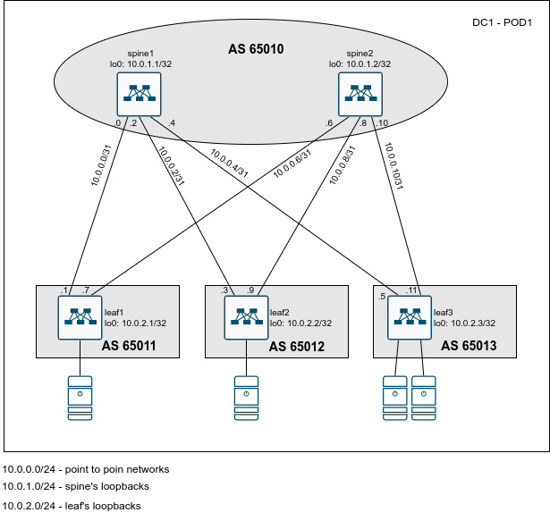

# Lesson 8
Домашняя работа к уроку №  "Построение Underlay сети (BGP)"

## Цели
* Настроить протокол BGP для Underlay сети;

## Задачи
1. Разработать план IP нумерации для Датацентра
2. Разработать схему нумерации AS. Спланировать распределение коммутаторов по разным автономным системам.
3. Выполнить настройку IP на интерфейсах коммутаторов. Проверить IP связность.
4. Выполнить настройку протокола BGP на коммутаторах
   * Настроить протокол BGP на коммутаторе
   * Настроить таймеры протокола BGP
   * Настроить аутентификацию BGP между коммутаторами 
5. Проверить установление соседства между коммутаторами и наличие маршрутов до префиксов loopback интерфейсов всех коммутаторов

## Реализация
### План IP нумерации и распределение AS между коммутаторами
   10.0.0.0/24 - диапазон IP адресов для использования на линках между коммутаторами leaf и spine. На каждом линке планируется использовать сеть /31.
   10.0.1.0/24 - диапазон IP адресов для использования на Loopback интерфейсах коммутаторов уровня spine.
   10.0.2.0/24 - диапазон IP адресов для использования на Loopback интерфейсах коммутаторов уровня leaf.

   Между коммутаторами соседство будет устанавливатся с использованием eBGP.
   
### Схема распределения коммутаторов по различным Автономным системам (AS)
   Коммутаторы уровня spine будут находится в одной AS 65010. Каждый коммутатор уровня leaf будет находитбся в своей AS с номеро 6501X, где X - номер коммутатора leaf (от 1 до 9).

## Сетевая схема


# Конфигурация коммутаторов
На коммутаторах выполнена следующая конфигурация:
* spine1:
```
hostname spine1
!
interface Ethernet1
   no switchport
   ip address 10.0.0.0/31
!
interface Ethernet2
   no switchport
   ip address 10.0.0.2/31
!
interface Ethernet3
   no switchport
   ip address 10.0.0.4/31
!
interface Loopback0
   ip address 10.0.1.1/32
!
ip routing
!
router bgp 65010
   router-id 10.0.1.1
   no bgp default ipv4-unicast
   timers bgp 1 3
   maximum-paths 8
   neighbor 10.0.0.1 remote-as 65011
   neighbor 10.0.0.1 password 0 otus
   neighbor 10.0.0.3 remote-as 65012
   neighbor 10.0.0.3 password 0 otus
   neighbor 10.0.0.5 remote-as 65013
   neighbor 10.0.0.5 password 0 otus
   !
   address-family ipv4
      neighbor 10.0.0.1 activate
      neighbor 10.0.0.3 activate
      neighbor 10.0.0.5 activate
      network 10.0.1.1/32
!
end
```

* spine2:
```
hostname spine2
!
interface Ethernet1
   no switchport
   ip address 10.0.0.6/31
!
interface Ethernet2
   no switchport
   ip address 10.0.0.8/31
!
interface Ethernet3
   no switchport
   ip address 10.0.0.10/31
!
interface Loopback0
   ip address 10.0.1.2/32
!
ip routing
!
router bgp 65010
   router-id 10.0.1.2
   no bgp default ipv4-unicast
   timers bgp 1 3
   maximum-paths 8
   neighbor 10.0.0.7 remote-as 65011
   neighbor 10.0.0.7 password 0 otus
   neighbor 10.0.0.9 remote-as 65012
   neighbor 10.0.0.9 password 0 otus
   neighbor 10.0.0.11 remote-as 65013
   neighbor 10.0.0.11 password 0 otus
   !
   address-family ipv4
      neighbor 10.0.0.7 activate
      neighbor 10.0.0.9 activate
      neighbor 10.0.0.11 activate
      network 10.0.1.2/32
!
end
```
* leaf1:
```
!
hostname leaf1
!
interface Ethernet1
   no switchport
   ip address 10.0.0.1/31
!
interface Ethernet2
   no switchport
   ip address 10.0.0.7/31
!
interface Loopback0
   ip address 10.0.2.1/32
!
ip routing
!
router bgp 65011
   router-id 10.0.2.1
   no bgp default ipv4-unicast
   timers bgp 1 3
   maximum-paths 8
   neighbor 10.0.0.0 remote-as 65010
   neighbor 10.0.0.0 password 0 otus
   neighbor 10.0.0.6 remote-as 65010
   neighbor 10.0.0.6 password 0 otus
   !
   address-family ipv4
      neighbor 10.0.0.0 activate
      neighbor 10.0.0.6 activate
      network 10.0.2.1/32
!
end
```
* leaf2:
```
!
hostname leaf2
!
interface Ethernet1
   no switchport
   ip address 10.0.0.3/31
!
interface Ethernet2
   no switchport
   ip address 10.0.0.9/31
!
interface Loopback0
   ip address 10.0.2.2/32
!
ip routing
!
router bgp 65012
   router-id 10.0.2.2
   no bgp default ipv4-unicast
   timers bgp 1 3
   maximum-paths 8
   neighbor 10.0.0.2 remote-as 65010
   neighbor 10.0.0.2 password 0 otus
   neighbor 10.0.0.8 remote-as 65010
   neighbor 10.0.0.8 password 0 otus
   !
   address-family ipv4
      neighbor 10.0.0.2 activate
      neighbor 10.0.0.8 activate
      network 10.0.2.2/32
!
end

```
* leaf3:
```
!
hostname leaf3
!
interface Ethernet1
   no switchport
   ip address 10.0.0.5/31
!
interface Ethernet2
   no switchport
   ip address 10.0.0.11/31
!
interface Loopback0
   ip address 10.0.2.3/32
!
interface Management1
!
ip routing
!
router bgp 65013
   router-id 10.0.2.3
   no bgp default ipv4-unicast
   timers bgp 1 3
   maximum-paths 8
   neighbor 10.0.0.4 remote-as 65010
   neighbor 10.0.0.4 password 0 otus
   neighbor 10.0.0.10 remote-as 65010
   neighbor 10.0.0.10 password 0 otus
   !
   address-family ipv4
      neighbor 10.0.0.4 activate
      neighbor 10.0.0.10 activate
      network 10.0.2.3/32
!
end
```

Вывод информации с коммутатора spine1:
```
spine1#show ip int br
                                                                        Address 
Interface        IP Address       Status      Protocol           MTU    Owner   
---------------- ---------------- ----------- ------------- ----------- ------- 
Ethernet1        10.0.0.0/31      up          up                1500            
Ethernet2        10.0.0.2/31      up          up                1500            
Ethernet3        10.0.0.4/31      up          up                1500            
Loopback0        10.0.1.1/32      up          up               65535            
Management1      unassigned       up          up                1500            

spine1#show ip bgp sum
BGP summary information for VRF default
Router identifier 10.0.1.1, local AS number 65010
Neighbor Status Codes: m - Under maintenance
  Neighbor         V  AS           MsgRcvd   MsgSent  InQ OutQ  Up/Down State   PfxRcd PfxAcc
  10.0.0.1         4  65011            967       970    0    0 00:08:59 Estab   1      1
  10.0.0.3         4  65012            923       922    0    0 00:08:02 Estab   1      1
  10.0.0.5         4  65013            877       877    0    0 00:07:09 Estab   1      1
spine1#show ip bgp
BGP routing table information for VRF default
Router identifier 10.0.1.1, local AS number 65010
Route status codes: s - suppressed, * - valid, > - active, # - not installed, E - ECMP head, e - ECMP
                    S - Stale, c - Contributing to ECMP, b - backup, L - labeled-unicast
Origin codes: i - IGP, e - EGP, ? - incomplete
AS Path Attributes: Or-ID - Originator ID, C-LST - Cluster List, LL Nexthop - Link Local Nexthop

         Network                Next Hop            Metric  LocPref Weight  Path
 * >     10.0.1.1/32            -                     0       0       -       i
 * >     10.0.2.1/32            10.0.0.1              0       100     0       65011 i
 * >     10.0.2.2/32            10.0.0.3              0       100     0       65012 i
 * >     10.0.2.3/32            10.0.0.5              0       100     0       65013 i
spine1#show ip route bgp

VRF: default
Codes: C - connected, S - static, K - kernel, 
       O - OSPF, IA - OSPF inter area, E1 - OSPF external type 1,
       E2 - OSPF external type 2, N1 - OSPF NSSA external type 1,
       N2 - OSPF NSSA external type2, B - BGP, B I - iBGP, B E - eBGP,
       R - RIP, I L1 - IS-IS level 1, I L2 - IS-IS level 2,
       O3 - OSPFv3, A B - BGP Aggregate, A O - OSPF Summary,
       NG - Nexthop Group Static Route, V - VXLAN Control Service,
       DH - DHCP client installed default route, M - Martian,
       DP - Dynamic Policy Route, L - VRF Leaked,
       G  - gRIBI, RC - Route Cache Route

 B E      10.0.2.1/32 [200/0] via 10.0.0.1, Ethernet1
 B E      10.0.2.2/32 [200/0] via 10.0.0.3, Ethernet2
 B E      10.0.2.3/32 [200/0] via 10.0.0.5, Ethernet3

spine1#show ip bgp neighb | in time
  Hold time is 3, keepalive interval is 1 seconds
  Configured hold time is 3, keepalive interval is 1 seconds
  Connect timer is inactive
  Idle-restart timer is inactive
  Last sent notification:Hold Timer Expired Error/Unspecified, Last time 00:11:53
  Last rcvd notification:Cease/administrative reset, Last time 00:15:32
  Restart timer is inactive
  End of rib timer is inactive
  Hold time is 3, keepalive interval is 1 seconds
  Configured hold time is 3, keepalive interval is 1 seconds
  Connect timer is inactive
  Idle-restart timer is inactive
  Last sent notification:Hold Timer Expired Error/Unspecified, Last time 00:11:43
  Last rcvd notification:Cease/administrative reset, Last time 00:15:28
  Restart timer is inactive
  End of rib timer is inactive
  Hold time is 3, keepalive interval is 1 seconds
  Configured hold time is 3, keepalive interval is 1 seconds
  Connect timer is inactive
  Idle-restart timer is inactive
  Last sent notification:Hold Timer Expired Error/Unspecified, Last time 00:11:39
  Last rcvd notification:Cease/administrative reset, Last time 00:15:22, First time 00:15:57, Repeats 1
  Restart timer is inactive
  End of rib timer is inactive
spine1#
```
Вывод информации с коммутатора spine2:
```
spine2#show ip int br
                                                                        Address 
Interface        IP Address        Status      Protocol          MTU    Owner   
---------------- ----------------- ----------- ------------- ---------- ------- 
Ethernet1        10.0.0.6/31       up          up               1500            
Ethernet2        10.0.0.8/31       up          up               1500            
Ethernet3        10.0.0.10/31      up          up               1500            
Loopback0        10.0.1.2/32       up          up              65535            
Management1      unassigned        up          up               1500            

spine2#show ip bgp summ
BGP summary information for VRF default
Router identifier 10.0.1.2, local AS number 65010
Neighbor Status Codes: m - Under maintenance
  Neighbor         V  AS           MsgRcvd   MsgSent  InQ OutQ  Up/Down State   PfxRcd PfxAcc
  10.0.0.7         4  65011           1188      1189    0    0 00:11:25 Estab   1      1
  10.0.0.9         4  65012           1137      1129    0    0 00:10:25 Estab   1      1
  10.0.0.11        4  65013           1096      1093    0    0 00:09:42 Estab   1      1
spine2#show ip bgp
BGP routing table information for VRF default
Router identifier 10.0.1.2, local AS number 65010
Route status codes: s - suppressed, * - valid, > - active, # - not installed, E - ECMP head, e - ECMP
                    S - Stale, c - Contributing to ECMP, b - backup, L - labeled-unicast
Origin codes: i - IGP, e - EGP, ? - incomplete
AS Path Attributes: Or-ID - Originator ID, C-LST - Cluster List, LL Nexthop - Link Local Nexthop

         Network                Next Hop            Metric  LocPref Weight  Path
 * >     10.0.1.2/32            -                     0       0       -       i
 * >     10.0.2.1/32            10.0.0.7              0       100     0       65011 i
 * >     10.0.2.2/32            10.0.0.9              0       100     0       65012 i
 * >     10.0.2.3/32            10.0.0.11             0       100     0       65013 i
spine2#show ip route bgp

VRF: default
Codes: C - connected, S - static, K - kernel, 
       O - OSPF, IA - OSPF inter area, E1 - OSPF external type 1,
       E2 - OSPF external type 2, N1 - OSPF NSSA external type 1,
       N2 - OSPF NSSA external type2, B - BGP, B I - iBGP, B E - eBGP,
       R - RIP, I L1 - IS-IS level 1, I L2 - IS-IS level 2,
       O3 - OSPFv3, A B - BGP Aggregate, A O - OSPF Summary,
       NG - Nexthop Group Static Route, V - VXLAN Control Service,
       DH - DHCP client installed default route, M - Martian,
       DP - Dynamic Policy Route, L - VRF Leaked,
       G  - gRIBI, RC - Route Cache Route

 B E      10.0.2.1/32 [200/0] via 10.0.0.7, Ethernet1
 B E      10.0.2.2/32 [200/0] via 10.0.0.9, Ethernet2
 B E      10.0.2.3/32 [200/0] via 10.0.0.11, Ethernet3

spine2#show ip bgp neighbor | in time
  Hold time is 3, keepalive interval is 1 seconds
  Configured hold time is 3, keepalive interval is 1 seconds
  Connect timer is inactive
  Idle-restart timer is inactive
  Last sent notification:Hold Timer Expired Error/Unspecified, Last time 00:13:01
  Last rcvd notification:Cease/administrative reset, Last time 00:18:15
  Restart timer is inactive
  End of rib timer is inactive
  Hold time is 3, keepalive interval is 1 seconds
  Configured hold time is 3, keepalive interval is 1 seconds
  Connect timer is inactive
  Idle-restart timer is inactive
  Last sent notification:Hold Timer Expired Error/Unspecified, Last time 00:12:56
  Last rcvd notification:Cease/administrative reset, Last time 00:18:10
  Restart timer is inactive
  End of rib timer is inactive
  Hold time is 3, keepalive interval is 1 seconds
  Configured hold time is 3, keepalive interval is 1 seconds
  Connect timer is inactive
  Idle-restart timer is inactive
  Last sent notification:Hold Timer Expired Error/Unspecified, Last time 00:12:52
  Last rcvd notification:Cease/administrative reset, Last time 00:18:04, First time 00:18:39, Repeats 1
  Restart timer is inactive
  End of rib timer is inactive
spine2#
```

Вывод информации с коммутатора leaf1:
```
leaf1#show ip int br
                                                                        Address 
Interface        IP Address       Status      Protocol           MTU    Owner   
---------------- ---------------- ----------- ------------- ----------- ------- 
Ethernet1        10.0.0.1/31      up          up                1500            
Ethernet2        10.0.0.7/31      up          up                1500            
Loopback0        10.0.2.1/32      up          up               65535            
Management1      unassigned       up          up                1500            

leaf1#show ip route bgp

VRF: default
Codes: C - connected, S - static, K - kernel, 
       O - OSPF, IA - OSPF inter area, E1 - OSPF external type 1,
       E2 - OSPF external type 2, N1 - OSPF NSSA external type 1,
       N2 - OSPF NSSA external type2, B - BGP, B I - iBGP, B E - eBGP,
       R - RIP, I L1 - IS-IS level 1, I L2 - IS-IS level 2,
       O3 - OSPFv3, A B - BGP Aggregate, A O - OSPF Summary,
       NG - Nexthop Group Static Route, V - VXLAN Control Service,
       DH - DHCP client installed default route, M - Martian,
       DP - Dynamic Policy Route, L - VRF Leaked,
       G  - gRIBI, RC - Route Cache Route

 B E      10.0.1.1/32 [200/0] via 10.0.0.0, Ethernet1
 B E      10.0.1.2/32 [200/0] via 10.0.0.6, Ethernet2
 B E      10.0.2.2/32 [200/0] via 10.0.0.0, Ethernet1
                              via 10.0.0.6, Ethernet2
 B E      10.0.2.3/32 [200/0] via 10.0.0.0, Ethernet1
                              via 10.0.0.6, Ethernet2

leaf1#show ip bgp
BGP routing table information for VRF default
Router identifier 10.0.2.1, local AS number 65011
Route status codes: s - suppressed, * - valid, > - active, # - not installed, E - ECMP head, e - ECMP
                    S - Stale, c - Contributing to ECMP, b - backup, L - labeled-unicast
Origin codes: i - IGP, e - EGP, ? - incomplete
AS Path Attributes: Or-ID - Originator ID, C-LST - Cluster List, LL Nexthop - Link Local Nexthop

         Network                Next Hop            Metric  LocPref Weight  Path
 * >     10.0.1.1/32            10.0.0.0              0       100     0       65010 i
 * >     10.0.1.2/32            10.0.0.6              0       100     0       65010 i
 * >     10.0.2.1/32            -                     0       0       -       i
 * >Ec   10.0.2.2/32            10.0.0.0              0       100     0       65010 65012 i
 *  ec   10.0.2.2/32            10.0.0.6              0       100     0       65010 65012 i
 * >Ec   10.0.2.3/32            10.0.0.0              0       100     0       65010 65013 i
 *  ec   10.0.2.3/32            10.0.0.6              0       100     0       65010 65013 i
leaf1#show ip bgp summ
BGP summary information for VRF default
Router identifier 10.0.2.1, local AS number 65011
Neighbor Status Codes: m - Under maintenance
  Neighbor         V  AS           MsgRcvd   MsgSent  InQ OutQ  Up/Down State   PfxRcd PfxAcc
  10.0.0.0         4  65010           1433      1438    0    0 00:16:47 Estab   3      3
  10.0.0.6         4  65010           1498      1506    0    0 00:16:39 Estab   3      3
leaf1#show ip bgp neighbor | in time
  Hold time is 3, keepalive interval is 1 seconds
  Configured hold time is 3, keepalive interval is 1 seconds
  Connect timer is inactive
  Idle-restart timer is inactive
  Last sent notification:Hold Timer Expired Error/Unspecified, Last time 00:19:36
  Last rcvd notification:Cease/administrative reset, Last time 00:23:26
  Restart timer is inactive
  End of rib timer is inactive
  Hold time is 3, keepalive interval is 1 seconds
  Configured hold time is 3, keepalive interval is 1 seconds
  Connect timer is inactive
  Idle-restart timer is inactive
  Last sent notification:Hold Timer Expired Error/Unspecified, Last time 00:18:01
  Last rcvd notification:Cease/administrative reset, Last time 00:23:20
  Restart timer is inactive
  End of rib timer is inactive
leaf1#
```

Вывод информации с коммутатора leaf2:
```
leaf2#show ip int br
                                                                        Address 
Interface        IP Address       Status      Protocol           MTU    Owner   
---------------- ---------------- ----------- ------------- ----------- ------- 
Ethernet1        10.0.0.3/31      up          up                1500            
Ethernet2        10.0.0.9/31      up          up                1500            
Loopback0        10.0.2.2/32      up          up               65535            
Management1      unassigned       up          up                1500            

leaf2#show ip route bgp

VRF: default
Codes: C - connected, S - static, K - kernel, 
       O - OSPF, IA - OSPF inter area, E1 - OSPF external type 1,
       E2 - OSPF external type 2, N1 - OSPF NSSA external type 1,
       N2 - OSPF NSSA external type2, B - BGP, B I - iBGP, B E - eBGP,
       R - RIP, I L1 - IS-IS level 1, I L2 - IS-IS level 2,
       O3 - OSPFv3, A B - BGP Aggregate, A O - OSPF Summary,
       NG - Nexthop Group Static Route, V - VXLAN Control Service,
       DH - DHCP client installed default route, M - Martian,
       DP - Dynamic Policy Route, L - VRF Leaked,
       G  - gRIBI, RC - Route Cache Route

 B E      10.0.1.1/32 [200/0] via 10.0.0.2, Ethernet1
 B E      10.0.1.2/32 [200/0] via 10.0.0.8, Ethernet2
 B E      10.0.2.1/32 [200/0] via 10.0.0.2, Ethernet1
                              via 10.0.0.8, Ethernet2
 B E      10.0.2.3/32 [200/0] via 10.0.0.2, Ethernet1
                              via 10.0.0.8, Ethernet2

leaf2#show ip bgp summ
BGP summary information for VRF default
Router identifier 10.0.2.2, local AS number 65012
Neighbor Status Codes: m - Under maintenance
  Neighbor         V  AS           MsgRcvd   MsgSent  InQ OutQ  Up/Down State   PfxRcd PfxAcc
  10.0.0.2         4  65010           1460      1468    0    0 00:17:03 Estab   3      3
  10.0.0.8         4  65010           1514      1526    0    0 00:16:52 Estab   3      3

leaf2#show ip bgp
BGP routing table information for VRF default
Router identifier 10.0.2.2, local AS number 65012
Route status codes: s - suppressed, * - valid, > - active, # - not installed, E - ECMP head, e - ECMP
                    S - Stale, c - Contributing to ECMP, b - backup, L - labeled-unicast
Origin codes: i - IGP, e - EGP, ? - incomplete
AS Path Attributes: Or-ID - Originator ID, C-LST - Cluster List, LL Nexthop - Link Local Nexthop

         Network                Next Hop            Metric  LocPref Weight  Path
 * >     10.0.1.1/32            10.0.0.2              0       100     0       65010 i
 * >     10.0.1.2/32            10.0.0.8              0       100     0       65010 i
 * >Ec   10.0.2.1/32            10.0.0.2              0       100     0       65010 65011 i
 *  ec   10.0.2.1/32            10.0.0.8              0       100     0       65010 65011 i
 * >     10.0.2.2/32            -                     0       0       -       i
 * >Ec   10.0.2.3/32            10.0.0.2              0       100     0       65010 65013 i
 *  ec   10.0.2.3/32            10.0.0.8              0       100     0       65010 65013 i

leaf2#show ip bgp neighbor | in time
  Hold time is 3, keepalive interval is 1 seconds
  Configured hold time is 3, keepalive interval is 1 seconds
  Connect timer is inactive
  Idle-restart timer is inactive
  Last sent notification:Hold Timer Expired Error/Unspecified, Last time 00:20:47
  Last rcvd notification:Cease/administrative reset, Last time 00:24:48
  Restart timer is inactive
  End of rib timer is inactive
  Hold time is 3, keepalive interval is 1 seconds
  Configured hold time is 3, keepalive interval is 1 seconds
  Connect timer is inactive
  Idle-restart timer is inactive
  Last sent notification:Hold Timer Expired Error/Unspecified, Last time 00:19:18
  Last rcvd notification:Cease/administrative reset, Last time 00:24:42
  Restart timer is inactive
  End of rib timer is inactive
leaf2#
```

Вывод информации с коммутатора leaf3:
```
leaf3#show ip int br
                                                                        Address 
Interface        IP Address        Status      Protocol          MTU    Owner   
---------------- ----------------- ----------- ------------- ---------- ------- 
Ethernet1        10.0.0.5/31       up          up               1500            
Ethernet2        10.0.0.11/31      up          up               1500            
Loopback0        10.0.2.3/32       up          up              65535            
Management1      unassigned        up          up               1500            

leaf3#show ip route bgp

VRF: default
Codes: C - connected, S - static, K - kernel, 
       O - OSPF, IA - OSPF inter area, E1 - OSPF external type 1,
       E2 - OSPF external type 2, N1 - OSPF NSSA external type 1,
       N2 - OSPF NSSA external type2, B - BGP, B I - iBGP, B E - eBGP,
       R - RIP, I L1 - IS-IS level 1, I L2 - IS-IS level 2,
       O3 - OSPFv3, A B - BGP Aggregate, A O - OSPF Summary,
       NG - Nexthop Group Static Route, V - VXLAN Control Service,
       DH - DHCP client installed default route, M - Martian,
       DP - Dynamic Policy Route, L - VRF Leaked,
       G  - gRIBI, RC - Route Cache Route

 B E      10.0.1.1/32 [200/0] via 10.0.0.4, Ethernet1
 B E      10.0.1.2/32 [200/0] via 10.0.0.10, Ethernet2
 B E      10.0.2.1/32 [200/0] via 10.0.0.4, Ethernet1
                              via 10.0.0.10, Ethernet2
 B E      10.0.2.2/32 [200/0] via 10.0.0.4, Ethernet1
                              via 10.0.0.10, Ethernet2

leaf3#show ip bgp summ
BGP summary information for VRF default
Router identifier 10.0.2.3, local AS number 65013
Neighbor Status Codes: m - Under maintenance
  Neighbor         V  AS           MsgRcvd   MsgSent  InQ OutQ  Up/Down State   PfxRcd PfxAcc
  10.0.0.4         4  65010           1613      1622    0    0 00:19:30 Estab   3      3
  10.0.0.10        4  65010           1678      1685    0    0 00:19:29 Estab   3      3
leaf3#show ip bgp
BGP routing table information for VRF default
Router identifier 10.0.2.3, local AS number 65013
Route status codes: s - suppressed, * - valid, > - active, # - not installed, E - ECMP head, e - ECMP
                    S - Stale, c - Contributing to ECMP, b - backup, L - labeled-unicast
Origin codes: i - IGP, e - EGP, ? - incomplete
AS Path Attributes: Or-ID - Originator ID, C-LST - Cluster List, LL Nexthop - Link Local Nexthop

         Network                Next Hop            Metric  LocPref Weight  Path
 * >     10.0.1.1/32            10.0.0.4              0       100     0       65010 i
 * >     10.0.1.2/32            10.0.0.10             0       100     0       65010 i
 * >Ec   10.0.2.1/32            10.0.0.4              0       100     0       65010 65011 i
 *  ec   10.0.2.1/32            10.0.0.10             0       100     0       65010 65011 i
 * >Ec   10.0.2.2/32            10.0.0.4              0       100     0       65010 65012 i
 *  ec   10.0.2.2/32            10.0.0.10             0       100     0       65010 65012 i
 * >     10.0.2.3/32            -                     0       0       -       i
leaf3#show ip bgp neighbor | in time
  Hold time is 3, keepalive interval is 1 seconds
  Configured hold time is 3, keepalive interval is 1 seconds
  Connect timer is inactive
  Idle-restart timer is inactive
  Last sent notification:Hold Timer Expired Error/Unspecified, Last time 00:24:03
  Last rcvd notification:Cease/administrative reset, Last time 00:28:08
  Restart timer is inactive
  End of rib timer is inactive
  Hold time is 3, keepalive interval is 1 seconds
  Configured hold time is 3, keepalive interval is 1 seconds
  Connect timer is inactive
  Idle-restart timer is inactive
  Last sent notification:Hold Timer Expired Error/Unspecified, Last time 00:22:34
  Last rcvd notification:Cease/administrative reset, Last time 00:28:02
  Restart timer is inactive
  End of rib timer is inactive
leaf3#
```