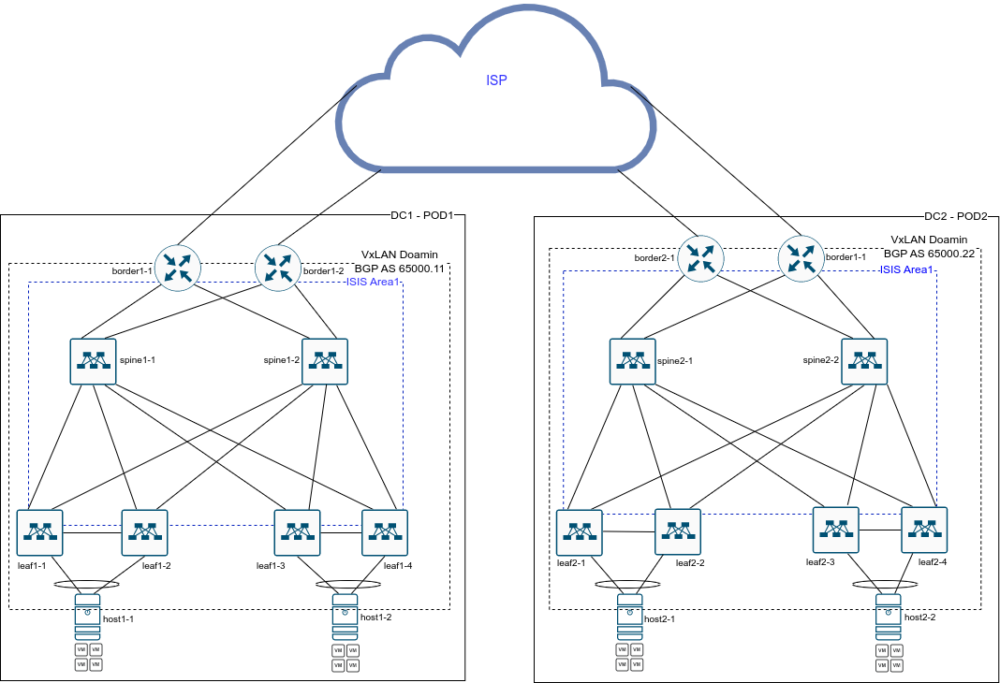
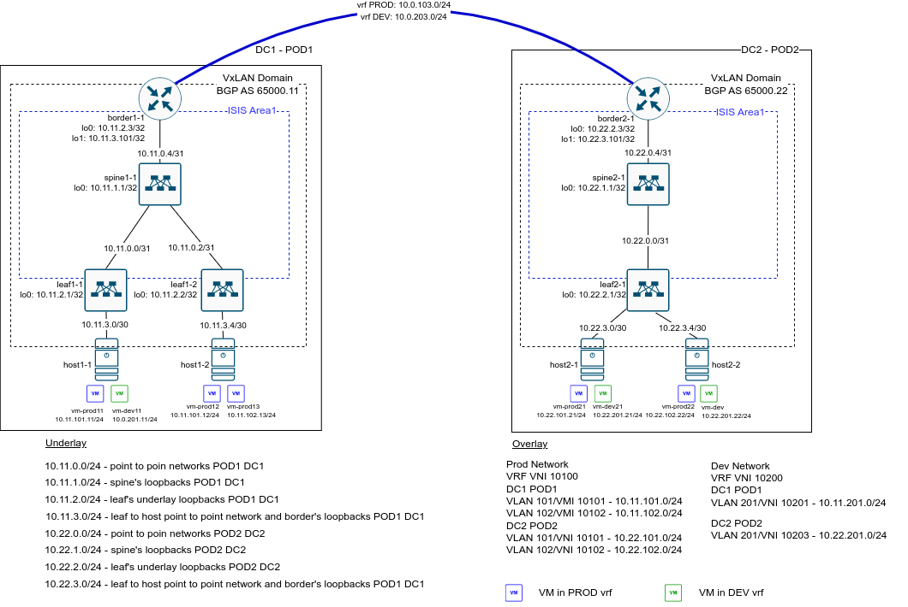
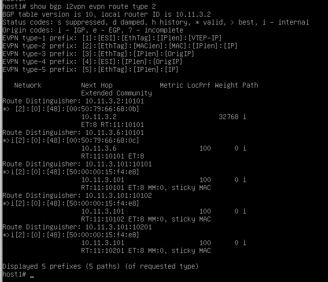
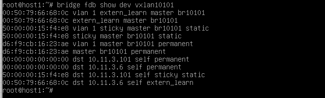

# Проектная работу на тему "Проектирование сетевой фабрики на основне VxLAN EVPN с использованием сетевых компонентов на базе аппаратных и программных компонентов".

## Цели проекта

Разработать сетевую схему двух ЦОДов с использованием технологии VXLAN/EVPN. Показать возможность взаимодействия аппаратных устройств и программных компонент на базе открытого ПО при построении сетевой инфраструктуры ЦОД. Изучить реализацию оверлейных сетей на базе VxLAN в ОС на базе ядра Linux.

## Техническое задание на разработку

Требуется разработать сетевую схему двух Датацентров, соединенных друг с другом L3 каналами передачи данных.
Предполагется использование Датацентров в схеме Активный - Резервный, т.е. не требуется "растягивать" L2 сегменты между датацентрами для организации отказоустойчивых кластеров. Резервирование сервисов из Активного датацентра в Резервный, планируется реализовать путем репликации виртуальных машин в ассинхронном режиме. Способ и методы репликации ВМ в данном проекте не рассматриваются.

## Ограничения проекта

В проекте не предполагается использование централизованной система управления конфигурации сетевого оборудования и управления виртуализацией.
В проекте не расчитывается необходимое количество коммутаторов, количество и скорость связей между коммутаторами. 

## Используемые технологии и программное обесречение

В качестве аппаратной платформы в проекте используется виртуальный образ коммутатора ARISTA vEOS версии EOS-4.26.4M.
В качестве хоста виртуализации используется ОС Linux на базе дистрибутива Debian 11.6. Виртуальный коммутатор реализуется на базе стандартного компонента bridge. В качестве демона маршрутизации используется ПО FRRouting.

## Описание архитектурного решения

Сетевая схема внутри Датацентра состоит из коммутаторов, соединенных в CLOS топологию. Хосты виртуализации подключаются двумя интерфейсами в разным leaf коммутаторам, объеденным в логическую пару (MLAG) для обеспечения резервирования.

В связи с ограничениями в поддержке маршрутизации между Vxlan в текущей реализации компонента bridge, сетевая фабрика будет реализовывать только коммутацию трафика (L2 bridging). Маршрутизация между различными сегментами будет выполняться на коммутаторах, выполняющих роль граничных маршрутизаторов (border leaf). Так же к граничным маршрутизаторам подключаются каналы передачи данных для соединений датацентров между собой.

### План IP нумерации в Underlay сети
В датацентрах будет использоваться следующий план IP нумерации в Underlay сети:
   10.AB.0.0/24 - диапазон IP адресов для использования на линках между коммутаторами leaf и spine. На каждом линке планируется использовать сеть /31.
   10.AB.1.0/24 - диапазон IP адресов для использования на Loopback интерфейсах коммутаторов уровня spine.
   10.AB.2.0/24 - диапазон IP адресов для использования на Loopback интерфейсах коммутаторов уровня leaf.
   10.AB.3.0/24 - диапазон IP адресов для использования на линках между хостами виртуализации и leaf коммутаторами и для Loopback интерфейса на border leafes. Используется в качестве источников VxLAN тунелей.
Где A - номер ЦОД, B -  номер POD внутри ЦОДа.

### Выбор протокола маршрутизации для Underlay сети
для Underlay сети будем использовать протокол ISIS.
Для простоты конфигурации, и так как в нашем Датацентре не предполагается большого числа коммутаторов, планируется включить все коммутаторы в одну Area 1 протокола ISIS. Все коммутаторы будут выполнять роль L2 маршрутизаторов.  

### Выбор тип соседства BGP для Overlay сети.
Для Overlay сети в пределах одно POD будем использовать соседство по протоколу iBGP. Spine коммутаторы будут выступать в роли Route Reflector. 

### План IP нумерации для Overlay сети
В Overlay сети будем использовать два VRF: PROD и DEV. Маршрутизация между VRF в проекте не предполается.
Для сервисных подключений в каждом VRF будем использовать два сегмента (VLAN 101 VLAN 102 - VRF PROD, VLAN 201 VLAN 202 - VRF DEV).
IP адресация для сегментов будет следующая:

```
VRF PROD (Production Network)
VRF VNI 10100
VLAN 101/VMI 10101 - 10.AB.101.0/24
VLAN 102/VNI 10102 - 10.AB.102.0/24
```
```
VRf DEV (Development Network)
VRF VNI 10200
VLAN 201/VNI 10201 - 10.AB.201.0/24
VLAN 202/VNI 10202 - 10.AB.202.0/24
```
Где A - номер ЦОД, B -  номер POD внутри ЦОДа.

Предлагемая схема сетевой инфраструктуры датацентров, представлена на рисунке 1.


Рисунок 1.

## Схема стенда и ограничения при проверке архитектурного решения

Для проверки работоспособности предложенного решения планируется реализовать упращенную схему, представленную на рисунке 2.


Рисунок 2.

### Конфигурация коммутаторов
Конфигурация коммутаторов находится в каталоге lab/
Описание настройки сетевой части хоста виртуализации приведена в файле lab/configure_linux_host.md

## Проверка результатов

1. Между всеми ВМ в DC1 и DC2 в vrf PROD есть сетевое взаимодействие:
ВМ vm-prod11 пингует все остальные ВМ в VRF PROD
```
vm-prod11> show ip

NAME        : vm-prod11[1]
IP/MASK     : 10.11.101.11/24
GATEWAY     : 10.11.101.1
DNS         : 
MAC         : 00:50:79:66:68:0b
LPORT       : 20000
RHOST:PORT  : 127.0.0.1:30000
MTU         : 1500

vm-prod11> ping 10.11.101.12

84 bytes from 10.11.101.12 icmp_seq=1 ttl=64 time=16.842 ms
84 bytes from 10.11.101.12 icmp_seq=2 ttl=64 time=13.359 ms
84 bytes from 10.11.101.12 icmp_seq=3 ttl=64 time=12.714 ms
84 bytes from 10.11.101.12 icmp_seq=4 ttl=64 time=11.886 ms
84 bytes from 10.11.101.12 icmp_seq=5 ttl=64 time=13.219 ms

vm-prod11> ping 10.11.101.1 

84 bytes from 10.11.101.1 icmp_seq=1 ttl=64 time=15.540 ms
84 bytes from 10.11.101.1 icmp_seq=2 ttl=64 time=17.780 ms
84 bytes from 10.11.101.1 icmp_seq=3 ttl=64 time=17.936 ms
84 bytes from 10.11.101.1 icmp_seq=4 ttl=64 time=15.426 ms
84 bytes from 10.11.101.1 icmp_seq=5 ttl=64 time=13.850 ms

vm-prod11> ping 10.11.102.13

84 bytes from 10.11.102.13 icmp_seq=1 ttl=63 time=43.814 ms
84 bytes from 10.11.102.13 icmp_seq=2 ttl=63 time=27.907 ms
84 bytes from 10.11.102.13 icmp_seq=3 ttl=63 time=25.530 ms
84 bytes from 10.11.102.13 icmp_seq=4 ttl=63 time=25.311 ms
84 bytes from 10.11.102.13 icmp_seq=5 ttl=63 time=28.666 ms

vm-prod11> ping 10.22.101.21

84 bytes from 10.22.101.21 icmp_seq=1 ttl=62 time=80.745 ms
84 bytes from 10.22.101.21 icmp_seq=2 ttl=62 time=41.897 ms
84 bytes from 10.22.101.21 icmp_seq=3 ttl=62 time=34.168 ms
84 bytes from 10.22.101.21 icmp_seq=4 ttl=62 time=38.155 ms
84 bytes from 10.22.101.21 icmp_seq=5 ttl=62 time=43.236 ms

vm-prod11> ping 10.22.102.22

84 bytes from 10.22.102.22 icmp_seq=1 ttl=62 time=58.155 ms
84 bytes from 10.22.102.22 icmp_seq=2 ttl=62 time=54.995 ms
84 bytes from 10.22.102.22 icmp_seq=3 ttl=62 time=36.158 ms
84 bytes from 10.22.102.22 icmp_seq=4 ttl=62 time=36.236 ms
84 bytes from 10.22.102.22 icmp_seq=5 ttl=62 time=33.941 ms

vm-prod11> show arp        

00:50:79:66:68:0c  10.11.101.12 expires in 90 seconds 
50:00:00:15:f4:e8  10.11.101.1 expires in 113 seconds 
```
ВМ vm-prod13 пингует все остальные ВМ в VRF PROD
```
vm-prod13> show ip

NAME        : vm-prod13[1]
IP/MASK     : 10.11.102.13/24
GATEWAY     : 10.11.102.1
DNS         : 
MAC         : 00:50:79:66:68:11
LPORT       : 20000
RHOST:PORT  : 127.0.0.1:30000
MTU         : 1500

vm-prod13> ping 10.11.102.1

84 bytes from 10.11.102.1 icmp_seq=1 ttl=64 time=13.784 ms
84 bytes from 10.11.102.1 icmp_seq=2 ttl=64 time=13.745 ms
84 bytes from 10.11.102.1 icmp_seq=3 ttl=64 time=15.128 ms
84 bytes from 10.11.102.1 icmp_seq=4 ttl=64 time=15.307 ms
84 bytes from 10.11.102.1 icmp_seq=5 ttl=64 time=15.488 ms

vm-prod13> ping 10.11.101.11

84 bytes from 10.11.101.11 icmp_seq=1 ttl=63 time=41.459 ms
84 bytes from 10.11.101.11 icmp_seq=2 ttl=63 time=25.692 ms
84 bytes from 10.11.101.11 icmp_seq=3 ttl=63 time=30.209 ms
84 bytes from 10.11.101.11 icmp_seq=4 ttl=63 time=29.520 ms
84 bytes from 10.11.101.11 icmp_seq=5 ttl=63 time=26.483 ms

vm-prod13> ping 10.22.101.21

10.22.101.21 icmp_seq=1 timeout
84 bytes from 10.22.101.21 icmp_seq=2 ttl=62 time=33.014 ms
84 bytes from 10.22.101.21 icmp_seq=3 ttl=62 time=33.118 ms
84 bytes from 10.22.101.21 icmp_seq=4 ttl=62 time=32.806 ms
84 bytes from 10.22.101.21 icmp_seq=5 ttl=62 time=34.608 ms

vm-prod13> ping 10.22.102.22

84 bytes from 10.22.102.22 icmp_seq=1 ttl=62 time=58.092 ms
84 bytes from 10.22.102.22 icmp_seq=2 ttl=62 time=35.178 ms
84 bytes from 10.22.102.22 icmp_seq=3 ttl=62 time=31.842 ms
84 bytes from 10.22.102.22 icmp_seq=4 ttl=62 time=31.638 ms
84 bytes from 10.22.102.22 icmp_seq=5 ttl=62 time=35.420 ms

vm-prod13> show arp

50:00:00:15:f4:e8  10.11.102.1 expires in 91 seconds 
```

2. Между всеми ВМ в DC1 и DC2 в vrf DEV есть сетевое взаимодействие:

ВМ vm-dev11 пингует все остальные ВМ в VRF DEV
```
vm-dev11> show ip

NAME        : vm-dev11[1]
IP/MASK     : 10.11.201.11/24
GATEWAY     : 10.11.201.1
DNS         : 
MAC         : 00:50:79:66:68:10
LPORT       : 20000
RHOST:PORT  : 127.0.0.1:30000
MTU         : 1500

vm-dev11> ping 10.11.201.1

84 bytes from 10.11.201.1 icmp_seq=1 ttl=64 time=20.715 ms
84 bytes from 10.реализуется на граничном маршрутизаторе путем передачи маршрутов между vrf. Для уменьшения маршрутной информации, на граничном маршрутизаторе выполняется агрегированием маршрутов, при передачи их в другой vrf11.201.1 icmp_seq=2 ttl=64 time=14.588 ms
84 bytes from 10.11.201.1 icmp_seq=3 ttl=64 time=14.375 ms
84 bytes from 10.11.201.1 icmp_seq=4 ttl=64 time=20.926 ms
84 bytes from 10.11.201.1 icmp_seq=5 ttl=64 time=14.835 ms

vm-dev11> ping 10.22.201.21

84 bytes from 10.22.201.21 icmp_seq=1 ttl=62 time=61.304 ms
84 bytes from 10.22.201.21 icmp_seq=2 ttl=62 time=36.162 ms
84 bytes from 10.22.201.21 icmp_seq=3 ttl=62 time=36.563 ms
84 bytes from 10.22.201.21 icmp_seq=4 ttl=62 time=36.860 ms
84 bytes from 10.22.201.21 icmp_seq=5 ttl=62 time=35.503 ms

vm-dev11> ping 10.22.201.22

84 bytes from 10.22.201.22 icmp_seq=1 ttl=62 time=145.740 ms
84 bytes from 10.22.201.22 icmp_seq=2 ttl=62 time=36.119 ms
84 bytes from 10.22.201.22 icmp_seq=3 ttl=62 time=46.269 ms
84 bytes from 10.22.201.22 icmp_seq=4 ttl=62 time=38.696 ms
84 bytes from 10.22.201.22 icmp_seq=5 ttl=62 time=41.884 ms

vm-dev11> show arp

50:00:00:15:f4:e8  10.11.201.1 expires in 69 seconds 
```

3. Хосты виртуализации получают по BGP EVPN MAC адреса всех ВМ, расположенных в том же сегменте и маршрутизатора.



4. В таблице коммутатции на хостах виртуализации есть MAC адреса всех ВМ, расположенных в том же сегменте и маршрутизатора.



5. На граничных маршрутизаторах есть маршруты, полученные по EVP внутри ЦОДа так и маршруты, полученные из соседнего ЦОДа.
реализуется на граничном маршрутизаторе путем передачи маршрутов между vrf. Для уменьшения маршрутной информации, на граничном маршрутизаторе выполняется агрегированием маршрутов, при передачи их в другой vrf
На граничном маршрутизаторе в DC1 POD1
* Таблица BGP и маршрутизации для VRF PROD и DEV
```
border1-1#show bgp ipv4 unicast vrf PROD 
BGP routing table information for VRF PROD
Router identifier 10.11.102.1, local AS number 4259840011
Route status codes: s - suppressed, * - valid, > - active, E - ECMP head, e - ECMP
                    S - Stale, c - Contributing to ECMP, b - backup, L - labeled-unicast
                    % - Pending BGP convergence
Origin codes: i - IGP, e - EGP, ? - incomplete
RPKI Origin Validation codes: V - valid, I - invalid, U - unknown
AS Path Attributes: Or-ID - Originator ID, C-LST - Cluster List, LL Nexthop - Link Local Nexthop

          Network                Next Hop              Metric  AIGP       LocPref Weight  Path
 * >      10.0.103.0/24          -                     -       -          -       0       i
 *        10.0.103.0/24          10.0.103.22           0       -          100     0       4259840022 i
 * >      10.11.101.0/24         -                     -       -          -       0       i
 * >      10.11.102.0/24         -                     -       -          -       0       i
 * >      10.22.101.0/24         10.0.103.22           0       -          100     0       4259840022 i
 * >      10.22.102.0/24         10.0.103.22           0       -          100     0       4259840022 i
border1-1#show bgp ipv4 unicast vrf DEV
BGP routing table information for VRF DEV
Router identifier 10.11.201.1, local AS number 4259840011
Route status codes: s - suppressed, * - valid, > - active, E - ECMP head, e - ECMP
                    S - Stale, c - Contributing to ECMP, b - backup, L - labeled-unicast
                    % - Pending BGP convergenceреализуется на граничном маршрутизаторе путем передачи маршрутов между vrf. Для уменьшения маршрутной информации, на граничном маршрутизаторе выполняется агрегированием маршрутов, при передачи их в другой vrf
Origin codes: i - IGP, e - EGP, ? - incomplete
RPKI Origin Validation codes: V - valid, I - invalid, U - unknown
AS Path Attributes: Or-ID - Originator ID, C-LST - Cluster List, LL Nexthop - Link Local Nexthop

          Network                Next Hop              Metric  AIGP       LocPref Weight  Path
 * >      10.0.203.0/24          -                     -       -          -       0       i
 *        10.0.203.0/24          10.0.203.22           0       -          100     0       4259840022 i
 * >      10.11.201.0/24         -                     -       -          -       0       i
 * >      10.22.201.0/24         10.0.203.22           0       -          100     0       4259840022 i

border1-1#show ip route vrf PROD

VRF: PROD
Codes: C - connected, S - static, K - kernel, 
       O - OSPF, IA - OSPF inter area, E1 - OSPF external type 1,
       E2 - OSPF external type 2, N1 - OSPF NSSA external type 1,
       N2 - OSPF NSSA external type2, B - BGP, B I - iBGP, B E - eBGP,
       R - RIP, I L1 - IS-IS level 1, I L2 - IS-IS level 2,
       O3 - OSPFv3, A B - BGP Aggregate, A O - OSPF Summary,
       NG - Nexthop Group Static Route, V - VXLAN Control Service,
       DH - DHCP client installed default route, M - Martian,
       DP - Dynamic Policy Route, L - VRF Leaked,
       G  - gRIBI, RC - Route Cache Route

Gateway of last resort is not set

 C        10.0.103.0/24 is directly connected, Vlan103
 C        10.11.101.0/24 is directly connected, Vlan101
 C        10.11.102.0/24 is directly connected, Vlan102
 B E      10.22.101.0/24 [200/0] via 10.0.103.22, Vlan103
 B E      10.22.102.0/24 [200/0] via 10.0.103.22, Vlan103

border1-1#show ip route vrf DEV

VRF: DEV
Codes: C - connected, S - static, K - kernel, 
       O - OSPF, IA - OSPF inter area, E1 - OSPF external type 1,
       E2 - OSPF external type 2, N1 - OSPF NSSA external type 1,
       N2 - OSPF NSSA external type2, B - BGP, B I - iBGP, B E - eBGP,
       R - RIP, I L1 - IS-IS level 1, I L2 - IS-IS level 2,
       O3 - OSPFv3, A B - BGP Aggregate, A O - OSPF Summary,
       NG - Nexthop Group Static Route, V - VXLAN Control Service,
       DH - DHCP client installed default route, M - Martian,
       DP - Dynamic Policy Route, L - VRF Leaked,
       G  - gRIBI, RC - Route Cache Route

Gateway of last resort is not set

 C        10.0.203.0/24 is directly connected, Vlan203
 C        10.11.201.0/24 is directly connected, Vlan201
 B E      10.22.201.0/24 [200/0] via 10.0.203.22, Vlan203
``` 
* Таблица BGP EVPN
```
border1-1#show bgp evpn 
BGP routing table information for VRF defaultреализуется на граничном маршрутизаторе путем передачи маршрутов между vrf. Для уменьшения маршрутной информации, на граничном маршрутизаторе выполняется агрегированием маршрутов, при передачи их в другой vrf
Router identifier 10.11.3.101, local AS number 4259840011
Route status codes: s - suppressed, * - valid, > - active, E - ECMP head, e - ECMP
                    S - Stale, c - Contributing to ECMP, b - backup
                    % - Pending BGP convergence
Origin codes: i - IGP, e - EGP, ? - incomplete
AS Path Attributes: Or-ID - Originator ID, C-LST - Cluster List, LL Nexthop - Link Local Nexthop

          Network                Next Hop              Metric  LocPref Weight  Path
 * >     RD: 10.11.3.2:10101 mac-ip 0050.7966.680b
                                 10.11.3.2             -       100     0       i Or-ID: 10.11.3.2 C-LST: 10.11.1.1 
 * >     RD: 10.11.3.6:10101 mac-ip 0050.7966.680c
                                 10.11.3.6             -       100     0       i Or-ID: 10.11.3.6 C-LST: 10.11.1.1 
 * >     RD: 10.11.3.101:10101 mac-ip 5000.0015.f4e8
                                 -                     -       -       0       i
 * >     RD: 10.11.3.101:10102 mac-ip 5000.0015.f4e8
                                 -                     -       -       0       i
 * >     RD: 10.11.3.101:10201 mac-ip 5000.0015.f4e8
                                 -                     -       -       0       i
 * >     RD: 10.11.3.2:4 imet 10.11.3.2
                                 10.11.3.2             -       100     0       i Or-ID: 10.11.3.2 C-LST: 10.11.1.1 
 * >     RD: 10.11.3.2:10101 imet 10.11.3.2
                                 10.11.3.2             -       100     0       i Or-ID: 10.11.3.2 C-LST: 10.11.1.1 
 * >     RD: 10.11.3.2:10102 imet 10.11.3.2
                                 10.11.3.2             -       100     0       i Or-ID: 10.11.3.2 C-LST: 10.11.1.1 
 * >     RD: 10.11.3.6:10101 imet 10.11.3.6
                                 10.11.3.6             -       100     0       i Or-ID: 10.11.3.6 C-LST: 10.11.1.1 
 * >     RD: 10.11.3.6:10102 imet 10.11.3.6
                                 10.11.3.6             -       100     0       i Or-ID: 10.11.3.6 C-LST: 10.11.1.1 
 * >     RD: 10.11.3.6:10201 imet 10.11.3.6
                                 10.11.3.6             -       100     0       i Or-ID: 10.11.3.6 C-LST: 10.11.1.1 
 * >     RD: 10.11.3.101:10101 imet 10.11.3.101
                                 -                     -       -       0       i
 * >     RD: 10.11.3.101:10102 imet 10.11.3.101
                                 -                     -       -       0       i
 * >     RD: 10.11.3.101:10201 imet 10.11.3.101
                                 -                     -       -       0       i
 * >     RD: 11:10100 ip-prefix 10.0.103.0/24
                                 -                     -       -       0       i
 *       RD: 11:10100 ip-prefix 10.0.103.0/24
                                 -                     -       100     0       4259840022 i
 * >     RD: 11:10200 ip-prefix 10.0.203.0/24
                                 -                     -       -       0       i
 *       RD: 11:10200 ip-prefix 10.0.203.0/24
                                 -                     -       100     0       4259840022 i
 * >     RD: 11:10100 ip-prefix 10.11.101.0/24
                                 -                     -       -       0       i
 * >     RD: 11:10100 ip-prefix 10.11.102.0/24реализуется на граничном маршрутизаторе путем передачи маршрутов между vrf. Для уменьшения маршрутной информации, на граничном маршрутизаторе выполняется агрегированием маршрутов, при передачи их в другой vrf
                                 -                     -       -       0       i
 * >     RD: 11:10200 ip-prefix 10.11.201.0/24
                                 -                     -       -       0       i
 * >     RD: 11:10100 ip-prefix 10.22.101.0/24
                                 -                     -       100     0       4259840022 i
 * >     RD: 11:10100 ip-prefix 10.22.102.0/24
                                 -                     -       100     0       4259840022 i
 * >     RD: 11:10200 ip-prefix 10.22.201.0/24
                                 -                     -       100     0       4259840022 i
```

На граничном маршрутизаторе в DC2 POD2
* Таблица BGP и маршрутизации для VRF PROD и DEV
```
border2-1#show bgp ipv4 unicast vrf PROD
BGP routing table information for VRF PROD
Router identifier 10.22.102.1, local AS number 4259840022
Route status codes: s - suppressed, * - valid, > - active, E - ECMP head, e - ECMP
                    S - Stale, c - Contributing to ECMP, b - backup, L - labeled-unicast
                    % - Pending BGP convergence
Origin codes: i - IGP, e - EGP, ? - incomplete
RPKI Origin Validation codes: V - valid, I - invalid, U - unknown
AS Path Attributes: Or-ID - Originator ID, C-LST - Cluster List, LL Nexthop - Link Local Nexthop

          Network                Next Hop              Metric  AIGP       LocPref Weight  Path
 * >      10.0.103.0/24          -                     - реализуется на граничном маршрутизаторе путем передачи маршрутов между vrf. Для уменьшения маршрутной информации, на граничном маршрутизаторе выполняется агрегированием маршрутов, при передачи их в другой vrf      -          -       0       i
 *        10.0.103.0/24          10.0.103.11           0       -          100     0       4259840011 i
 * >      10.11.101.0/24         10.0.103.11           0       -          100     0       4259840011 i
 * >      10.11.102.0/24         10.0.103.11           0       -          100     0       4259840011 i
 * >      10.22.101.0/24         -                     -       -          -       0       i
 * >      10.22.102.0/24         -                     -       -          -       0       i

border2-1#show bgp ipv4 unicast vrf DEV
BGP routing table information for VRF DEV
Router identifier 10.22.201.1, local AS number 4259840022
Route status codes: s - suppressed, * - valid, > - active, E - ECMP head, e - ECMP
                    S - Stale, c - Contributing to ECMP, b - backup, L - labeled-unicast
                    % - Pending BGP convergence
Origin codes: i - IGP, e - EGP, ? - incomplete
RPKI Origin Validation codes: V - valid, I - invalid, U - unknown
AS Path Attributes: Or-ID - Originator ID, C-LST - Cluster List, LL Nexthop - Link Local Nexthop

          Network                Next Hop              Metric  AIGP       LocPref Weight  Path
 * >      10.0.203.0/24          -                     -       -          -       0       i
 *        10.0.203.0/24          10.0.203.11           0       -          100     0       4259840011 i
 * >      10.11.201.0/24         10.0.203.11           0       -          100     0       4259840011 i
 * >      10.22.201.0/24         -                     -       -          -       0       i

border2-1#show ip route vrf PROD

VRF: PROD
Codes: C - connected, S - static, K - kernel, 
       O - OSPF, IA - OSPF inter area, E1 - OSPF external type 1,
       E2 - OSPF external type 2, N1 - OSPF NSSA external type 1,
       N2 - OSPF NSSA external type2, B - BGP, B I - iBGP, B E - eBGP,
       R - RIP, I L1 - IS-IS level 1, I L2 - IS-IS level 2,
       O3 - OSPFv3, A B - BGP Aggregate, A O - OSPF Summary,
       NG - Nexthop Group Static Route, V - VXLAN Control Service,
       DH - DHCP client installed default route, M - Martian,
       DP - Dynamic Policy Route, L - VRF Leaked,
       G  - gRIBI, RC - Route Cache Route

Gateway of last resort is not set

 C        10.0.103.0/24 is directly connected, Vlan103
 B E      10.11.101.0/24 [200/0] via 10.0.103.11, Vlan103
 B E      10.11.102.0/24 [200/0] via 10.0.103.11, Vlan103
 C        10.22.101.0/24 is directly connected, Vlan101
 C        10.22.102.0/24 is directly connected, Vlan102

border2-1#show ip route vrf DEV

VRF: DEV
Codes: C - connected, S - static, K - kernel, 
       O - OSPF, IA - OSPF inter area, E1 - OSPF external type 1,
       E2 - OSPF external type 2, N1 - OSPF NSSA external type 1,
       N2 - OSPF NSSA external type2, B - BGP, B I - iBGP, B E - eBGP,
       R - RIP, I L1 - IS-IS level 1, I L2 - IS-IS level 2,
       O3 - OSPFv3, A B - BGP Aggregate, A O - OSPF Summary,
       NG - Nexthop Group Static Route, V - VXLAN Control Service,
       DH - DHCP client installed default route, M - Martian,
       DP - Dynamic Policy Route, L - VRF Leaked,
       G  - gRIBI, RC - Route Cache Route

Gateway of last resort is not set

 C        10.0.203.0/24 is directly connected, Vlan203
 B E      10.11.201.0/24 [200/0] via 10.0.203.11, Vlan203
 C        10.22.201.0/24 is directly connected, Vlan201
```

* Таблица BGP EVPN
```
border2-1#show bgp evpn 
BGP routing table information for VRF default
Router identifier 10.22.3.101, local AS number 4259840022
Route status codes: s - suppressed, * - valid, > - active, E - ECMP head, e - ECMP
                    S - Stale, c - Contributing to ECMP, b - backup
                    % - Pending BGP convergence
Origin codes: i - IGP, e - EGP, ? - incomplete
AS Path Attributes: Or-ID - Originator ID, C-LST - Cluster List, LL Nexthop - Link Local Nexthop

          Network                Next Hop              Metric  LocPref Weight  Path
 * >     RD: 10.22.3.101:10101 mac-ip 5000.0072.8b31
                                 -                     -       -       0       i
 * >     RD: 10.22.3.101:10102 mac-ip 5000.0072.8b31
                                 -                     -       -       0       i
 * >     RD: 10.22.3.101:10201 mac-ip 5000.0072.8b31
                                 -                     -       -       0       i
 * >     RD: 10.22.3.2:10101 imet 10.22.3.2
                                 10.22.3.2             -       100     0       i Or-ID: 10.22.3.2 C-LST: 10.22.1.1 
 * >     RD: 10.22.3.2:10102 imet 10.22.3.2
                                 10.22.3.2             -       100     0       i Or-ID: 10.22.3.2 C-LST: 10.22.1.1 
 * >     RD: 10.22.3.2:10201 imet 10.22.3.2
                                 10.22.3.2             -       100     0       i Or-ID: 10.22.3.2 C-LST: 10.22.1.1 
 * >     RD: 10.22.3.6:5 imet 10.22.3.6
                                 10.22.3.6             -       100     0       i Or-ID: 10.22.3.6 C-LST: 10.22.1.1 
 * >     RD: 10.22.3.6:6 imet 10.22.3.6
                                 10.22.3.6             -       100     0       i Or-ID: 10.22.3.6 C-LST: 10.22.1.1 
 * >     RD: 10.22.3.6:10101 imet 10.22.3.6
                                 10.22.3.6             -       100     0       i Or-ID: 10.22.3.6 C-LST: 10.22.1.1 
 * >     RD: 10.22.3.101:10101 imet 10.22.3.101
                                 -                     -       -       0       i
 * >     RD: 10.22.3.101:10102 imet 10.22.3.101
                                 -                     -       -       0       i
 * >     RD: 10.22.3.101:10201 imet 10.22.3.101
                                 -                     -       -       0       i
 * >     RD: 22:10100 ip-prefix 10.0.103.0/24
                                 -                     -       -       0       i
 *       RD: 22:10100 ip-prefix 10.0.103.0/24
                                 -                     -       100     0       4259840011 i
 * >     RD: 22:10200 ip-prefix 10.0.203.0/24
                                 -                     -       -       0       i
 *       RD: 22:10200 ip-prefix 10.0.203.0/24
                                 -                     -       100     0       4259840011 i
 * >     RD: 22:10100 ip-prefix 10.11.101.0/24
                                 -                     -       100     0       4259840011 i
 * >     RD: 22:10100 ip-prefix 10.11.102.0/24
                                 -                     -       100     0       4259840011 i
 * >     RD: 22:10200 ip-prefix 10.11.201.0/24
                                 -                     -       100     0       4259840011 i
 * >     RD: 22:10100 ip-prefix 10.22.101.0/24
                                 -                     -       -       0       i
 * >     RD: 22:10100 ip-prefix 10.22.102.0/24
                                 -                     -       -       0       i
 * >     RD: 22:10200 ip-prefix 10.22.201.0/24
                                 -                     -       -       0       i
```

## Выводы и дальнейшие планы
По результатам реализации проекта, показано, что возможно взаимодействие программных и аппратных компонентов для передачи маршрутной информации на хосты виртуализации и настройка технологии VxLAN с хоста виртуализации.
В дальнейшем планируется реализовать следующие изменения в предложенной схеме:
- Реализовать на хосте виртуализации маршрутизацию между виртуальными сетями (VNI) с распределенным шлюзом (L3 routing with distributed gateway), что должно уменьшить трафик передаваемый по сети датацентра.
- Реализовать коммутацию и маршрутизацию на хосте с использованием программной реализацией коммутатора Open vSwitch (OVS). Переход на OVS также позволит реализовать маршрутизацию, фильтрацию трафика, управление приоритетом трафика прямо на хосте виртуализации.
- На стыке между ЦОД, реализовать отдельную VxLAN фабрику, что позволит вместо настройки отдельной BGP сесии для каждого VRF, использовать одну BGP сессию.
- Реализовать взаимодействие между различными VRF с использованием выделеных аппаратных МСЭ.